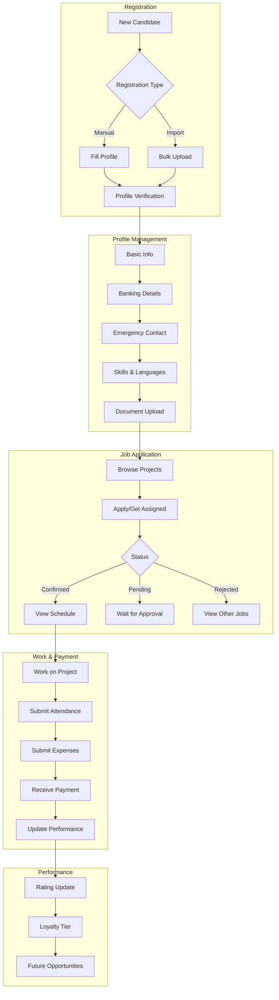
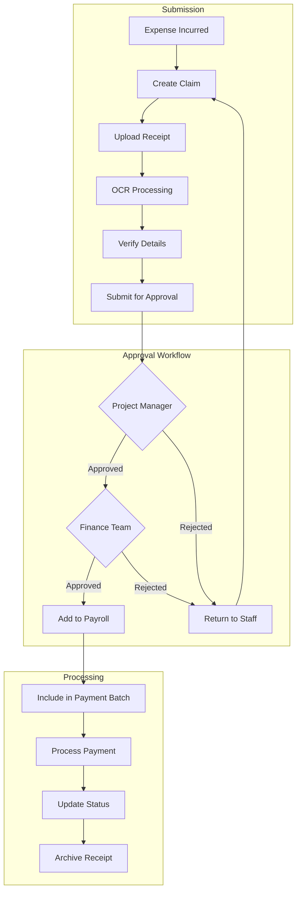
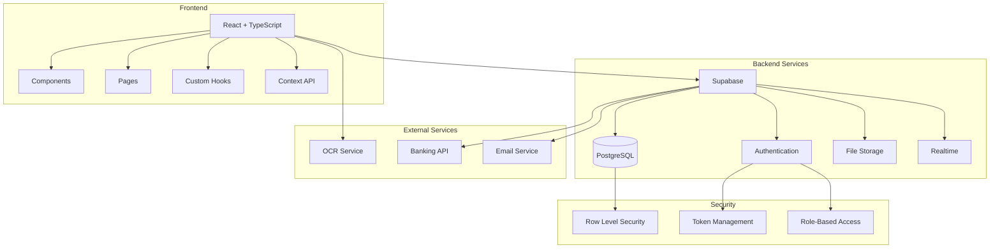
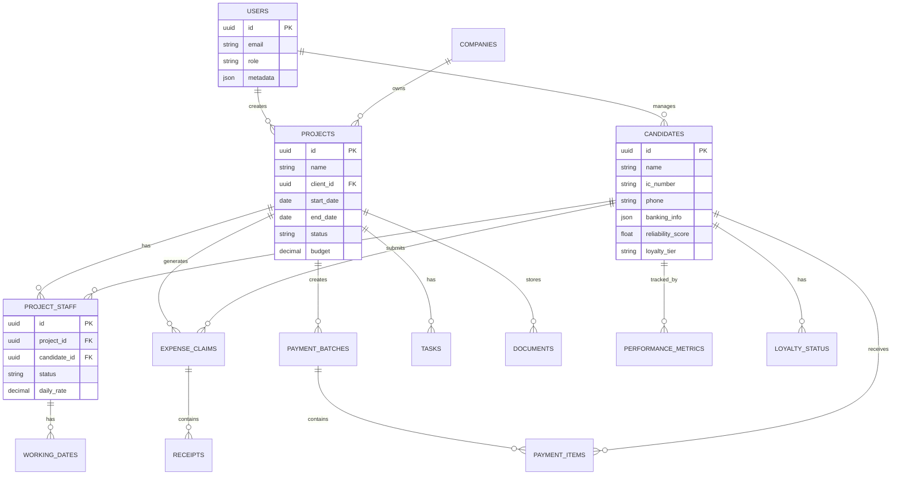

# Project System Architecture & Workflow

## System Overview Flowchart

```mermaid
flowchart TB
    subgraph "User Types"
        U1[Super Admin]
        U2[Admin]
        U3[Manager]
        U4[Client]
        U5[Staff/Candidate]
    end

    subgraph "Authentication"
        AUTH[Supabase Auth]
        AUTH --> PROFILE[User Profiles]
        AUTH --> ROLES[Role Management]
    end

    subgraph "Core Modules"
        CM[Candidate Management]
        PM[Project Management]
        SM[Staffing & Scheduling]
        EM[Expense Management]
        PAY[Payment & Payroll]
        COM[Company Management]
        TM[Task Management]
    end

    subgraph "Features"
        CM --> CM1[Profile Management]
        CM --> CM2[Performance Tracking]
        CM --> CM3[Loyalty System]
        CM --> CM4[Import/Export]
        
        PM --> PM1[Project Creation]
        PM --> PM2[Location Management]
        PM --> PM3[Budget Tracking]
        PM --> PM4[Document Storage]
        
        SM --> SM1[Staff Assignment]
        SM --> SM2[Schedule Management]
        SM --> SM3[Conflict Detection]
        SM --> SM4[Calendar View]
        
        EM --> EM1[Claim Creation]
        EM --> EM2[Receipt Upload/OCR]
        EM --> EM3[Approval Workflow]
        EM --> EM4[Project Tracking]
        
        PAY --> PAY1[Batch Creation]
        PAY --> PAY2[DuitNow Export]
        PAY --> PAY3[Approval Process]
        PAY --> PAY4[Payment History]
    end

    U1 --> AUTH
    U2 --> AUTH
    U3 --> AUTH
    U4 --> AUTH
    U5 --> AUTH

    PROFILE --> CM
    PROFILE --> PM
    PROFILE --> SM
    PROFILE --> EM
    PROFILE --> PAY
    PROFILE --> COM
    PROFILE --> TM
```

## Main Business Process Flow

```mermaid
flowchart LR
    subgraph "1. Project Setup"
        A[Client Request] --> B[Create Project]
        B --> C[Define Requirements]
        C --> D[Set Budget & Timeline]
        D --> E[Add Locations]
    end

    subgraph "2. Staffing"
        E --> F[Search Candidates]
        F --> G[Review Profiles]
        G --> H[Assign Staff]
        H --> I[Send Invitations]
        I --> J[Staff Confirmation]
    end

    subgraph "3. Execution"
        J --> K[Project Start]
        K --> L[Attendance Tracking]
        L --> M[Task Management]
        M --> N[Expense Claims]
        N --> O[Progress Updates]
    end

    subgraph "4. Completion"
        O --> P[Project End]
        P --> Q[Calculate Payroll]
        Q --> R[Process Payments]
        R --> S[Generate Reports]
        S --> T[Update Metrics]
    end
```

## Candidate Lifecycle

## Payment Processing Flow

```mermaid
flowchart LR
    subgraph "Initiation"
        P1[Project Completion] --> P2[Generate Payroll]
        P2 --> P3[Review Staff Hours]
        P3 --> P4[Calculate Amounts]
    end

    subgraph "Batch Creation"
        P4 --> B1[Create Payment Batch]
        B1 --> B2[Add Staff Payments]
        B2 --> B3[Include Expenses]
        B3 --> B4[Set Payment Date]
    end

    subgraph "Approval"
        B4 --> A1{Manager Review}
        A1 -->|Approved| A2[Finance Review]
        A1 -->|Rejected| A3[Revise Batch]
        A2 -->|Approved| A4[Ready for Export]
        A2 -->|Rejected| A3
    end

    subgraph "Execution"
        A4 --> E1[Export DuitNow]
        E1 --> E2[Bank Processing]
        E2 --> E3[Payment Confirmation]
        E3 --> E4[Update Records]
        E4 --> E5[Notify Recipients]
    end
```

## Expense Management Flow

## System Architecture

## Data Model Overview

This comprehensive flowchart system shows:
1. **System Overview** - User types and core modules
2. **Main Business Process** - End-to-end project flow
3. **Candidate Lifecycle** - From registration to performance tracking
4. **Payment Processing** - Complete payroll workflow
5. **Expense Management** - Claim submission and approval
6. **System Architecture** - Technical stack and integrations
7. **Data Model** - Key database relationships

Each diagram can be rendered using any Mermaid-compatible tool or viewer.