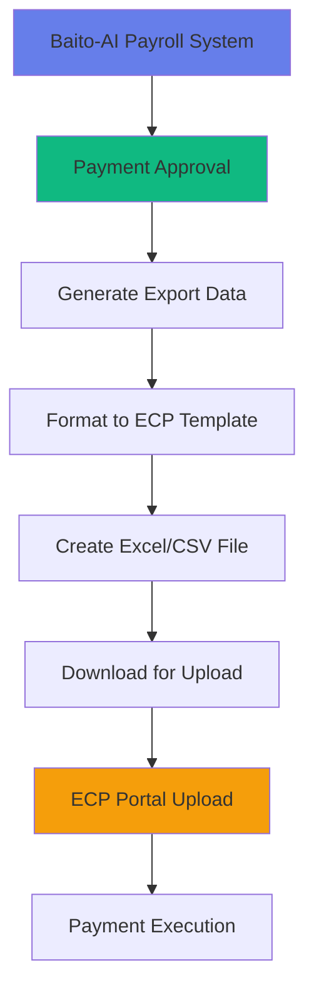

# Baito-AI Payment Export Integration Guide
## Integrating ECP File Export with Baito-AI Payroll System

---

## 🎯 Purpose

This document provides specific implementation guidance for integrating the ECP (Electronic Corporate Payment) file export functionality into the Baito-AI payroll and staffing management system.

---

## 📋 Integration Overview



---

## 🔧 Implementation Steps

### Step 1: Extend Payment Queue Service

```typescript
// src/lib/payment-queue-service.ts - Add ECP export functionality

import * as XLSX from 'xlsx';
import { format } from 'date-fns';

interface ECPPaymentRow {
  transactionType: 'IBG' | 'RENTAS';
  beneficiaryName: string;
  beneficiaryAccount: string;
  beneficiaryBank: string;
  beneficiaryBIC: string;
  beneficiaryId?: string; // IC Number for RENTAS
  amount: string;
  paymentDate: string;
  paymentReference: string;
  emailNotification?: string;
}

export class ECPExportService {

  /**
   * Generate ECP-compatible payment file from approved payroll data
   */
  static async generateECPExport(
    payments: PaymentQueueItem[],
    options: {
      transactionType: 'IBG' | 'RENTAS';
      paymentDate: Date;
      batchReference: string;
    }
  ): Promise<Blob> {

    // Map payment data to ECP format
    const ecpRows: ECPPaymentRow[] = payments.map(payment => ({
      transactionType: options.transactionType,
      beneficiaryName: payment.recipientName,
      beneficiaryAccount: payment.bankAccount,
      beneficiaryBank: payment.bankName,
      beneficiaryBIC: this.getBICCode(payment.bankName, options.transactionType),
      beneficiaryId: options.transactionType === 'RENTAS' ? payment.icNumber : undefined,
      amount: payment.amount.toFixed(2),
      paymentDate: format(options.paymentDate, 'dd/MM/yyyy'),
      paymentReference: `${options.batchReference}-${payment.id}`,
      emailNotification: payment.email
    }));

    // Validate required fields
    this.validateECPData(ecpRows, options.transactionType);

    // Generate Excel file
    return this.createExcelFile(ecpRows);
  }

  /**
   * Validate ECP data requirements
   */
  private static validateECPData(
    rows: ECPPaymentRow[],
    type: 'IBG' | 'RENTAS'
  ): void {
    rows.forEach((row, index) => {
      // Common validations
      if (!row.beneficiaryAccount) {
        throw new Error(`Row ${index + 1}: Beneficiary account is required`);
      }
      if (!row.beneficiaryBIC) {
        throw new Error(`Row ${index + 1}: BIC code is required`);
      }

      // RENTAS specific validation
      if (type === 'RENTAS' && !row.beneficiaryId) {
        throw new Error(`Row ${index + 1}: Beneficiary ID is mandatory for RENTAS transactions`);
      }

      // Validate payment date is not backdated
      const paymentDate = new Date(row.paymentDate);
      if (paymentDate < new Date().setHours(0, 0, 0, 0)) {
        throw new Error(`Row ${index + 1}: Payment date cannot be backdated`);
      }
    });
  }

  /**
   * Create Excel file from ECP data
   */
  private static createExcelFile(data: ECPPaymentRow[]): Blob {
    const ws = XLSX.utils.json_to_sheet(data);
    const wb = XLSX.utils.book_new();
    XLSX.utils.book_append_sheet(wb, ws, 'Payments');

    // Generate binary string
    const wbout = XLSX.write(wb, { bookType: 'xlsx', type: 'binary' });

    // Convert to Blob
    const buf = new ArrayBuffer(wbout.length);
    const view = new Uint8Array(buf);
    for (let i = 0; i < wbout.length; i++) {
      view[i] = wbout.charCodeAt(i) & 0xFF;
    }

    return new Blob([buf], { type: 'application/octet-stream' });
  }

  /**
   * Get BIC code for bank
   */
  private static getBICCode(bankName: string, type: 'IBG' | 'RENTAS'): string {
    // This would be populated from the BIC code PDFs
    const bicCodes = {
      'IBG': {
        'Maybank': 'MBBEMYKL',
        'CIMB': 'CIBBMYKL',
        'Public Bank': 'PBBEMYKL',
        // ... more banks
      },
      'RENTAS': {
        'Maybank': 'MBBEMYKLXXX',
        'CIMB': 'CIBBMYKLXXX',
        'Public Bank': 'PBBEMYKLXXX',
        // ... more banks
      }
    };

    return bicCodes[type][bankName] || '';
  }
}
```

---

### Step 2: Add UI Component for Export

```typescript
// src/components/payroll-manager/ECPExportDialog.tsx

import { useState } from 'react';
import { Dialog, DialogContent, DialogHeader, DialogTitle } from '@/components/ui/dialog';
import { Button } from '@/components/ui/button';
import { RadioGroup, RadioGroupItem } from '@/components/ui/radio-group';
import { Label } from '@/components/ui/label';
import { Calendar } from '@/components/ui/calendar';
import { Alert, AlertDescription } from '@/components/ui/alert';
import { Download, AlertCircle, FileText, CreditCard } from 'lucide-react';
import { ECPExportService } from '@/lib/payment-queue-service';

export function ECPExportDialog({
  payments,
  open,
  onOpenChange
}: {
  payments: PaymentQueueItem[];
  open: boolean;
  onOpenChange: (open: boolean) => void;
}) {
  const [transactionType, setTransactionType] = useState<'IBG' | 'RENTAS'>('IBG');
  const [paymentDate, setPaymentDate] = useState<Date>(new Date());
  const [isGenerating, setIsGenerating] = useState(false);

  const handleExport = async () => {
    try {
      setIsGenerating(true);

      // Generate unique batch reference
      const batchRef = `BAITO-${format(new Date(), 'yyyyMMdd-HHmmss')}`;

      // Generate ECP file
      const blob = await ECPExportService.generateECPExport(payments, {
        transactionType,
        paymentDate,
        batchReference: batchRef
      });

      // Download file
      const url = URL.createObjectURL(blob);
      const a = document.createElement('a');
      a.href = url;
      a.download = `${batchRef}_${transactionType}.xlsx`;
      a.click();
      URL.revokeObjectURL(url);

      // Show success message
      toast({
        title: 'Export Successful',
        description: `ECP file generated: ${a.download}`,
        icon: <Download className="h-4 w-4" />
      });

      onOpenChange(false);

    } catch (error) {
      toast({
        title: 'Export Failed',
        description: error.message,
        variant: 'destructive'
      });
    } finally {
      setIsGenerating(false);
    }
  };

  const rentasPayments = payments.filter(p => !p.icNumber).length;

  return (
    <Dialog open={open} onOpenChange={onOpenChange}>
      <DialogContent className="max-w-2xl">
        <DialogHeader>
          <DialogTitle className="flex items-center gap-2">
            <FileText className="h-5 w-5" />
            Export to ECP File
          </DialogTitle>
        </DialogHeader>

        <div className="space-y-6">
          {/* Summary */}
          <div className="bg-gray-50 p-4 rounded-lg">
            <h3 className="font-medium mb-2">Export Summary</h3>
            <div className="grid grid-cols-2 gap-2 text-sm">
              <div>Total Payments: {payments.length}</div>
              <div>Total Amount: RM {payments.reduce((sum, p) => sum + p.amount, 0).toFixed(2)}</div>
            </div>
          </div>

          {/* Transaction Type */}
          <div className="space-y-3">
            <Label>Transaction Type</Label>
            <RadioGroup value={transactionType} onValueChange={setTransactionType}>
              <div className="flex items-center space-x-2">
                <RadioGroupItem value="IBG" id="ibg" />
                <Label htmlFor="ibg" className="font-normal cursor-pointer">
                  IBG - Interbank GIRO (Next Business Day)
                </Label>
              </div>
              <div className="flex items-center space-x-2">
                <RadioGroupItem value="RENTAS" id="rentas" />
                <Label htmlFor="rentas" className="font-normal cursor-pointer">
                  RENTAS - Real-time Transfer (Immediate)
                </Label>
              </div>
            </RadioGroup>
          </div>

          {/* RENTAS Warning */}
          {transactionType === 'RENTAS' && rentasPayments > 0 && (
            <Alert className="border-orange-200 bg-orange-50">
              <AlertCircle className="h-4 w-4 text-orange-600" />
              <AlertDescription>
                <strong>Warning:</strong> {rentasPayments} payment(s) are missing IC numbers.
                Beneficiary ID is mandatory for RENTAS transactions.
              </AlertDescription>
            </Alert>
          )}

          {/* Payment Date */}
          <div className="space-y-3">
            <Label>Payment Date</Label>
            <Calendar
              mode="single"
              selected={paymentDate}
              onSelect={setPaymentDate}
              disabled={(date) => date < new Date() || date > addDays(new Date(), 60)}
              className="rounded-md border"
            />
            <p className="text-sm text-gray-600">
              Can be scheduled up to 60 days in advance
            </p>
          </div>

          {/* Important Notes */}
          <Alert>
            <AlertCircle className="h-4 w-4" />
            <AlertDescription className="space-y-2">
              <p><strong>Important:</strong></p>
              <ul className="list-disc list-inside text-sm space-y-1">
                <li>Beneficiary names are not validated - verify account numbers</li>
                <li>Each filename can only be uploaded once to ECP portal</li>
                <li>PIDM protection does not apply to transferred funds</li>
              </ul>
            </AlertDescription>
          </Alert>

          {/* Actions */}
          <div className="flex justify-between items-center pt-4">
            <div className="flex gap-2">
              <Button
                variant="outline"
                size="sm"
                onClick={() => window.open('/Payment/ibg-members-bic-codes.pdf')}
              >
                <FileText className="h-4 w-4 mr-1" />
                IBG Codes
              </Button>
              <Button
                variant="outline"
                size="sm"
                onClick={() => window.open('/Payment/rentas-members-bic-codes.pdf')}
              >
                <FileText className="h-4 w-4 mr-1" />
                RENTAS Codes
              </Button>
            </div>

            <div className="flex gap-2">
              <Button variant="outline" onClick={() => onOpenChange(false)}>
                Cancel
              </Button>
              <Button
                onClick={handleExport}
                disabled={isGenerating || (transactionType === 'RENTAS' && rentasPayments > 0)}
              >
                {isGenerating ? (
                  <Loader2 className="h-4 w-4 mr-2 animate-spin" />
                ) : (
                  <Download className="h-4 w-4 mr-2" />
                )}
                Generate ECP File
              </Button>
            </div>
          </div>
        </div>
      </DialogContent>
    </Dialog>
  );
}
```

---

### Step 3: Add to Payment Workflow

```typescript
// src/components/payroll-manager/PayrollManager.tsx - Add export button

import { ECPExportDialog } from './ECPExportDialog';

// In your PayrollManager component
function PayrollManager() {
  const [showECPExport, setShowECPExport] = useState(false);
  const approvedPayments = payments.filter(p => p.status === 'approved');

  return (
    <>
      {/* Existing UI */}

      {/* Add Export Button */}
      {approvedPayments.length > 0 && (
        <Button
          onClick={() => setShowECPExport(true)}
          className="bg-green-600 hover:bg-green-700"
        >
          <Download className="h-4 w-4 mr-2" />
          Export to ECP ({approvedPayments.length} payments)
        </Button>
      )}

      {/* Export Dialog */}
      <ECPExportDialog
        payments={approvedPayments}
        open={showECPExport}
        onOpenChange={setShowECPExport}
      />
    </>
  );
}
```

---

## 📊 Database Schema Updates

```sql
-- Add ECP export tracking
CREATE TABLE ecp_export_batches (
  id UUID PRIMARY KEY DEFAULT gen_random_uuid(),
  batch_reference VARCHAR(50) UNIQUE NOT NULL,
  filename VARCHAR(255) NOT NULL,
  transaction_type VARCHAR(10) CHECK (transaction_type IN ('IBG', 'RENTAS')),
  payment_date DATE NOT NULL,
  total_amount DECIMAL(15, 2) NOT NULL,
  payment_count INTEGER NOT NULL,
  exported_by UUID REFERENCES users(id),
  exported_at TIMESTAMP DEFAULT NOW(),
  upload_status VARCHAR(20) DEFAULT 'pending',
  upload_confirmed_at TIMESTAMP,
  notes TEXT
);

-- Link payments to export batches
ALTER TABLE payment_queue
ADD COLUMN ecp_batch_id UUID REFERENCES ecp_export_batches(id);

-- Add BIC codes reference table
CREATE TABLE bank_bic_codes (
  id UUID PRIMARY KEY DEFAULT gen_random_uuid(),
  bank_name VARCHAR(100) NOT NULL,
  transaction_type VARCHAR(10) NOT NULL,
  bic_code VARCHAR(20) NOT NULL,
  active BOOLEAN DEFAULT true,
  UNIQUE(bank_name, transaction_type)
);
```

---

## 🔒 Security Considerations

1. **File Encryption**: Consider encrypting exported files
2. **Audit Trail**: Log all export activities
3. **Access Control**: Restrict export function to authorized users
4. **Data Masking**: Option to mask sensitive data in exports
5. **File Retention**: Auto-delete old export files after confirmation

---

## 📈 Monitoring & Analytics

### Track Export Metrics
```typescript
// Track successful exports
await trackActivity({
  action: 'ecp_export',
  details: {
    batchReference,
    transactionType,
    paymentCount: payments.length,
    totalAmount
  }
});
```

### Dashboard Widgets
- Total exports this month
- Average payment batch size
- IBG vs RENTAS distribution
- Export success rate

---

## 🚀 Quick Start Checklist

- [ ] Install XLSX library: `npm install xlsx`
- [ ] Add ECPExportService to payment-queue-service.ts
- [ ] Create ECPExportDialog component
- [ ] Add export button to PayrollManager
- [ ] Create database tables for tracking
- [ ] Test with sample data
- [ ] Document bank BIC codes
- [ ] Set up user permissions
- [ ] Add activity logging
- [ ] Deploy and test in staging

---

## 📚 Resources

- [ECP Documentation](./ECP_FILE_EXPORT_DOCUMENTATION.md)
- [Excel Template](./ecp-excel-template.xlsx)
- [User Guide](./ecp-user-guide.pdf)
- [IBG BIC Codes](./ibg-members-bic-codes.pdf)
- [RENTAS BIC Codes](./rentas-members-bic-codes.pdf)

---

*Generated by Winston (Architect) for Baito-AI System*