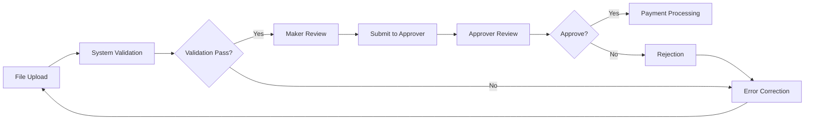

# ECP File Export Documentation
## Electronic Corporate Payment System Guide

---

## 📋 Table of Contents
1. [Overview](#overview)
2. [Required Resources](#required-resources)
3. [Pre-Export Checklist](#pre-export-checklist)
4. [Step-by-Step Export Process](#step-by-step-export-process)
5. [File Upload Guidelines](#file-upload-guidelines)
6. [Processing Windows](#processing-windows)
7. [Validation & Approval Process](#validation--approval-process)
8. [Important Warnings & Restrictions](#important-warnings--restrictions)
9. [Troubleshooting](#troubleshooting)
10. [Quick Reference](#quick-reference)

---

## Overview

The ECP (Electronic Corporate Payment) system enables batch payment processing through file uploads. This documentation covers the complete process from file preparation to payment execution.

### System Components
- **Excel Template**: Standardized format for payment data entry
- **ECP Portal**: Web-based platform for file upload and management
- **Validation Engine**: Automated verification of payment details
- **Approval Workflow**: Maker-Checker process for payment authorization

---

## Required Resources

### 📚 Essential Documents
| Resource | File Location | Purpose |
|----------|--------------|---------|
| User Guide | `ecp-user-guide.pdf` | Comprehensive system documentation |
| Excel Template | `ecp-excel-template.xlsx` | Payment data entry template |
| IBG BIC Codes | `ibg-members-bic-codes.pdf` | Interbank GIRO member codes |
| RENTAS BIC Codes | `rentas-members-bic-codes.pdf` | Real-time Electronic Transfer of Funds codes |

### 🔑 System Access Requirements
- Valid corporate banking credentials
- Maker role for file upload
- Approver role for payment authorization
- Secure network connection

---

## Pre-Export Checklist

### ✅ Before You Begin
- [ ] Download and review the latest Excel template
- [ ] Obtain correct BIC codes for beneficiary banks
- [ ] Verify all beneficiary account numbers
- [ ] Confirm payment dates are not backdated
- [ ] Ensure Beneficiary IDs are available for RENTAS transactions
- [ ] Check available account balance
- [ ] Verify user has appropriate system permissions

---

## Step-by-Step Export Process

### 📝 Step 1: Prepare Payment Data

1. **Download the Excel Template**
   ```
   File: ecp-excel-template.xlsx
   Location: /Payment folder
   ```

2. **Fill in Required Fields**
   - Transaction Type (IBG/RENTAS)
   - Beneficiary Name
   - Beneficiary Account Number
   - Beneficiary Bank BIC Code
   - Payment Amount
   - Payment Date
   - Payment Reference
   - **For RENTAS**: Beneficiary ID (mandatory)

3. **Data Validation**
   - Verify all account numbers are accurate
   - Ensure BIC codes match the beneficiary bank
   - Confirm payment dates are current or future-dated (max 60 days)
   - Double-check payment amounts

### 📤 Step 2: Export to ECP Format

1. **Save the Excel File**
   - Use descriptive filename: `[Company]_[Date]_[Batch].xlsx`
   - Example: `BaitoAI_20250929_Payroll01.xlsx`
   - Note: Each filename can only be used once

2. **Generate ECP File**
   - Save as CSV or use system export function
   - Verify file encoding (UTF-8 recommended)
   - Check file size limits (if applicable)

### 🌐 Step 3: Upload to ECP Portal

1. **Access ECP System**
   - Log in with corporate banking credentials
   - Navigate to "ECP File Upload" section

2. **Upload Process**
   ```
   Portal Path: Payments > Bulk Payment > ECP File Upload
   ```
   - Click "Choose File" or "Browse"
   - Select your prepared ECP file
   - Verify filename hasn't been previously used

3. **Select Processing Window**
   - Available windows depend on upload time
   - Options include:
     - **Same-Day Processing**: Limited time windows
     - **Future-Dated**: Up to 60 days advance
   - Ensure selected date matches file payment date

### ✔️ Step 4: Validation

1. **Initial Upload Validation**
   - System performs automatic format check
   - Verifies mandatory fields
   - Checks BIC code validity

2. **Check File Status**
   ```
   Portal Path: Payments > ECP File Status
   ```
   - Status indicators:
     - ✅ Validated - Ready for submission
     - ⚠️ Pending - Under validation
     - ❌ Failed - Errors detected

3. **Review Validation Results**
   - Check for any error messages
   - Verify beneficiary details
   - Confirm total payment amount

### 👥 Step 5: Submit for Approval

1. **Maker Submission**
   - Navigate to "ECP File Status"
   - Select validated file
   - Click "Submit to Approver"
   - Add remarks if necessary

2. **Notification**
   - System sends notification to designated approvers
   - Includes file summary and total amount

---

## File Upload Guidelines

### 📁 File Specifications

| Parameter | Requirement |
|-----------|------------|
| File Format | Excel (.xlsx) or CSV |
| Encoding | UTF-8 |
| Max File Size | Check system limits |
| Filename | Unique, no special characters |
| Date Format | DD/MM/YYYY |
| Amount Format | Numeric, 2 decimal places |

### 🚫 Upload Restrictions

- **One-Time Filename Use**: Each filename can only be uploaded once
- **No Backdating**: Payment dates must be current or future
- **Mandatory Fields**: All required fields must be populated
- **RENTAS Requirement**: Beneficiary ID is mandatory

---

## Processing Windows

### ⏰ Same-Day Processing
| Upload Time | Processing Window |
|------------|------------------|
| Before 9:00 AM | Morning batch (11:00 AM) |
| Before 12:00 PM | Afternoon batch (3:00 PM) |
| Before 3:00 PM | Evening batch (5:00 PM) |

### 📅 Future-Dated Processing
- Available for payments up to 60 days in advance
- All processing windows available for selection
- Payment executed on specified date

---

## Validation & Approval Process

### 🔄 Workflow Stages



### 👤 Maker Responsibilities
1. Prepare and upload payment file
2. Review validation results
3. Submit validated files to approver
4. Correct any errors identified

### 👨‍💼 Approver Responsibilities
1. Review submitted payment files
2. Verify payment details and amounts
3. Approve or reject submissions
4. Monitor payment execution status

---

## Important Warnings & Restrictions

### ⚠️ Critical Notices

1. **Beneficiary Name Validation**
   > ⚠️ Beneficiary names are NOT validated by the system and are for receiving bank reference only. Always verify account numbers for accuracy.

2. **PIDM Protection**
   > ⚠️ Money withdrawn from your insured deposit is no longer protected by PIDM if transferred to:
   > - Non-PIDM members
   > - Non-deposit products

3. **RENTAS Transactions**
   > ⚠️ Beneficiary ID is MANDATORY for all RENTAS transactions, even when ID checking is marked as "Not Required"

4. **File Resubmission**
   > ⚠️ Previously uploaded filenames cannot be reused unless the original file is removed from "ECP Payment Status"

5. **Payment Date Matching**
   > ⚠️ Selected payment date MUST match the date specified in the file and cannot be backdated

---

## Troubleshooting

### 🔧 Common Issues & Solutions

| Issue | Cause | Solution |
|-------|-------|----------|
| File upload fails | Duplicate filename | Use unique filename or remove previous file |
| Validation error | Missing mandatory fields | Check Beneficiary ID for RENTAS |
| No processing windows | Upload after cutoff | Select future-dated option |
| BIC code error | Invalid/outdated code | Refer to latest BIC code documents |
| Amount mismatch | Formatting issue | Use numeric format with 2 decimals |

### 📞 Support Escalation
1. Check user guide for detailed instructions
2. Verify against this documentation
3. Contact system administrator
4. Raise support ticket with error details

---

## Quick Reference

### 🎯 Key Points Summary

✅ **DO**
- Use unique filenames for each upload
- Verify account numbers before submission
- Include Beneficiary ID for RENTAS
- Check file validation status
- Submit to approver after validation

❌ **DON'T**
- Reuse filenames
- Backdate payments
- Skip validation check
- Rely solely on beneficiary name
- Upload outside processing windows for same-day

### 📊 Payment Types Comparison

| Feature | IBG | RENTAS |
|---------|-----|--------|
| Processing Speed | Next business day | Real-time |
| Beneficiary ID | Optional | Mandatory |
| BIC Code Source | IBG members list | RENTAS members list |
| Max Amount | Check limits | Higher limits |
| Suitable For | Regular payments | Urgent/High-value |

---

## Implementation in Baito-AI System

### 🔄 Integration Points

For the Baito-AI payroll system, the ECP file export can be integrated with:

1. **Payroll Manager Component** (`/src/components/payroll-manager/`)
   - Export approved payroll data to ECP format
   - Map staff payment data to Excel template fields

2. **DuitNow Payment Export** (`/src/components/duitnow-payment-export/`)
   - Generate payment files in ECP-compatible format
   - Include validation before export

3. **Payment Queue Service** (`/src/lib/payment-queue-service.ts`)
   - Queue payments for batch processing
   - Track payment status after ECP submission

### 📝 Sample Code Integration

```typescript
// Example: Generate ECP-compatible export
async function exportToECP(payrollData: PayrollData[]): Promise<ECPFile> {
  const ecpData = payrollData.map(payment => ({
    transactionType: payment.urgent ? 'RENTAS' : 'IBG',
    beneficiaryName: payment.staffName,
    beneficiaryAccount: payment.bankAccount,
    beneficiaryBIC: payment.bankCode,
    beneficiaryId: payment.icNumber, // Required for RENTAS
    amount: payment.netPay.toFixed(2),
    paymentDate: format(payment.paymentDate, 'dd/MM/yyyy'),
    reference: `PAYROLL-${payment.projectId}-${payment.period}`
  }));

  return generateECPFile(ecpData);
}
```

---

## Document Version

| Version | Date | Author | Changes |
|---------|------|--------|---------|
| 1.0 | 2025-09-29 | Winston (Architect) | Initial documentation |

---

## Appendix

### 📎 Related Files
- `ecp-user-guide.pdf` - Complete user manual
- `ecp-excel-template.xlsx` - Payment template
- `ibg-members-bic-codes.pdf` - IBG bank codes
- `rentas-members-bic-codes.pdf` - RENTAS bank codes

### 🔗 Quick Links
- [Download User Guide](./ecp-user-guide.pdf)
- [Download Excel Template](./ecp-excel-template.xlsx)
- [View IBG BIC Codes](./ibg-members-bic-codes.pdf)
- [View RENTAS BIC Codes](./rentas-members-bic-codes.pdf)

---

*This documentation is maintained as part of the Baito-AI payment system architecture.*