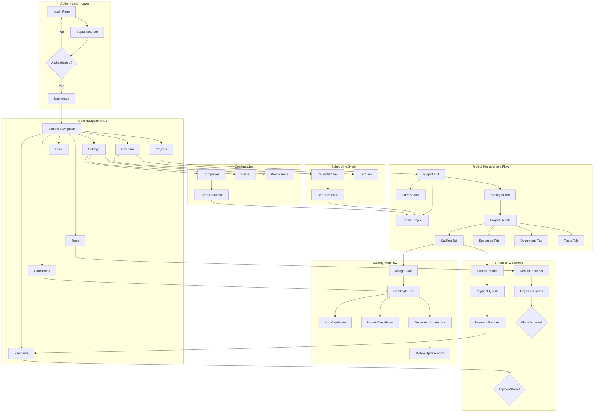
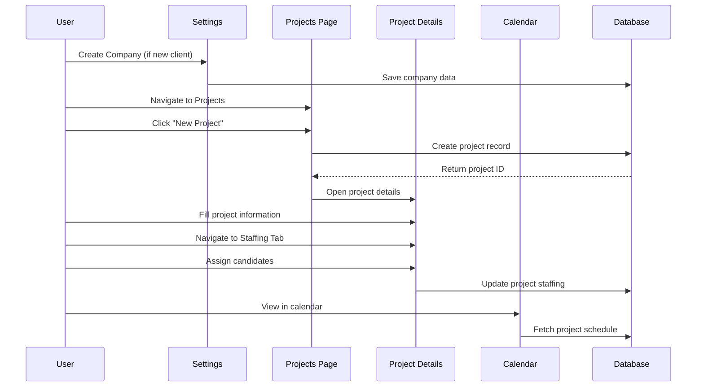
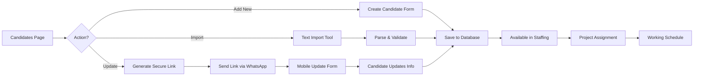
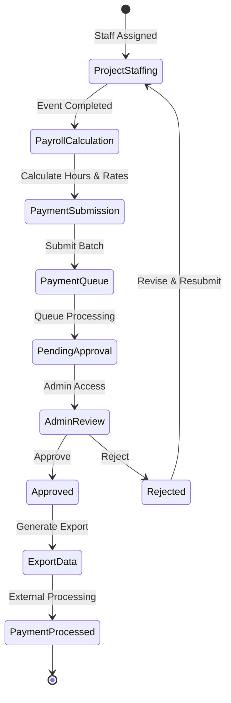
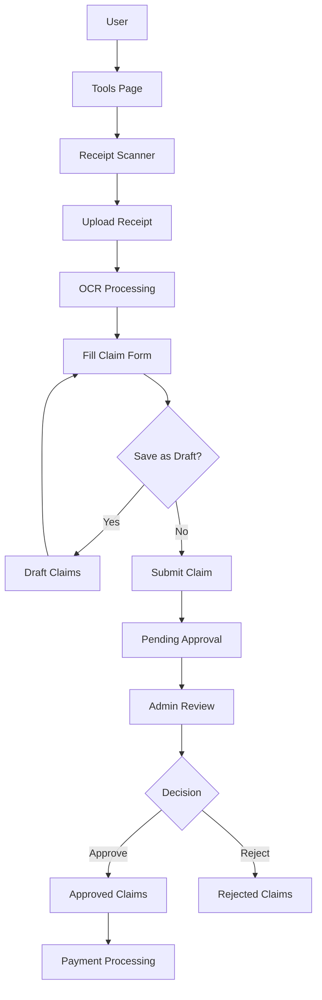
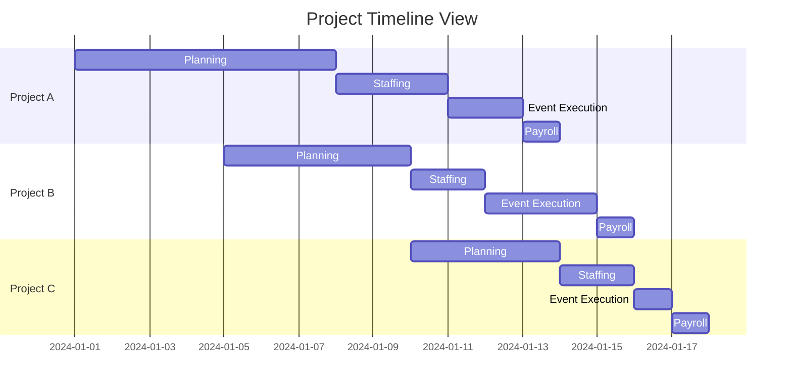
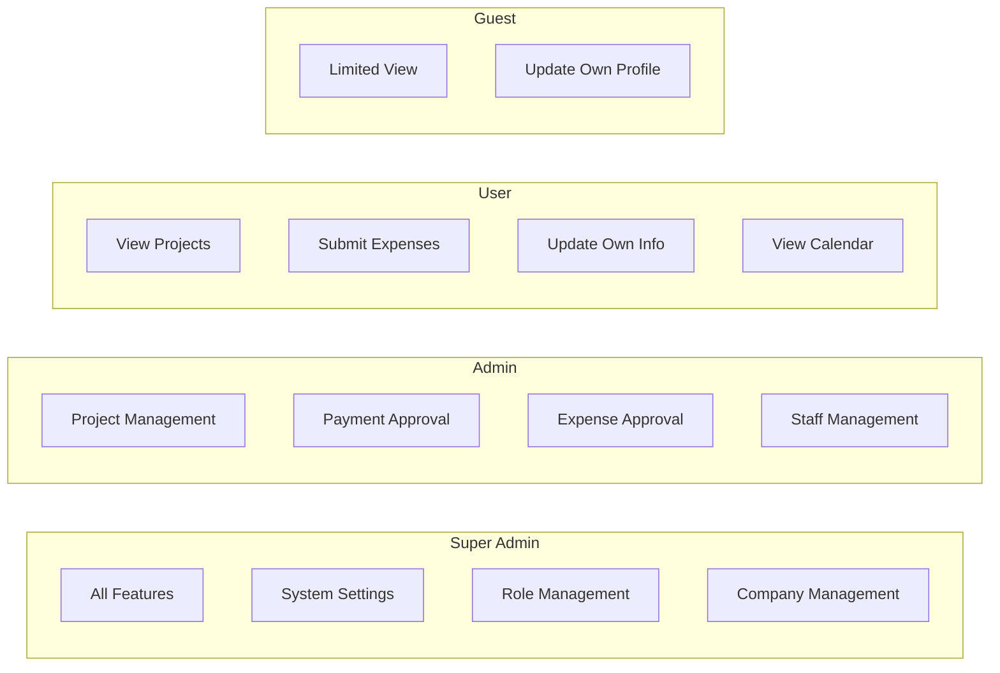
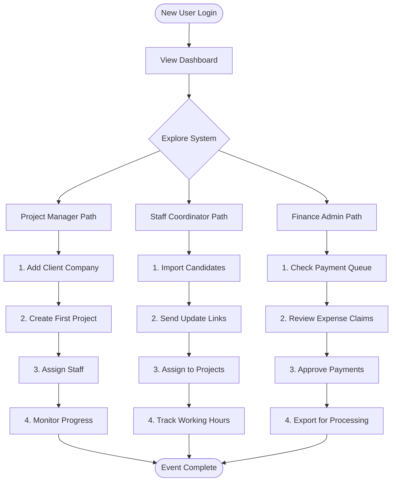
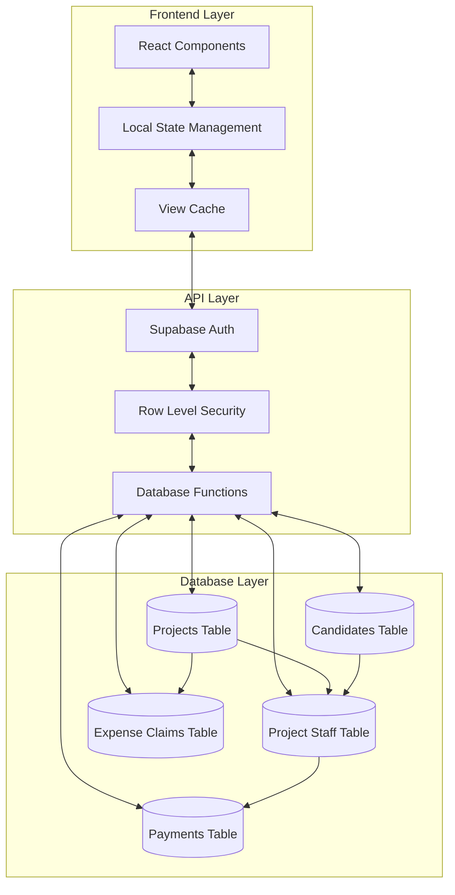
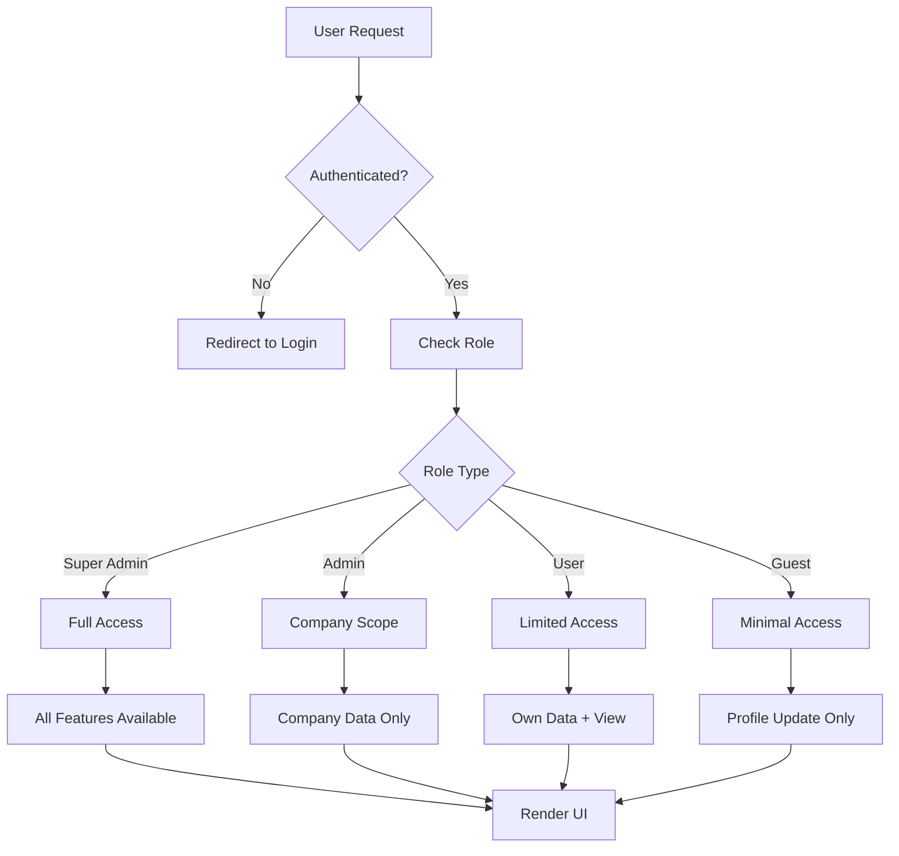

# Event Management System - Visual Workflow Diagram

## System Architecture Overview

## Detailed User Flow Diagrams

### 1. Project Creation and Management Flow

### 2. Candidate Management and Assignment Flow

### 3. Payment Processing Workflow

### 4. Expense Claims Flow

### 5. Calendar and Scheduling Integration

## User Role Permissions Matrix

## Quick Start Guide for New Users

## Data Flow Architecture

## Security and Access Control Flow

This comprehensive workflow guide and diagram set provides:
1. System architecture overview
2. Detailed user flows for each major feature
3. Visual representations of data flow
4. Permission matrices
5. Quick start guides for different user types

The diagrams can be rendered using any Mermaid-compatible viewer or documentation system.