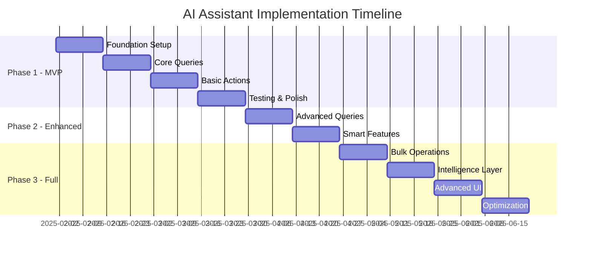

# Product Requirements Document: AI Chatbot Assistant for Baito-AI

## Document Version
- **Version**: 2.0.0 (Agentic Update)
- **Date**: October 2025
- **Author**: Baito-AI Product Team
- **Status**: Draft - Updated with Agentic Capabilities
- **Reference**: See `/docs/AI_CHATBOT_AGENTIC_ANALYSIS.md` for detailed analysis

---

## 1. Executive Summary

The AI Chatbot Assistant for Baito-AI is an **intelligent agentic system** that enables users to interact with the Baito-AI staffing and project management system using natural language. This feature provides a floating chat widget interface with **autonomous reasoning capabilities** (ReAct pattern), **multi-agent orchestration**, and **context-aware conversations** that can query data, create and update records, and proactively assist with complex workflows.

### Key Benefits
- **Reduced Learning Curve**: Natural language interface eliminates need for UI navigation training
- **Increased Productivity**: 40-60% faster task completion with autonomous multi-step workflows
- **24/7 Availability**: Intelligent assistance that learns from patterns and improves over time
- **Data Insights**: Proactive monitoring, suggestions, and analytics through agentic AI
- **Cost-Effective**: 15x cheaper than Claude, 50x cheaper than GPT-4 using Gemini 2.5 Flash

### Investment Requirements
- **Development Time**: 8 weeks for MVP, 16 weeks for enhanced agent, 24 weeks for full agentic system
- **Resources**: 2 Frontend Engineers, 1 Backend Engineer, 1 AI/ML Engineer, 1 UX Designer
- **Infrastructure Cost**: ~$500/month (MVP) → $10,000/month (100k active users)
- **Technology**: OpenRouter (Gemini 2.5 Flash) + CrewAI + Supabase pgvector

---

## 2. Problem Statement

### Current Challenges

1. **Complex Navigation**: Users struggle to find specific features in the extensive UI
2. **Repetitive Tasks**: Common operations require multiple clicks and page navigations
3. **Data Discovery**: Difficult to quickly query cross-table relationships and insights
4. **Training Overhead**: New users require significant onboarding time
5. **Mobile Limitations**: Complex operations are challenging on mobile devices

### User Pain Points

- "I need to quickly check which candidates are available for tomorrow's project"
- "Creating a new project requires navigating through multiple forms"
- "Finding specific expense claims or payment records takes too long"
- "I want to bulk update candidate statuses but the UI doesn't support it"

### Business Impact

- **Support Tickets**: 35% of support requests are navigation/how-to questions
- **User Adoption**: 25% of new users abandon the platform within first week
- **Task Completion**: Average 8-12 clicks for common operations

---

## 3. User Personas

### Persona 1: Operations Manager (Sarah)
- **Role**: Manages multiple projects and staff assignments
- **Tech Savvy**: Medium
- **Primary Goals**:
  - Quickly staff projects
  - Monitor project status
  - Handle urgent changes
- **Pain Points**:
  - Switching between multiple project views
  - Finding available candidates quickly
  - Bulk operations take too long

### Persona 2: Field Coordinator (Mike)
- **Role**: On-site project coordination
- **Tech Savvy**: Low-Medium
- **Primary Goals**:
  - Check daily schedules
  - Update attendance
  - Submit expense claims
- **Pain Points**:
  - Mobile interface complexity
  - Quick status updates while on-site
  - Finding specific information quickly

### Persona 3: Admin Staff (Jennifer)
- **Role**: Data entry and system administration
- **Tech Savvy**: High
- **Primary Goals**:
  - Bulk data operations
  - Generate reports
  - Maintain data accuracy
- **Pain Points**:
  - Repetitive data entry
  - Complex filtering and queries
  - No keyboard shortcuts

### Persona 4: Finance Manager (David)
- **Role**: Payroll and expense management
- **Tech Savvy**: Medium
- **Primary Goals**:
  - Process payments
  - Review expense claims
  - Generate financial reports
- **Pain Points**:
  - Cross-referencing multiple tables
  - Bulk payment processing
  - Finding specific transactions

---

## 4. Feature Requirements

### 4.1 Core Chat Functionality

#### 4.1.1 Chat Widget Interface
```typescript
interface ChatWidgetProps {
  position: 'bottom-right' | 'bottom-left';
  collapsed: boolean;
  theme: 'light' | 'dark' | 'auto';
  size: 'compact' | 'standard' | 'expanded';
  hotkey: string; // e.g., 'cmd+k' or 'ctrl+k'
}
```

**Requirements:**
- Floating action button (FAB) with chat icon
- Expandable chat window (400px × 600px default)
- Minimizable to icon
- Persistent conversation history (last 30 days)
- Keyboard shortcut activation (Cmd/Ctrl + K)
- Mobile-responsive design
- Smooth animations (Framer Motion)

#### 4.1.2 Message Interface
```typescript
interface Message {
  id: string;
  type: 'user' | 'assistant' | 'system' | 'confirmation' | 'error';
  content: string;
  timestamp: Date;
  metadata?: {
    action?: 'query' | 'create' | 'update' | 'delete';
    entity?: string;
    recordId?: string;
    confidence?: number;
  };
  attachments?: Attachment[];
  quickActions?: QuickAction[];
}
```

### 4.2 AI Capabilities

#### 4.2.1 Natural Language Understanding (NLU)
**Supported Intent Categories:**

1. **Query Intents**
   - Simple queries: "Show me today's projects"
   - Complex queries: "Which candidates with forklift license are available next week?"
   - Aggregations: "How many hours did John work last month?"
   - Comparisons: "Compare this month's revenue with last month"

2. **Action Intents**
   - Create: "Create a new project for ABC Company on Friday"
   - Update: "Change project status to completed"
   - Assign: "Assign John and Mary to tomorrow's warehouse project"
   - Schedule: "Schedule a task for next Monday at 9 AM"

3. **Navigation Intents**
   - "Take me to expense claims"
   - "Show candidate profile for John Doe"
   - "Open project settings"

4. **Help Intents**
   - "How do I create a project?"
   - "What's the shortcut for adding candidates?"
   - "Explain project statuses"

#### 4.2.2 Context Management
```typescript
interface ConversationContext {
  userId: string;
  sessionId: string;
  currentEntity?: string; // e.g., 'project', 'candidate'
  currentRecordId?: string;
  recentEntities: Entity[];
  userRole: UserRole;
  permissions: Permission[];
  timezone: string;
  language: string;
}
```

### 4.3 Database Operations

#### 4.3.1 Supported Entities and Operations

| Entity | View | Create | Update | Delete | Bulk Ops |
|--------|------|--------|--------|--------|----------|
| Projects | ✅ | ✅ | ✅ | ⚠️ | ✅ |
| Candidates | ✅ | ✅ | ✅ | ⚠️ | ✅ |
| Staff Assignments | ✅ | ✅ | ✅ | ✅ | ✅ |
| Tasks | ✅ | ✅ | ✅ | ✅ | ✅ |
| Expense Claims | ✅ | ✅ | ✅ | ❌ | ❌ |
| Payments | ✅ | ✅ | ⚠️ | ❌ | ❌ |
| Companies | ✅ | ✅ | ✅ | ❌ | ❌ |
| Documents | ✅ | ✅ | ❌ | ✅ | ❌ |

**Legend:**
- ✅ Full support
- ⚠️ With confirmation/restrictions
- ❌ Not supported

#### 4.3.2 Query Language Support
```typescript
interface QueryCapabilities {
  filtering: {
    operators: ['=', '!=', '>', '<', '>=', '<=', 'in', 'contains', 'between'];
    logicalOperators: ['AND', 'OR', 'NOT'];
  };
  sorting: {
    fields: string[];
    directions: ['asc', 'desc'];
  };
  pagination: {
    limit: number;
    offset: number;
  };
  aggregation: {
    functions: ['count', 'sum', 'avg', 'min', 'max'];
    groupBy: string[];
  };
}
```

### 4.4 Smart Features

#### 4.4.1 Proactive Suggestions
- Staffing recommendations based on skills and availability
- Deadline reminders
- Anomaly detection (e.g., unusual expense claims)
- Optimization suggestions (e.g., "You can save costs by combining these projects")

#### 4.4.2 Quick Actions
```typescript
interface QuickAction {
  label: string;
  icon: string;
  action: () => void;
  shortcut?: string;
}
```

Examples:
- "Create similar project"
- "Assign recommended candidates"
- "Export to Excel"
- "Share via link"

#### 4.4.3 Intelligent Formatting
- Table views for lists
- Cards for detailed records
- Charts for analytics
- Calendar views for schedules
- Interactive forms for data input

---

## 5. Technical Architecture

### 5.1 System Architecture

```
┌─────────────────────────────────────────────────────┐
│                   Frontend (React)                   │
├─────────────────────────────────────────────────────┤
│  ┌────────────┐  ┌─────────────┐  ┌──────────────┐ │
│  │Chat Widget │  │Message List │  │Input Handler │ │
│  └────────────┘  └─────────────┘  └──────────────┘ │
├─────────────────────────────────────────────────────┤
│              WebSocket Connection                    │
└─────────────────────────────────────────────────────┘
                          │
                          ▼
┌─────────────────────────────────────────────────────┐
│              AI Service Layer (Edge)                 │
├─────────────────────────────────────────────────────┤
│  ┌────────────┐  ┌─────────────┐  ┌──────────────┐ │
│  │NLU Engine  │  │Context Mgr  │  │Rate Limiter  │ │
│  └────────────┘  └─────────────┘  └──────────────┘ │
└─────────────────────────────────────────────────────┘
                          │
                          ▼
┌─────────────────────────────────────────────────────┐
│                  LLM Provider API                    │
│            (Anthropic Claude / OpenAI)               │
└─────────────────────────────────────────────────────┘
                          │
                          ▼
┌─────────────────────────────────────────────────────┐
│              Supabase Backend                        │
├─────────────────────────────────────────────────────┤
│  ┌────────────┐  ┌─────────────┐  ┌──────────────┐ │
│  │PostgreSQL  │  │Edge Funcs   │  │Realtime      │ │
│  └────────────┘  └─────────────┘  └──────────────┘ │
└─────────────────────────────────────────────────────┘
```

### 5.2 Frontend Components

```typescript
// Main component structure
interface AIAssistantComponents {
  // Core Components
  'components/ai-assistant/ChatWidget.tsx': React.FC<ChatWidgetProps>;
  'components/ai-assistant/MessageList.tsx': React.FC<MessageListProps>;
  'components/ai-assistant/MessageInput.tsx': React.FC<MessageInputProps>;
  'components/ai-assistant/MessageBubble.tsx': React.FC<MessageProps>;

  // UI Components
  'components/ai-assistant/QuickActions.tsx': React.FC<QuickActionsProps>;
  'components/ai-assistant/TypingIndicator.tsx': React.FC;
  'components/ai-assistant/ConfirmationDialog.tsx': React.FC<ConfirmationProps>;
  'components/ai-assistant/DataTable.tsx': React.FC<TableProps>;
  'components/ai-assistant/FormRenderer.tsx': React.FC<FormProps>;

  // Hooks
  'hooks/use-ai-assistant.ts': () => AIAssistantHook;
  'hooks/use-conversation.ts': () => ConversationHook;
  'hooks/use-ai-suggestions.ts': () => SuggestionsHook;

  // Services
  'lib/ai-assistant-service.ts': AIAssistantService;
  'lib/nlu-parser.ts': NLUParser;
  'lib/action-executor.ts': ActionExecutor;
}
```

### 5.3 Backend API Design

#### 5.3.1 Supabase Edge Functions

```typescript
// /supabase/functions/ai-chat/index.ts
interface ChatRequest {
  message: string;
  context: ConversationContext;
  sessionId: string;
}

interface ChatResponse {
  reply: string;
  actions?: Action[];
  suggestions?: string[];
  data?: any;
  confidence: number;
}

// /supabase/functions/ai-execute-action/index.ts
interface ActionRequest {
  action: Action;
  parameters: Record<string, any>;
  userId: string;
}

interface ActionResponse {
  success: boolean;
  result?: any;
  error?: string;
  affectedRecords?: number;
}
```

#### 5.3.2 Database Schema Updates

```sql
-- Chat conversation storage
CREATE TABLE ai_conversations (
  id UUID PRIMARY KEY DEFAULT gen_random_uuid(),
  user_id UUID REFERENCES auth.users(id),
  session_id TEXT NOT NULL,
  started_at TIMESTAMPTZ DEFAULT NOW(),
  ended_at TIMESTAMPTZ,
  metadata JSONB
);

-- Message history
CREATE TABLE ai_messages (
  id UUID PRIMARY KEY DEFAULT gen_random_uuid(),
  conversation_id UUID REFERENCES ai_conversations(id),
  type TEXT NOT NULL CHECK (type IN ('user', 'assistant', 'system', 'error')),
  content TEXT NOT NULL,
  metadata JSONB,
  created_at TIMESTAMPTZ DEFAULT NOW()
);

-- Action audit log
CREATE TABLE ai_action_logs (
  id UUID PRIMARY KEY DEFAULT gen_random_uuid(),
  user_id UUID REFERENCES auth.users(id),
  action_type TEXT NOT NULL,
  entity_type TEXT,
  entity_id TEXT,
  parameters JSONB,
  result JSONB,
  success BOOLEAN,
  executed_at TIMESTAMPTZ DEFAULT NOW()
);

-- User preferences
CREATE TABLE ai_user_preferences (
  user_id UUID PRIMARY KEY REFERENCES auth.users(id),
  enabled BOOLEAN DEFAULT true,
  shortcuts JSONB,
  quick_actions JSONB,
  language TEXT DEFAULT 'en',
  updated_at TIMESTAMPTZ DEFAULT NOW()
);
```

### 5.4 LLM Integration

#### 5.4.1 Prompt Engineering Structure

```typescript
interface PromptTemplate {
  system: string;
  userMessageTemplate: string;
  examples: Example[];
  constraints: string[];
  outputFormat: 'json' | 'markdown' | 'plain';
}

const SYSTEM_PROMPT = `
You are an AI assistant for Baito-AI, a staffing and project management system.
Your role is to help users manage projects, candidates, staff assignments, and related operations.

Available entities and operations:
- Projects: view, create, update, archive
- Candidates: view, create, update, assign
- Tasks: view, create, update, delete
- Expense Claims: view, create, update
- Payments: view, create (with restrictions)

Context about the current user:
- Role: {userRole}
- Permissions: {permissions}
- Timezone: {timezone}

Response format:
{
  "intent": "query|action|navigation|help",
  "confidence": 0.0-1.0,
  "action": {
    "type": "view|create|update|delete",
    "entity": "project|candidate|task|...",
    "parameters": {}
  },
  "reply": "Natural language response",
  "data": {},
  "suggestions": []
}
`;
```

---

## 6. User Stories

### Story 1: Quick Project Creation
**As an** Operations Manager
**I want to** create a new project using natural language
**So that** I can quickly set up projects without navigating forms

**Acceptance Criteria:**
- User types: "Create a warehouse project for ABC Corp tomorrow from 9-5 with 10 staff"
- System parses intent and extracts parameters
- Shows confirmation with pre-filled form
- Creates project upon confirmation
- Suggests next actions (assign staff, add tasks)

### Story 2: Candidate Availability Check
**As a** Field Coordinator
**I want to** quickly check candidate availability
**So that** I can make staffing decisions on the spot

**Example Dialog:**
```
User: "Who's available for tomorrow's morning shift?"
AI: "I found 15 candidates available for tomorrow morning:
     - John Doe (Forklift certified)
     - Jane Smith (Team leader experience)
     - Mike Johnson (Warehouse specialist)
     ... [Show more]
     Would you like to assign any of them to a project?"
```

### Story 3: Expense Claim Submission
**As a** Field Staff
**I want to** submit expense claims through chat
**So that** I don't have to navigate complex forms

**Example Dialog:**
```
User: "Submit expense claim for $45.50 lunch receipts for today's project"
AI: "I'll help you submit an expense claim:
     - Amount: $45.50
     - Category: Meals
     - Project: [Today's Project Name]
     - Date: [Today]
     Please upload the receipt photo or confirm to proceed."
```

### Story 4: Bulk Status Update
**As an** Admin Staff
**I want to** update multiple records at once
**So that** I can save time on repetitive tasks

**Example:**
```
User: "Mark all yesterday's projects as completed"
AI: "Found 8 projects from yesterday. Updating status to 'Completed':
     ✓ Project A - ABC Corp
     ✓ Project B - XYZ Ltd
     ...
     All projects updated successfully."
```

### Story 5: Analytics Query
**As a** Finance Manager
**I want to** get quick financial insights
**So that** I can make informed decisions

**Example:**
```
User: "What's our revenue this month vs last month?"
AI: "Revenue Comparison:
     This Month: $125,450 (45 projects)
     Last Month: $98,200 (38 projects)
     Change: +27.7% ($27,250)
     Top clients: ABC Corp ($45,000), XYZ Ltd ($32,000)"
```

### Story 6: Smart Scheduling
**As an** Operations Manager
**I want to** get AI suggestions for optimal staffing
**So that** I can maximize efficiency

**Example:**
```
User: "Suggest best candidates for tomorrow's warehouse project"
AI: "Based on requirements and history, I recommend:
     1. John Doe - 98% match (worked similar projects, nearest location)
     2. Jane Smith - 92% match (team leader, available all day)
     3. Mike Johnson - 88% match (forklift certified, good ratings)"
```

### Story 7: Document Search
**As a** Coordinator
**I want to** find specific documents quickly
**So that** I can access information during meetings

**Example:**
```
User: "Find the safety checklist for warehouse projects"
AI: "Found 3 relevant documents:
     1. warehouse-safety-checklist-2024.pdf (Updated last week)
     2. general-safety-guidelines.docx
     3. warehouse-sop.pdf
     [Click to view or download]"
```

### Story 8: Payment Processing
**As a** Finance Manager
**I want to** process payments efficiently
**So that** staff are paid on time

**Example:**
```
User: "Process all approved payments for this week"
AI: "Found 25 approved payments totaling $15,750:
     - 20 staff payments: $12,500
     - 5 expense reimbursements: $3,250
     Require authorization to proceed. [Authorize] [Review]"
```

### Story 9: Conflict Resolution
**As an** Operations Manager
**I want to** identify and resolve scheduling conflicts
**So that** projects are properly staffed

**Example:**
```
User: "Check for any scheduling conflicts this week"
AI: "Found 2 potential conflicts:
     ⚠️ John Doe is double-booked on Wednesday (Project A & B)
     ⚠️ Insufficient forklift operators for Friday's warehouse project
     Suggested actions: [Reassign John] [Find forklift operators]"
```

### Story 10: Report Generation
**As an** Admin
**I want to** generate reports through conversation
**So that** I can quickly provide information to management

**Example:**
```
User: "Generate weekly staffing report"
AI: "Weekly Staffing Report (Jan 15-21, 2025):
     - Total Projects: 42
     - Staff Deployed: 156 unique / 520 assignments
     - Utilization Rate: 78%
     - Top Performers: [List]
     [Download PDF] [Email Report] [View Details]"
```

---

## 7. UI/UX Specifications

### 7.1 Chat Widget Design

```tsx
// Visual Design Specifications
const ChatWidgetTheme = {
  colors: {
    primary: '#3B82F6', // Blue-500
    secondary: '#10B981', // Emerald-500
    background: '#FFFFFF',
    surface: '#F9FAFB',
    text: {
      primary: '#111827',
      secondary: '#6B7280',
      inverse: '#FFFFFF'
    },
    status: {
      success: '#10B981',
      warning: '#F59E0B',
      error: '#EF4444',
      info: '#3B82F6'
    }
  },
  dimensions: {
    widget: {
      collapsed: { width: 60, height: 60 },
      expanded: { width: 400, height: 600 },
      mobile: { width: '100vw', height: '100vh' }
    },
    borderRadius: {
      widget: 16,
      message: 12,
      button: 8
    }
  },
  animations: {
    duration: 200,
    easing: 'cubic-bezier(0.4, 0, 0.2, 1)'
  }
};
```

### 7.2 Message Types and Styles

```tsx
// Message bubble variants
interface MessageVariants {
  user: {
    background: '#3B82F6',
    color: '#FFFFFF',
    align: 'right'
  },
  assistant: {
    background: '#F3F4F6',
    color: '#111827',
    align: 'left'
  },
  system: {
    background: 'transparent',
    color: '#6B7280',
    align: 'center',
    fontSize: '0.875rem'
  },
  confirmation: {
    background: '#FEF3C7',
    color: '#92400E',
    border: '1px solid #FCD34D',
    align: 'left'
  },
  error: {
    background: '#FEE2E2',
    color: '#991B1B',
    border: '1px solid #FCA5A5',
    align: 'left'
  }
}
```

### 7.3 Interaction Patterns

#### 7.3.1 Input Methods
- Text input with autocomplete
- Voice input (optional)
- File upload via drag-and-drop
- Quick action buttons
- Slash commands (e.g., `/project`, `/help`)

#### 7.3.2 Response Formatting
- **Plain text**: Simple responses
- **Rich text**: Formatted with markdown
- **Cards**: Structured data display
- **Tables**: List views with sorting
- **Charts**: Analytics visualization
- **Forms**: Interactive input collection
- **Buttons**: Action confirmations

#### 7.3.3 Loading States
```tsx
interface LoadingStates {
  typing: 'AI is typing...';
  processing: 'Processing your request...';
  loading: 'Loading data...';
  executing: 'Executing action...';
}
```

---

## 8. Security & Permissions

### 8.1 Role-Based Access Control (RBAC)

```typescript
interface RolePermissions {
  admin: {
    projects: ['create', 'read', 'update', 'delete'],
    candidates: ['create', 'read', 'update', 'delete'],
    payments: ['create', 'read', 'update', 'approve'],
    all_data_access: true
  },
  manager: {
    projects: ['create', 'read', 'update'],
    candidates: ['create', 'read', 'update'],
    payments: ['read'],
    scope: 'assigned_projects'
  },
  coordinator: {
    projects: ['read', 'update'],
    candidates: ['read', 'update'],
    payments: [],
    scope: 'assigned_projects'
  },
  staff: {
    projects: ['read'],
    candidates: [],
    payments: [],
    scope: 'self'
  }
}
```

### 8.2 Security Measures

#### 8.2.1 Input Validation
```typescript
interface SecurityValidation {
  sql_injection: {
    pattern: /(\b(SELECT|INSERT|UPDATE|DELETE|DROP|UNION|ALTER)\b)/gi,
    action: 'block'
  },
  xss_prevention: {
    sanitize_html: true,
    allowed_tags: []
  },
  prompt_injection: {
    detect_patterns: [
      'ignore previous instructions',
      'disregard all prior',
      'system prompt'
    ],
    action: 'flag_and_block'
  }
}
```

#### 8.2.2 Audit Logging
```typescript
interface AuditLog {
  id: string;
  timestamp: Date;
  userId: string;
  action: {
    type: string;
    entity: string;
    entityId?: string;
    oldValue?: any;
    newValue?: any;
  };
  ai_context: {
    message: string;
    intent: string;
    confidence: number;
  };
  result: {
    success: boolean;
    error?: string;
  };
  ip_address: string;
  user_agent: string;
}
```

### 8.3 Data Protection

- **Encryption**: All messages encrypted in transit (TLS) and at rest (AES-256)
- **PII Handling**: Automatic detection and masking of sensitive data
- **Data Retention**: Messages retained for 30 days, audit logs for 1 year
- **GDPR Compliance**: User consent, data export, right to deletion

### 8.4 Rate Limiting

```typescript
interface RateLimits {
  message: {
    per_minute: 20,
    per_hour: 200,
    per_day: 1000
  },
  actions: {
    create: { per_hour: 50 },
    update: { per_hour: 100 },
    delete: { per_hour: 10 },
    bulk: { per_hour: 5 }
  },
  cost_limits: {
    daily_token_limit: 100000,
    monthly_cost_limit: 500 // USD
  }
}
```

---

## 9. Implementation Phases

### Phase 1: MVP (Weeks 1-8)

#### Sprint 1-2: Foundation
- [ ] Chat widget UI component
- [ ] Basic message interface
- [ ] Supabase edge function setup
- [ ] Simple query intent recognition

#### Sprint 3-4: Core Queries
- [ ] Project listing and search
- [ ] Candidate availability checks
- [ ] Basic natural language parsing
- [ ] Response formatting

#### Sprint 5-6: Basic Actions
- [ ] Create project workflow
- [ ] Update project status
- [ ] Assign candidates
- [ ] Confirmation dialogs

#### Sprint 7-8: Polish & Testing
- [ ] Error handling
- [ ] Loading states
- [ ] Basic help system
- [ ] User acceptance testing

**MVP Success Criteria:**
- Support 5 basic intents
- 80% accuracy on supported intents
- <2 second response time
- Handle 100 concurrent users

### Phase 2: Enhanced Features (Weeks 9-12)

#### Sprint 9-10: Advanced Queries
- [ ] Complex filtering and sorting
- [ ] Cross-entity relationships
- [ ] Aggregation queries
- [ ] Export capabilities

#### Sprint 11-12: Smart Features
- [ ] Proactive suggestions
- [ ] Context awareness
- [ ] Quick actions
- [ ] Keyboard shortcuts

### Phase 3: Full Implementation (Weeks 13-20)

#### Sprint 13-14: Bulk Operations
- [ ] Bulk updates
- [ ] Batch processing
- [ ] Import/export via chat
- [ ] Transaction support

#### Sprint 15-16: Intelligence Layer
- [ ] Predictive suggestions
- [ ] Anomaly detection
- [ ] Optimization recommendations
- [ ] Learning from user behavior

#### Sprint 17-18: Advanced UI
- [ ] Voice input
- [ ] Rich media support
- [ ] Interactive forms
- [ ] Advanced visualizations

#### Sprint 19-20: Optimization
- [ ] Performance tuning
- [ ] Cost optimization
- [ ] A/B testing framework
- [ ] Production hardening

---

## 10. Technology Stack Recommendations

### 10.1 LLM Provider Comparison

| Provider | Model | Strengths | Weaknesses | Cost | Recommendation |
|----------|-------|-----------|------------|------|----------------|
| **Google (via OpenRouter)** | gemini-2.5-flash-preview-09-2025 | - **Extremely fast** (< 1s)<br>- **1M token context**<br>- Native function calling<br>- JSON mode support<br>- **15x cheaper than Claude** | - Newer model<br>- Less proven at scale | **$0.20 per 1M tokens** | **✅ PRIMARY** |
| OpenAI (via OpenRouter) | GPT-3.5-Turbo | - Proven reliability<br>- Fast response<br>- Native function calling<br>- Wide ecosystem | - Limited context (16k)<br>- More expensive<br>- Privacy concerns | $0.50/$1.50 per 1M tokens | **FALLBACK** |
| Anthropic Claude | Claude 3 Sonnet | - Superior context handling<br>- Excellent for complex queries<br>- Strong safety features<br>- 200k token context | - **50x more expensive**<br>- Higher latency<br>- Vendor lock-in | $3 per 1M tokens | **EMERGENCY ONLY** |

### 10.2 Recommended Architecture

```typescript
// Primary Stack
const TechStack = {
  llm: {
    primary: 'Google Gemini 2.5 Flash (via OpenRouter)',
    fallback: 'OpenAI GPT-3.5-Turbo (via OpenRouter)',
    embeddings: 'OpenAI text-embedding-3-small',
    provider: 'OpenRouter (multi-model access)'
  },
  agentic: {
    framework: 'CrewAI (Phase 2+)',
    patterns: ['ReAct Loop', 'Multi-Agent Orchestration', 'Reflection'],
    mvp: 'Simple ReAct loop (no framework)'
  },
  frontend: {
    framework: 'React 18',
    ui: 'ShadCN UI + Framer Motion',
    state: 'Zustand',
    websocket: 'Supabase Realtime'
  },
  backend: {
    runtime: 'Supabase Edge Functions (Deno)',
    database: 'PostgreSQL with pgvector (semantic search)',
    cache: 'Built-in (Edge Function caching)',
    queue: 'Supabase Queue'
  },
  context: {
    shortTerm: 'In-memory (last 10 messages)',
    longTerm: 'pgvector semantic search',
    summary: 'Auto-generated session summaries'
  },
  monitoring: {
    llm: 'OpenRouter Analytics',
    errors: 'Sentry',
    analytics: 'PostHog',
    performance: 'Vercel Analytics'
  }
};
```

### 10.3 Implementation Libraries

```json
{
  "dependencies": {
    "@openrouter/ai-sdk-provider": "^0.0.5",
    "openai": "^4.28.0",
    "@supabase/supabase-js": "^2.39.0",
    "crewai": "^0.28.0",
    "framer-motion": "^11.0.0",
    "zustand": "^4.5.0",
    "react-markdown": "^9.0.0",
    "react-hook-form": "^7.48.0",
    "zod": "^3.22.0",
    "date-fns": "^3.2.0",
    "recharts": "^2.10.0"
  },
  "devDependencies": {
    "@types/node": "^20.0.0",
    "typescript": "^5.3.0"
  },
  "notes": {
    "openrouter": "Provides unified access to Gemini, GPT, Claude, and 100+ models",
    "crewai": "Phase 2: Multi-agent orchestration framework",
    "pgvector": "Built into Supabase - no additional package needed"
  }
}
```

### 10.4 Agentic Architecture

The AI chatbot implements a **progressive agentic system** that evolves from simple assistant to autonomous agent across 3 phases.

#### 10.4.1 Phase 1: Simple ReAct Agent (MVP - Weeks 1-8)

**ReAct Pattern** (Reasoning + Acting):

```typescript
// Supabase Edge Function: /functions/ai-chat/index.ts
async function simpleReActLoop(userMessage: string, context: Context) {
  let iteration = 0;
  const maxIterations = 5;
  const conversationHistory = await loadConversationHistory(context.conversationId);

  while (iteration < maxIterations) {
    // 1. REASON: Ask LLM what to do next
    const response = await fetch('https://openrouter.ai/api/v1/chat/completions', {
      method: 'POST',
      headers: {
        'Authorization': `Bearer ${OPENROUTER_API_KEY}`,
        'Content-Type': 'application/json'
      },
      body: JSON.stringify({
        model: 'google/gemini-2.5-flash-preview-09-2025',
        messages: [
          { role: 'system', content: SYSTEM_PROMPT },
          ...conversationHistory,
          { role: 'user', content: userMessage }
        ],
        tools: AVAILABLE_TOOLS, // Function definitions
        tool_choice: 'auto'
      })
    });

    const data = await response.json();

    // 2. ACT: Execute tool if requested
    if (data.choices[0].message.tool_calls) {
      const toolResults = await executeTools(
        data.choices[0].message.tool_calls,
        context
      );

      // 3. OBSERVE: Add results to conversation
      conversationHistory.push({
        role: 'tool',
        content: JSON.stringify(toolResults)
      });

      iteration++;
      continue; // Loop back to REASON
    }

    // 4. DONE: No more tools needed, return response
    return data.choices[0].message.content;
  }

  throw new Error('Max iterations reached');
}
```

**Tool Definitions:**

```typescript
const AVAILABLE_TOOLS = [
  {
    type: 'function',
    function: {
      name: 'query_projects',
      description: 'Search and filter projects from database',
      parameters: {
        type: 'object',
        properties: {
          status: { type: 'string', enum: ['active', 'completed', 'cancelled'] },
          date_from: { type: 'string', format: 'date' },
          date_to: { type: 'string', format: 'date' },
          limit: { type: 'number', default: 10 }
        }
      }
    }
  },
  {
    type: 'function',
    function: {
      name: 'create_project',
      description: 'Create a new project (requires user confirmation)',
      parameters: {
        type: 'object',
        properties: {
          title: { type: 'string' },
          date: { type: 'string', format: 'date' },
          company_id: { type: 'string' },
          crew_count: { type: 'number' }
        },
        required: ['title', 'date', 'company_id', 'crew_count']
      }
    }
  }
  // ... 20+ more tools
];
```

#### 10.4.2 Phase 2: Multi-Agent System (Weeks 9-16)

**CrewAI Orchestration:**

```python
# Python implementation (Supabase Edge Function with Python runtime)
from crewai import Agent, Task, Crew, Process

# Define specialized agents
query_agent = Agent(
    role='Data Query Specialist',
    goal='Fetch accurate data from Baito-AI database respecting RLS policies',
    backstory='Expert at SQL queries and Supabase operations',
    tools=[supabase_query_tool],
    llm=openrouter_llm,
    verbose=True
)

action_agent = Agent(
    role='Database Action Executor',
    goal='Safely create/update records with user confirmation',
    backstory='Cautious executor that always validates permissions and gets confirmation',
    tools=[supabase_insert_tool, supabase_update_tool, confirmation_tool],
    llm=openrouter_llm,
    verbose=True
)

validation_agent = Agent(
    role='Security Validator',
    goal='Ensure all operations respect RLS policies and user permissions',
    backstory='Security-first agent that verifies every action',
    tools=[check_rls_tool, validate_permissions_tool],
    llm=openrouter_llm,
    verbose=True
)

analytics_agent = Agent(
    role='Analytics Specialist',
    goal='Generate insights and reports from data',
    backstory='Data analyst that creates visualizations and summaries',
    tools=[aggregate_data_tool, generate_chart_tool],
    llm=openrouter_llm,
    verbose=True
)

# Create task
task = Task(
    description=user_message,
    agent=query_agent,  # Starting agent
    expected_output='Comprehensive response with data and insights'
)

# Orchestrate agents
crew = Crew(
    agents=[query_agent, action_agent, validation_agent, analytics_agent],
    tasks=[task],
    process=Process.hierarchical,  # Manager coordinates subtasks
    manager_llm=openrouter_llm
)

result = crew.kickoff()
```

**Benefits:**
- ✅ Clear separation of concerns (query vs action vs validation vs analytics)
- ✅ Easy to add new agent roles without changing core logic
- ✅ Built-in error handling and retry mechanisms
- ✅ Natural language coordination between agents

#### 10.4.3 Phase 3: Full Agentic System (Weeks 17-24)

**Advanced Features:**

1. **Reflection Pattern** (Self-Correction):
```typescript
async function reflectAndImprove(action: Action, result: Result) {
  if (result.error) {
    // AI reflects on why it failed
    const reflection = await llm.chat({
      message: `Action failed: ${action}. Error: ${result.error}. What went wrong and how can we fix it?`
    });

    // AI proposes alternative approach
    const alternative = await llm.chat({
      message: `Based on reflection: ${reflection}, suggest an alternative approach.`
    });

    // Retry with new strategy
    return await executeAction(alternative);
  }

  return result;
}
```

2. **Proactive Monitoring**:
```typescript
// Cron job runs every hour
async function proactiveMonitor() {
  const issues = await detectIssues([
    'scheduling_conflicts',
    'understaffed_projects',
    'overdue_payments',
    'missing_documents'
  ]);

  for (const issue of issues) {
    await notifyUser({
      type: 'proactive_suggestion',
      issue: issue,
      recommendation: await generateRecommendation(issue)
    });
  }
}
```

3. **Learning from Patterns**:
```typescript
// Store user preferences
async function learnFromInteraction(userId: string, action: Action, satisfaction: number) {
  await supabase
    .from('user_preferences')
    .upsert({
      user_id: userId,
      action_type: action.type,
      parameters: action.parameters,
      satisfaction_score: satisfaction,
      timestamp: new Date()
    });
}

// Use learned preferences
async function getRecommendations(userId: string, context: Context) {
  const preferences = await supabase
    .from('user_preferences')
    .select('*')
    .eq('user_id', userId)
    .gte('satisfaction_score', 4)
    .order('timestamp', { ascending: false })
    .limit(10);

  // AI uses historical preferences to make better suggestions
  return await llm.chat({
    message: `Based on user's preferences: ${preferences}, suggest best action for: ${context}`
  });
}
```

### 10.5 Conversation Context Management

#### 10.5.1 Hybrid Memory Architecture

**Problem:** Conversations exceed token limits and lose context over time.

**Solution:** Three-layer memory system:

```
┌─────────────────────────────────────────────────────────┐
│               Memory Layer Architecture                  │
│                                                          │
│  Layer 1: Working Memory (Last 10 messages)             │
│  ├─ Storage: In-memory array                            │
│  ├─ Purpose: Immediate conversation context             │
│  └─ Size: ~5k tokens                                    │
│                                                          │
│  Layer 2: Session Summary (Current conversation)        │
│  ├─ Storage: ai_conversations.session_summary           │
│  ├─ Purpose: Conversation thread context                │
│  └─ Size: ~2k tokens (auto-summarized every 20 msgs)    │
│                                                          │
│  Layer 3: Long-term Memory (Semantic search)            │
│  ├─ Storage: ai_messages with pgvector embeddings       │
│  ├─ Purpose: Historical context retrieval               │
│  └─ Size: Top 5 relevant messages (~3k tokens)          │
│                                                          │
│  Total Context Budget: ~10k tokens per request          │
└─────────────────────────────────────────────────────────┘
```

#### 10.5.2 Database Schema

```sql
-- Enable pgvector extension
CREATE EXTENSION IF NOT EXISTS vector;

-- Conversations table
CREATE TABLE ai_conversations (
  id UUID PRIMARY KEY DEFAULT gen_random_uuid(),
  user_id UUID REFERENCES auth.users(id) NOT NULL,
  session_id TEXT NOT NULL,
  session_summary TEXT,
  started_at TIMESTAMPTZ DEFAULT NOW(),
  last_activity TIMESTAMPTZ DEFAULT NOW(),
  ended_at TIMESTAMPTZ,
  metadata JSONB,
  CONSTRAINT unique_session_per_user UNIQUE(user_id, session_id)
);

-- Messages table with embeddings
CREATE TABLE ai_messages (
  id UUID PRIMARY KEY DEFAULT gen_random_uuid(),
  conversation_id UUID REFERENCES ai_conversations(id) ON DELETE CASCADE,
  type TEXT NOT NULL CHECK (type IN ('user', 'assistant', 'system', 'tool', 'error')),
  content TEXT NOT NULL,
  embedding vector(1536), -- OpenAI text-embedding-3-small dimension
  metadata JSONB,
  created_at TIMESTAMPTZ DEFAULT NOW()
);

-- Semantic search function
CREATE OR REPLACE FUNCTION search_conversation_history(
  query_embedding vector(1536),
  p_conversation_id uuid,
  match_threshold float DEFAULT 0.7,
  match_count int DEFAULT 5
)
RETURNS TABLE (
  message_id uuid,
  content text,
  similarity float,
  created_at timestamptz
) AS $$
BEGIN
  RETURN QUERY
  SELECT
    id,
    content,
    1 - (embedding <=> query_embedding) as similarity,
    created_at
  FROM ai_messages
  WHERE
    conversation_id = p_conversation_id
    AND embedding IS NOT NULL
    AND 1 - (embedding <=> query_embedding) > match_threshold
  ORDER BY similarity DESC
  LIMIT match_count;
END;
$$ LANGUAGE plpgsql;

-- Create HNSW index for fast similarity search
CREATE INDEX ai_messages_embedding_idx ON ai_messages
USING hnsw (embedding vector_cosine_ops)
WITH (m = 16, ef_construction = 64);

-- RLS policies (covered in 10.6)
```

#### 10.5.3 Context Service Implementation

```typescript
class ConversationMemoryService {
  async buildContext(conversationId: string, userMessage: string): Promise<Context> {
    // Layer 1: Working memory (last 10 messages)
    const recentMessages = await supabase
      .from('ai_messages')
      .select('type, content')
      .eq('conversation_id', conversationId)
      .order('created_at', { ascending: false })
      .limit(10);

    // Layer 2: Session summary
    const conversation = await supabase
      .from('ai_conversations')
      .select('session_summary, metadata')
      .eq('id', conversationId)
      .single();

    // Layer 3: Semantic search for relevant history
    const queryEmbedding = await this.getEmbedding(userMessage);
    const { data: relevantHistory } = await supabase.rpc(
      'search_conversation_history',
      {
        query_embedding: queryEmbedding,
        p_conversation_id: conversationId,
        match_count: 5
      }
    );

    return {
      workingMemory: recentMessages.data,
      summary: conversation.data.session_summary,
      relevantHistory: relevantHistory,
      totalTokens: this.estimateTokens([
        ...recentMessages.data,
        conversation.data.session_summary,
        ...relevantHistory
      ])
    };
  }

  async saveMessage(conversationId: string, message: Message) {
    // Generate embedding for semantic search
    const embedding = await this.getEmbedding(message.content);

    await supabase
      .from('ai_messages')
      .insert({
        conversation_id: conversationId,
        type: message.type,
        content: message.content,
        embedding: embedding,
        metadata: message.metadata
      });

    // Update last activity
    await supabase
      .from('ai_conversations')
      .update({ last_activity: new Date() })
      .eq('id', conversationId);
  }

  async summarizeSession(conversationId: string) {
    // Get all messages since last summary
    const messages = await this.getUnsummarizedMessages(conversationId);

    if (messages.length < 20) return; // Only summarize after 20+ messages

    // Generate summary using LLM
    const summary = await openrouter.chat({
      model: 'google/gemini-2.5-flash-preview-09-2025',
      messages: [{
        role: 'user',
        content: `Summarize this conversation in 3-4 sentences, focusing on key topics, decisions, and actions:\n\n${messages.map(m => `${m.type}: ${m.content}`).join('\n')}`
      }]
    });

    // Save summary
    await supabase
      .from('ai_conversations')
      .update({ session_summary: summary.content })
      .eq('id', conversationId);
  }

  private async getEmbedding(text: string): Promise<number[]> {
    const response = await fetch('https://api.openai.com/v1/embeddings', {
      method: 'POST',
      headers: {
        'Authorization': `Bearer ${OPENAI_API_KEY}`,
        'Content-Type': 'application/json'
      },
      body: JSON.stringify({
        model: 'text-embedding-3-small',
        input: text
      })
    });

    const data = await response.json();
    return data.data[0].embedding;
  }
}
```

### 10.6 Row Level Security Strategy

#### 10.6.1 Security Principles

1. **AI Agent Cannot Bypass RLS** - All queries execute with user's permissions
2. **Role-Based Access Control** - Different roles see different data
3. **Audit Everything** - Log all AI actions for compliance
4. **Principle of Least Privilege** - Grant minimum necessary permissions

#### 10.6.2 RLS Policies

```sql
-- ==========================================
-- AI CONVERSATIONS RLS
-- ==========================================

-- Users see only their own conversations
CREATE POLICY "Users view own conversations"
ON ai_conversations FOR SELECT
USING (auth.uid() = user_id);

-- Admins see all conversations in their organization
CREATE POLICY "Admins view all conversations"
ON ai_conversations FOR SELECT
USING (
  EXISTS (
    SELECT 1 FROM user_profiles
    WHERE user_profiles.id = auth.uid()
    AND user_profiles.role IN ('admin', 'super_admin')
  )
);

-- Users create their own conversations
CREATE POLICY "Users create own conversations"
ON ai_conversations FOR INSERT
WITH CHECK (auth.uid() = user_id);

-- ==========================================
-- AI MESSAGES RLS
-- ==========================================

-- Users view messages in their conversations
CREATE POLICY "Users view messages in own conversations"
ON ai_messages FOR SELECT
USING (
  EXISTS (
    SELECT 1 FROM ai_conversations
    WHERE ai_conversations.id = ai_messages.conversation_id
    AND ai_conversations.user_id = auth.uid()
  )
);

-- Users insert messages in their conversations
CREATE POLICY "Users insert messages in own conversations"
ON ai_messages FOR INSERT
WITH CHECK (
  EXISTS (
    SELECT 1 FROM ai_conversations
    WHERE ai_conversations.id = conversation_id
    AND ai_conversations.user_id = auth.uid()
  )
);

-- ==========================================
-- AI ACTION LOGS RLS
-- ==========================================

-- Users view their own actions
CREATE POLICY "Users view own actions"
ON ai_action_logs FOR SELECT
USING (auth.uid() = user_id);

-- Finance views payment-related actions
CREATE POLICY "Finance views payment actions"
ON ai_action_logs FOR SELECT
USING (
  EXISTS (
    SELECT 1 FROM user_profiles
    WHERE user_profiles.id = auth.uid()
    AND user_profiles.role = 'finance'
  )
  AND action_type IN (
    'create_payment',
    'approve_payment',
    'process_payment',
    'create_expense_claim'
  )
);

-- Admins view all actions
CREATE POLICY "Admins view all actions"
ON ai_action_logs FOR SELECT
USING (
  EXISTS (
    SELECT 1 FROM user_profiles
    WHERE user_profiles.id = auth.uid()
    AND user_profiles.role IN ('admin', 'super_admin')
  )
);

-- ==========================================
-- BUSINESS DATA RLS (Projects, Candidates, etc)
-- ==========================================

-- AI queries respect existing RLS policies on business tables
-- Example: Projects RLS
CREATE POLICY "Users view assigned projects"
ON projects FOR SELECT
USING (
  auth.uid() = created_by OR
  auth.uid() IN (SELECT user_id FROM project_staff WHERE project_id = projects.id) OR
  EXISTS (
    SELECT 1 FROM user_profiles
    WHERE user_profiles.id = auth.uid()
    AND user_profiles.role IN ('admin', 'super_admin', 'manager')
  )
);
```

#### 10.6.3 RLS-Aware Query Execution

```typescript
class RLSAwareQueryService {
  async executeAIQuery(
    sql: string,
    userId: string,
    userRole: string
  ): Promise<QueryResult> {
    // CRITICAL: Set RLS context before query execution
    const { error: contextError } = await supabase.rpc('set_rls_context', {
      user_id: userId,
      user_role: userRole
    });

    if (contextError) {
      throw new SecurityError('Failed to set RLS context');
    }

    // Execute query - RLS policies automatically apply
    const { data, error } = await supabase.rpc('execute_query', {
      query: sql
    });

    if (error) {
      // Log unauthorized access attempts
      await this.logSecurityEvent({
        userId,
        attemptedQuery: sql,
        error: error.message,
        timestamp: new Date()
      });

      throw new PermissionError('Access denied: Insufficient permissions');
    }

    // Log successful queries for audit
    await this.logAuditEvent({
      userId,
      query: sql,
      rowsAffected: data.length,
      timestamp: new Date()
    });

    return data;
  }

  async validateToolExecution(
    tool: Tool,
    parameters: Record<string, any>,
    userId: string
  ): Promise<boolean> {
    // Check if user has permission to execute this tool
    const permissions = await this.getUserPermissions(userId);

    const requiredPermission = TOOL_PERMISSIONS[tool.name];
    if (!permissions.includes(requiredPermission)) {
      await this.logSecurityEvent({
        userId,
        attemptedTool: tool.name,
        error: 'Permission denied',
        timestamp: new Date()
      });

      return false;
    }

    return true;
  }
}

// Tool permission mapping
const TOOL_PERMISSIONS = {
  'query_projects': 'read:projects',
  'create_project': 'write:projects',
  'update_project': 'write:projects',
  'delete_project': 'delete:projects',
  'query_candidates': 'read:candidates',
  'create_payment': 'write:payments',
  'approve_payment': 'approve:payments',
  // ... all tools mapped to permissions
};
```

#### 10.6.4 Security Monitoring

```typescript
// Real-time security monitoring
async function monitorSecurityEvents() {
  // Subscribe to security events
  const subscription = supabase
    .channel('security_events')
    .on(
      'postgres_changes',
      {
        event: 'INSERT',
        schema: 'public',
        table: 'security_events'
      },
      async (payload) => {
        const event = payload.new;

        // Alert on suspicious activity
        if (event.severity === 'high') {
          await sendSecurityAlert({
            type: 'unauthorized_access_attempt',
            userId: event.user_id,
            details: event,
            timestamp: new Date()
          });
        }

        // Block user if too many violations
        const violations = await countRecentViolations(event.user_id);
        if (violations > 5) {
          await temporarilyBlockUser(event.user_id, '15 minutes');
        }
      }
    )
    .subscribe();
}
```

---

## 11. Success Metrics & KPIs

### 11.1 Adoption Metrics

| Metric | Target (3 months) | Target (6 months) | Measurement |
|--------|------------------|-------------------|-------------|
| Daily Active Users | 40% of total users | 70% of total users | Unique users/day |
| Messages per User | 10/day | 20/day | Avg messages |
| Feature Adoption | 30% using AI | 60% using AI | Users with >5 messages/week |

### 11.2 Performance Metrics

| Metric | Requirement | Critical | Measurement |
|--------|------------|----------|-------------|
| Response Time | <2 seconds | <5 seconds | P95 latency |
| Accuracy | >85% | >75% | Intent match rate |
| Success Rate | >90% | >80% | Completed actions |
| Availability | 99.5% | 99% | Uptime monitoring |

### 11.3 Business Impact

| Metric | Baseline | Target (6 months) | Impact |
|--------|----------|------------------|--------|
| Task Completion Time | 8 minutes | 3 minutes | -62.5% |
| Support Tickets | 100/week | 40/week | -60% |
| User Satisfaction | 3.5/5 | 4.2/5 | +20% |
| Feature Discovery | 25% | 60% | +140% |
| New User Retention | 75% | 90% | +20% |

### 11.4 Cost Metrics

| Metric | Budget | Alert Threshold | Action |
|--------|--------|----------------|--------|
| LLM API Cost | $2000/month | $1500 | Optimize prompts |
| Tokens per Message | 500 avg | 800 | Implement caching |
| Cache Hit Rate | >60% | <40% | Improve caching |

---

## 12. Risk Analysis

### 12.1 Technical Risks

| Risk | Probability | Impact | Mitigation |
|------|------------|--------|------------|
| LLM API Downtime | Medium | High | Multi-provider fallback, graceful degradation |
| Response Latency | Medium | Medium | Edge caching, query optimization, streaming |
| Cost Overrun | Medium | Medium | Rate limiting, token optimization, monitoring |
| Security Breach | Low | Critical | Input validation, RBAC, audit logging |
| Data Accuracy | Medium | High | Confidence scoring, human confirmation |

### 12.2 Business Risks

| Risk | Probability | Impact | Mitigation |
|------|------------|--------|------------|
| Low Adoption | Medium | High | User training, onboarding, incentives |
| Feature Creep | High | Medium | Strict MVP scope, phased rollout |
| Privacy Concerns | Medium | High | Clear data policy, opt-in, GDPR compliance |
| Dependency on AI | Low | Medium | Maintain UI alternatives, graceful fallbacks |

### 12.3 Mitigation Strategies

1. **Fallback Mechanisms**
   - Traditional UI remains fully functional
   - Multiple LLM providers for redundancy
   - Cached responses for common queries

2. **Progressive Enhancement**
   - Start with simple features
   - Gradual complexity increase
   - User feedback loops

3. **Cost Controls**
   - Per-user token limits
   - Intelligent caching
   - Query optimization
   - Regular cost audits

---

## 13. Timeline Estimate

### 13.1 Development Timeline



### 13.2 Milestone Schedule

| Milestone | Date | Deliverables |
|-----------|------|--------------|
| Kickoff | Feb 1, 2025 | Project setup, team onboarding |
| MVP Alpha | Mar 1, 2025 | Basic chat with 5 intents |
| MVP Beta | Mar 28, 2025 | Full MVP feature set |
| Phase 2 Complete | Apr 25, 2025 | Advanced features |
| Production Launch | Jun 20, 2025 | Full implementation |

### 13.3 Resource Allocation

```typescript
interface TeamAllocation {
  'Weeks 1-8': {
    frontend: 2,
    backend: 1,
    ai_engineer: 1,
    ux_designer: 0.5,
    qa: 0.5
  },
  'Weeks 9-12': {
    frontend: 1,
    backend: 1,
    ai_engineer: 1,
    qa: 1
  },
  'Weeks 13-20': {
    frontend: 2,
    backend: 1,
    ai_engineer: 1,
    devops: 0.5,
    qa: 1
  }
}
```

---

## 14. Appendices

### Appendix A: Example Conversations

```typescript
// Complex Query Example
const queryExample = {
  user: "Show me all available warehouse-certified candidates for next week who have worked with ABC Corp before",
  ai: {
    intent: 'query',
    parsed: {
      entity: 'candidates',
      filters: {
        availability: 'next_week',
        certifications: ['warehouse'],
        previous_client: 'ABC Corp'
      }
    },
    response: "I found 8 warehouse-certified candidates who are available next week and have previously worked with ABC Corp:

    1. John Doe - Available Mon-Fri, 4.8★ rating
    2. Jane Smith - Available Tue-Thu, 4.9★ rating
    ...

    Would you like to assign any of them to a project?"
  }
};

// Action Example
const actionExample = {
  user: "Create a project for tomorrow at the downtown warehouse from 9am to 5pm for 10 people",
  ai: {
    intent: 'action',
    action: 'create_project',
    parameters: {
      date: '2025-02-02',
      start_time: '09:00',
      end_time: '17:00',
      location: 'downtown warehouse',
      staff_needed: 10
    },
    response: "I'll create a project with these details:
    - Date: February 2, 2025
    - Time: 9:00 AM - 5:00 PM
    - Location: Downtown Warehouse
    - Staff needed: 10

    [Confirm] [Edit] [Cancel]"
  }
};
```

### Appendix B: Database Query Patterns

```sql
-- Common query patterns the AI will generate

-- Find available candidates
SELECT c.*,
       array_agg(DISTINCT cs.skill_name) as skills
FROM candidates c
LEFT JOIN candidate_skills cs ON c.id = cs.candidate_id
WHERE c.id NOT IN (
  SELECT candidate_id
  FROM project_staff ps
  JOIN projects p ON ps.project_id = p.id
  WHERE p.date = $1
  AND (p.working_hours_start, p.working_hours_end)
      OVERLAPS ($2::time, $3::time)
)
AND c.status = 'active'
GROUP BY c.id;

-- Project statistics
SELECT
  COUNT(*) as total_projects,
  SUM(crew_count) as total_positions,
  SUM(filled_positions) as filled_positions,
  AVG(filled_positions::float / NULLIF(crew_count, 0)) as fill_rate
FROM projects
WHERE date BETWEEN $1 AND $2;
```

### Appendix C: Error Messages and Recovery

```typescript
const ErrorTemplates = {
  intent_unclear: "I'm not quite sure what you're asking. Could you rephrase that or try one of these:
    • 'Show me today's projects'
    • 'Create a new task'
    • 'Find available candidates'",

  permission_denied: "You don't have permission to {action} {entity}. Please contact your administrator if you need access.",

  validation_failed: "I couldn't process that because: {validation_errors}. Please check the information and try again.",

  api_error: "I'm having trouble connecting right now. Please try again in a moment or use the regular interface.",

  rate_limited: "You've sent too many messages. Please wait a moment before continuing."
};
```

### Appendix D: Integration Points

```typescript
// Existing Baito-AI services to integrate with
interface IntegrationPoints {
  auth: 'lib/auth.ts',
  projects: 'lib/projects.ts',
  candidates: 'lib/candidate-service.ts',
  staff: 'lib/staff-payroll-service.ts',
  expenses: 'lib/expense-claim-service.ts',
  documents: 'lib/document-service.ts',
  notifications: 'lib/notification-service.ts',
  activity: 'lib/activity-logger.ts'
}
```

---

## 15. Approval and Sign-off

| Role | Name | Signature | Date |
|------|------|-----------|------|
| Product Owner | | | |
| Tech Lead | | | |
| UX Lead | | | |
| Engineering Manager | | | |
| Security Officer | | | |

---

## Document History

| Version | Date | Author | Changes |
|---------|------|--------|---------|
| 1.0.0 | Jan 2025 | Product Team | Initial PRD creation |

---

*This PRD is a living document and will be updated as requirements evolve and new insights are gained during implementation.*