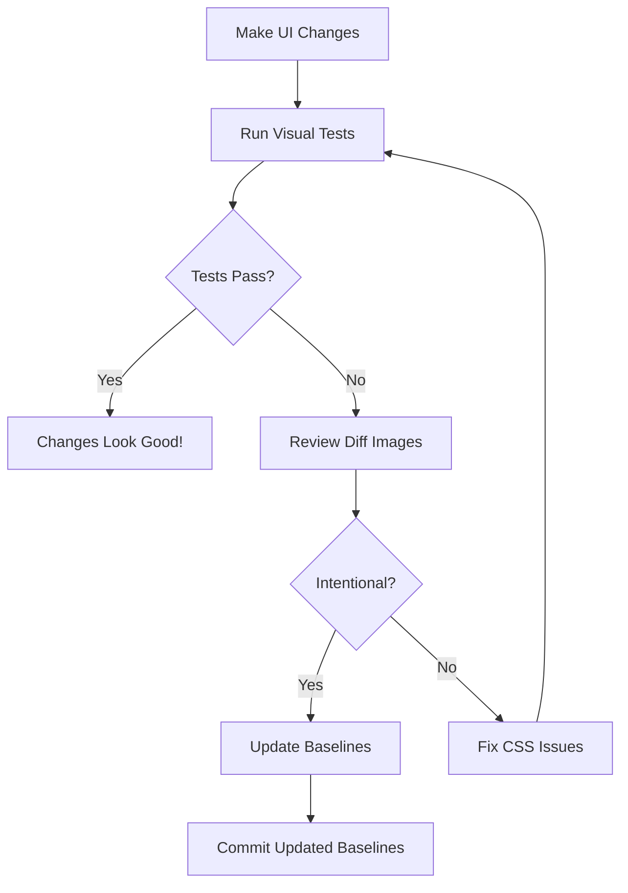

# Visual Regression Testing Guide 📸

**Framework**: Playwright Visual Comparisons
**Status**: ✅ Active with Baselines
**Baseline Count**: 7 screenshots

---

## 🎯 What is Visual Regression Testing?

Visual regression testing captures screenshots of your application and compares them against baseline images to detect unintended visual changes.

**Use Cases**:
- ✅ Catch CSS breaking changes
- ✅ Detect layout shifts
- ✅ Identify responsive design issues
- ✅ Verify cross-browser consistency
- ✅ Prevent UI regressions

---

## 📸 Current Baselines

**Location**: `tests/visual/visual-regression.spec.ts-snapshots/`

| Screenshot | Page | Status |
|------------|------|--------|
| `dashboard-chromium-darwin.png` | Dashboard | ✅ Created |
| `projects-list-chromium-darwin.png` | Projects | ✅ Created |
| `calendar-view-chromium-darwin.png` | Calendar | ✅ Created |
| `settings-chromium-darwin.png` | Settings | ✅ Created |
| `candidates-chromium-darwin.png` | Candidates | ✅ Created |
| `expenses-chromium-darwin.png` | Expenses | ✅ Created |
| `warehouse-chromium-darwin.png` | Warehouse | ✅ Created |

---

## 🚀 Quick Start

### 1. Run Visual Tests (Compare Against Baselines)

```bash
npx playwright test tests/visual/visual-regression.spec.ts --project=chromium
```

**Expected Output** (if no changes):
```
7 passed (25s)
```

**If Visual Differences Detected**:
```
✘ Dashboard visual snapshot - screenshot comparison failed
  Expected: dashboard-chromium-darwin.png
  Actual: dashboard-chromium-darwin-actual.png
  Diff: dashboard-chromium-darwin-diff.png
```

### 2. Update Baselines (After Intentional UI Changes)

```bash
npx playwright test tests/visual --update-snapshots
```

**When to Update**:
- ✅ After intentional UI changes
- ✅ After design updates
- ✅ After responsive improvements
- ❌ NOT for accidental CSS breaks

### 3. View Visual Diffs

When tests fail, check the diff images:

```bash
# Location of diff images
test-results/visual/
├── dashboard-chromium-darwin-actual.png    (New screenshot)
├── dashboard-chromium-darwin-expected.png  (Baseline)
└── dashboard-chromium-darwin-diff.png      (Highlighted differences)
```

Or use Playwright's built-in viewer:

```bash
npx playwright show-report
```

---

## 📝 Writing Visual Tests

### Basic Example

```typescript
import { test, expect } from '../support/fixtures/auth';

test('My page visual snapshot @visual', async ({ authenticatedPage }) => {
  await authenticatedPage.goto('/my-page');
  await authenticatedPage.waitForLoadState('networkidle');

  await expect(authenticatedPage).toHaveScreenshot('my-page.png', {
    fullPage: true,           // Capture entire page
    maxDiffPixels: 100,       // Allow 100 pixels difference
  });
});
```

### Component-Level Screenshot

```typescript
test('Button component visual', async ({ authenticatedPage }) => {
  await authenticatedPage.goto('/dashboard');

  const button = authenticatedPage.locator('button.primary');

  await expect(button).toHaveScreenshot('primary-button.png', {
    maxDiffPixelRatio: 0.01, // Allow 1% difference
  });
});
```

### With Hover State

```typescript
test('Button hover state visual', async ({ authenticatedPage }) => {
  await authenticatedPage.goto('/dashboard');

  const button = authenticatedPage.locator('button.primary');
  await button.hover();

  await expect(button).toHaveScreenshot('primary-button-hover.png');
});
```

### Responsive Screenshots

```typescript
test('Mobile dashboard visual', async ({ authenticatedPage }) => {
  await authenticatedPage.setViewportSize({ width: 375, height: 667 });
  await authenticatedPage.goto('/dashboard');

  await expect(authenticatedPage).toHaveScreenshot('dashboard-mobile.png', {
    fullPage: true,
  });
});
```

---

## ⚙️ Configuration Options

### Screenshot Options

```typescript
await expect(page).toHaveScreenshot('name.png', {
  // Full page or viewport only
  fullPage: true,              // Default: false

  // Clip specific area
  clip: {
    x: 0,
    y: 0,
    width: 800,
    height: 600,
  },

  // Tolerance for differences
  maxDiffPixels: 100,          // Max pixels that can differ
  maxDiffPixelRatio: 0.01,     // Max 1% of pixels can differ

  // Timeout
  timeout: 5000,               // 5 seconds

  // Animations
  animations: 'disabled',      // Disable animations for consistency

  // Masking (hide dynamic content)
  mask: [
    page.locator('.timestamp'),
    page.locator('.user-avatar'),
  ],
});
```

### Masking Dynamic Content

```typescript
test('Dashboard with masked dynamic content', async ({ authenticatedPage }) => {
  await authenticatedPage.goto('/dashboard');

  // Hide elements that change (timestamps, user names, etc.)
  await expect(authenticatedPage).toHaveScreenshot('dashboard-stable.png', {
    fullPage: true,
    mask: [
      authenticatedPage.locator('.timestamp'),
      authenticatedPage.locator('.user-name'),
      authenticatedPage.locator('.notification-badge'),
    ],
  });
});
```

---

## 🔄 Workflow

### Development Workflow



### Step-by-Step

1. **Make UI Changes**
   ```bash
   # Edit CSS, components, etc.
   ```

2. **Run Visual Tests**
   ```bash
   npx playwright test tests/visual --project=chromium
   ```

3. **If Tests Fail**
   ```bash
   # View the diff report
   npx playwright show-report

   # Check diff images in test-results/
   open test-results/visual/dashboard-chromium-darwin-diff.png
   ```

4. **If Changes Are Intentional**
   ```bash
   # Update baselines
   npx playwright test tests/visual --update-snapshots

   # Commit the new baselines
   git add tests/visual/*.png
   git commit -m "chore: update visual regression baselines"
   ```

5. **If Changes Are Bugs**
   ```bash
   # Fix the CSS
   # Re-run tests
   npx playwright test tests/visual
   ```

---

## 🎨 Best Practices

### ✅ DO

1. **Use Stable Test Data**
   ```typescript
   // Good: Use fixed data
   const testUser = { name: 'John Doe', email: 'test@example.com' };
   ```

2. **Disable Animations**
   ```typescript
   await expect(page).toHaveScreenshot('page.png', {
     animations: 'disabled',
   });
   ```

3. **Mask Dynamic Content**
   ```typescript
   mask: [
     page.locator('.timestamp'),
     page.locator('.live-data'),
   ]
   ```

4. **Wait for Network Idle**
   ```typescript
   await page.goto('/dashboard');
   await page.waitForLoadState('networkidle');
   ```

5. **Use Descriptive Names**
   ```typescript
   // Good
   'dashboard-admin-view-desktop.png'

   // Bad
   'test1.png'
   ```

### ❌ DON'T

1. **Don't Screenshot Dynamic Content**
   - Timestamps
   - User avatars
   - Live data feeds
   - Random IDs

2. **Don't Use Tight Tolerances**
   ```typescript
   // Too strict (will fail often)
   maxDiffPixels: 0

   // Better
   maxDiffPixels: 100
   maxDiffPixelRatio: 0.01
   ```

3. **Don't Screenshot Before Load**
   ```typescript
   // Bad
   await page.goto('/dashboard');
   await expect(page).toHaveScreenshot('dashboard.png');

   // Good
   await page.goto('/dashboard');
   await page.waitForLoadState('networkidle');
   await expect(page).toHaveScreenshot('dashboard.png');
   ```

---

## 🔍 Debugging Failed Visual Tests

### Step 1: View the Diff

```bash
# Open the HTML report
npx playwright show-report

# Or view diff images directly
open test-results/visual/*-diff.png
```

### Step 2: Analyze Differences

**Common Causes**:
- Font rendering differences
- Image loading timing
- Animation frames
- Dynamic content (timestamps, IDs)
- Scrollbar visibility
- Browser zoom level

### Step 3: Fix or Accept

**If Intentional**:
```bash
npx playwright test tests/visual --update-snapelines
```

**If Bug**:
- Fix CSS
- Update component
- Re-run tests

---

## 📊 Visual Test Examples

### Full Page Screenshots

```typescript
test.describe('Full Page Visuals @visual', () => {
  const pages = [
    '/dashboard',
    '/projects',
    '/calendar',
    '/candidates',
    '/expenses',
    '/settings',
  ];

  for (const path of pages) {
    test(`${path} page visual`, async ({ authenticatedPage }) => {
      await authenticatedPage.goto(path);
      await authenticatedPage.waitForLoadState('networkidle');

      const name = path.replace('/', '') || 'home';
      await expect(authenticatedPage).toHaveScreenshot(`${name}.png`, {
        fullPage: true,
        maxDiffPixels: 100,
      });
    });
  }
});
```

### Component Screenshots

```typescript
test('Button variants visual', async ({ page }) => {
  await page.goto('/components/buttons');

  // Primary button
  await expect(page.locator('.btn-primary')).toHaveScreenshot('btn-primary.png');

  // Secondary button
  await expect(page.locator('.btn-secondary')).toHaveScreenshot('btn-secondary.png');

  // Danger button
  await expect(page.locator('.btn-danger')).toHaveScreenshot('btn-danger.png');
});
```

### Responsive Screenshots

```typescript
test('Responsive dashboard visuals', async ({ page }) => {
  const viewports = [
    { name: 'mobile', width: 375, height: 667 },
    { name: 'tablet', width: 768, height: 1024 },
    { name: 'desktop', width: 1920, height: 1080 },
  ];

  for (const viewport of viewports) {
    await page.setViewportSize({ width: viewport.width, height: viewport.height });
    await page.goto('/dashboard');
    await page.waitForLoadState('networkidle');

    await expect(page).toHaveScreenshot(`dashboard-${viewport.name}.png`, {
      fullPage: true,
    });
  }
});
```

---

## 🚦 CI/CD Integration

### GitHub Actions (Already Configured)

Visual regression tests run automatically in CI:

```yaml
visual-regression:
  name: Visual Regression Tests
  runs-on: ubuntu-latest
  if: github.event_name == 'pull_request'

  steps:
    - uses: actions/checkout@v4
    - name: Run visual tests
      run: npx playwright test --grep @visual
    - name: Upload visual diffs
      if: always()
      uses: actions/upload-artifact@v4
      with:
        name: visual-diffs
        path: test-results/visual/
```

### Viewing CI Results

1. Go to GitHub Actions tab
2. Find your PR workflow run
3. Download "visual-diffs" artifact
4. Review diff images locally

---

## 📈 Maintenance

### When to Update Baselines

✅ **Update When**:
- Intentional design changes
- Layout improvements
- Typography updates
- Color scheme changes
- Component redesigns

❌ **Don't Update When**:
- Tests are flaky
- Random failures
- Haven't reviewed diffs
- Trying to "make tests pass"

### Baseline Management

```bash
# List all baselines
ls -lh tests/visual/visual-regression.spec.ts-snapshots/

# Remove old baselines
rm tests/visual/*-old.png

# Update specific test
npx playwright test tests/visual -g "Dashboard" --update-snapshots

# Update all visuals
npx playwright test tests/visual --update-snapshots
```

---

## 🎯 Current Coverage

| Page | Screenshot | Status |
|------|------------|--------|
| Dashboard | ✅ | Baseline created |
| Projects | ✅ | Baseline created |
| Calendar | ✅ | Baseline created |
| Settings | ✅ | Baseline created |
| Candidates | ✅ | Baseline created |
| Expenses | ✅ | Baseline created |
| Warehouse | ✅ | Baseline created |

---

## 🔧 Troubleshooting

### Issue: Flaky Visual Tests

**Solution**: Increase tolerance
```typescript
await expect(page).toHaveScreenshot('page.png', {
  maxDiffPixels: 200,        // Increase from 100
  maxDiffPixelRatio: 0.02,   // Increase from 0.01
});
```

### Issue: Font Rendering Differences

**Solution**: Mask text or use higher tolerance
```typescript
await expect(page).toHaveScreenshot('page.png', {
  mask: [page.locator('text, p, h1, h2, h3')],
});
```

### Issue: Tests Pass Locally, Fail in CI

**Cause**: Different OS rendering
**Solution**: Use Docker or update baselines in CI

---

## 📚 Resources

- [Playwright Visual Comparisons](https://playwright.dev/docs/test-snapshots)
- [Best Practices](https://playwright.dev/docs/best-practices)
- [CI Integration](https://playwright.dev/docs/ci)

---

**Status**: ✅ **Active**
**Baselines**: 7 pages
**Last Updated**: 2025-10-07
