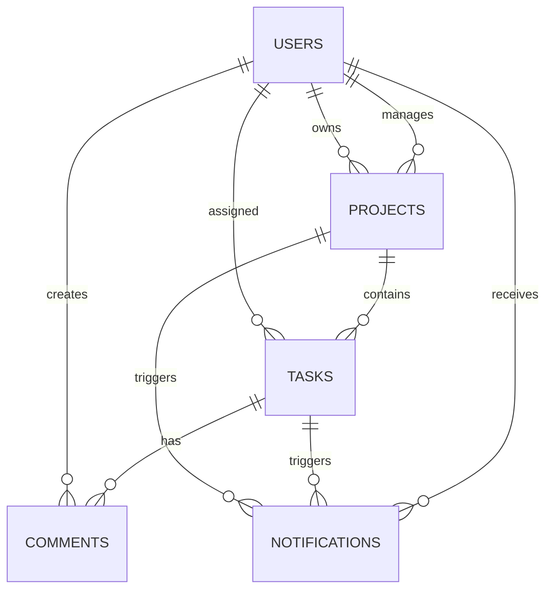

# BaitoAI Database Architecture

## Table Structure

### 1. Users Table
```sql
CREATE TABLE users (
  id UUID PRIMARY KEY REFERENCES users(id),
  email TEXT UNIQUE NOT NULL,
  full_name TEXT NOT NULL,
  role UserRole NOT NULL,
  is_super_admin BOOLEAN DEFAULT FALSE,
  company_name TEXT,
  contact_phone TEXT,
  created_at TIMESTAMPTZ DEFAULT NOW(),
  updated_at TIMESTAMPTZ DEFAULT NOW(),
  raw_user_meta_data JSONB,
  raw_app_meta_data JSONB
);

-- User Roles Enum
CREATE TYPE UserRole AS ENUM (
  'super_admin',
  'admin',
  'manager',
  'client',
  'staff'
);
```

### 2. Projects Table
```sql
CREATE TABLE projects (
  id UUID PRIMARY KEY DEFAULT uuid_generate_v4(),
  title TEXT NOT NULL,
  client_id UUID REFERENCES users(id),
  manager_id UUID REFERENCES users(id),
  status TEXT NOT NULL,
  priority TEXT NOT NULL,
  start_date TIMESTAMPTZ NOT NULL,
  end_date TIMESTAMPTZ,
  crew_count INTEGER NOT NULL,
  filled_positions INTEGER NOT NULL,
  working_hours_start TEXT NOT NULL,
  working_hours_end TEXT NOT NULL,
  event_type TEXT NOT NULL,
  venue_address TEXT NOT NULL,
  venue_details TEXT,
  supervisors_required INTEGER NOT NULL,
  color TEXT NOT NULL,
  deleted_at TIMESTAMPTZ,
  deleted_by UUID REFERENCES users(id),
  created_at TIMESTAMPTZ DEFAULT NOW(),
  updated_at TIMESTAMPTZ DEFAULT NOW()
);
```

### 3. Tasks Table
```sql
CREATE TABLE tasks (
  id UUID PRIMARY KEY DEFAULT uuid_generate_v4(),
  title TEXT NOT NULL,
  description TEXT,
  status TaskStatus NOT NULL,
  priority TEXT NOT NULL,
  project_id UUID REFERENCES projects(id),
  assigned_to UUID REFERENCES users(id),
  assigned_by UUID REFERENCES users(id),
  due_date TIMESTAMPTZ,
  created_at TIMESTAMPTZ DEFAULT NOW(),
  updated_at TIMESTAMPTZ DEFAULT NOW()
);

-- Task Status Enum
CREATE TYPE TaskStatus AS ENUM (
  'backlog',
  'todo',
  'doing',
  'done'
);
```

### 4. Comments Table
```sql
CREATE TABLE comments (
  id UUID PRIMARY KEY DEFAULT uuid_generate_v4(),
  task_id UUID REFERENCES tasks(id),
  text TEXT NOT NULL,
  created_by UUID REFERENCES users(id),
  created_at TIMESTAMPTZ DEFAULT NOW(),
  mentions JSONB
);
```

### 5. Notifications Table
```sql
CREATE TABLE notifications (
  id UUID PRIMARY KEY DEFAULT uuid_generate_v4(),
  user_id UUID REFERENCES users(id),
  type TEXT NOT NULL,
  task_id UUID REFERENCES tasks(id),
  project_id UUID REFERENCES projects(id),
  title TEXT NOT NULL,
  message TEXT NOT NULL,
  read BOOLEAN DEFAULT FALSE,
  created_at TIMESTAMPTZ DEFAULT NOW()
);
```

## Row Level Security (RLS) Policies

### Users Table Policies
```sql
-- Enable RLS
ALTER TABLE users ENABLE ROW LEVEL SECURITY;

-- Super Admin Access
CREATE POLICY "Super admins can do everything"
ON users FOR ALL TO authenticated
USING (
  users() IN (
    SELECT id FROM users WHERE is_super_admin = TRUE
  )
)
WITH CHECK (
  users() IN (
    SELECT id FROM users WHERE is_super_admin = TRUE
  )
);

-- Self Access
CREATE POLICY "Users can read their own data"
ON users FOR SELECT TO authenticated
USING (users() = id);
```

### Projects Table Policies
```sql
-- Enable RLS
ALTER TABLE projects ENABLE ROW LEVEL SECURITY;

-- Super Admin Access
CREATE POLICY "Super admins can manage all projects"
ON projects FOR ALL TO authenticated
USING (
  EXISTS (
    SELECT 1 FROM users
    WHERE users.id = users()
    AND users.is_super_admin = true
  )
);

-- Regular User Access
CREATE POLICY "Regular users can only see non-deleted projects"
ON projects FOR SELECT TO authenticated
USING (
  deleted_at IS NULL OR
  EXISTS (
    SELECT 1 FROM users
    WHERE users.id = users()
    AND users.is_super_admin = true
  )
);
```

## Authentication Metadata

### User Metadata Structure
```typescript
interface UserMetadata {
  raw_user_meta_data: {
    full_name: string;
    email_verified: boolean;
    is_super_admin: boolean; // Source of truth for super admin status
  };
  raw_app_meta_data: {
    role: string;
    provider: string;
    providers: string[];
  };
}
```

## Table Relationships

### Project Management


## Data Flow

### Project Lifecycle
1. Project Creation
   - Client assignment
   - Manager assignment
   - Status tracking
   - Soft delete capability

### Task Management
1. Task Assignment
   - User assignment
   - Status updates
   - Priority management
   - Comment system

### Notification System
1. Notification Types
   - Mentions
   - Assignments
   - Updates
2. Delivery Flow
   - User targeting
   - Real-time updates
   - Read status tracking

## Security Implementation

### Authentication Flow
1. User Authentication
   - Email/password verification
   - Session management
   - Token refresh

### Authorization Levels
1. Super Admin
   - Full system access
   - User management
   - Project restoration

2. Regular Admin
   - Limited access
   - View-only for deleted items
   - Project-specific access

### Data Protection
1. Row Level Security
   - Table-specific policies
   - Role-based access
   - Super admin overrides

## Backup and Recovery

### Soft Delete Implementation
1. Projects
   - Deletion timestamp
   - Deletion author tracking
   - Recovery capability

### Data Integrity
1. Foreign Key Constraints
   - Referential integrity
   - Cascade operations
   - Null constraints

## Performance Considerations

### Indexing Strategy
1. Primary Keys
   - UUID for scalability
   - Distributed systems support

2. Foreign Keys
   - Relationship optimization
   - Query performance

### Query Optimization
1. RLS Policies
   - Efficient filtering
   - Access control
   - Performance impact management
