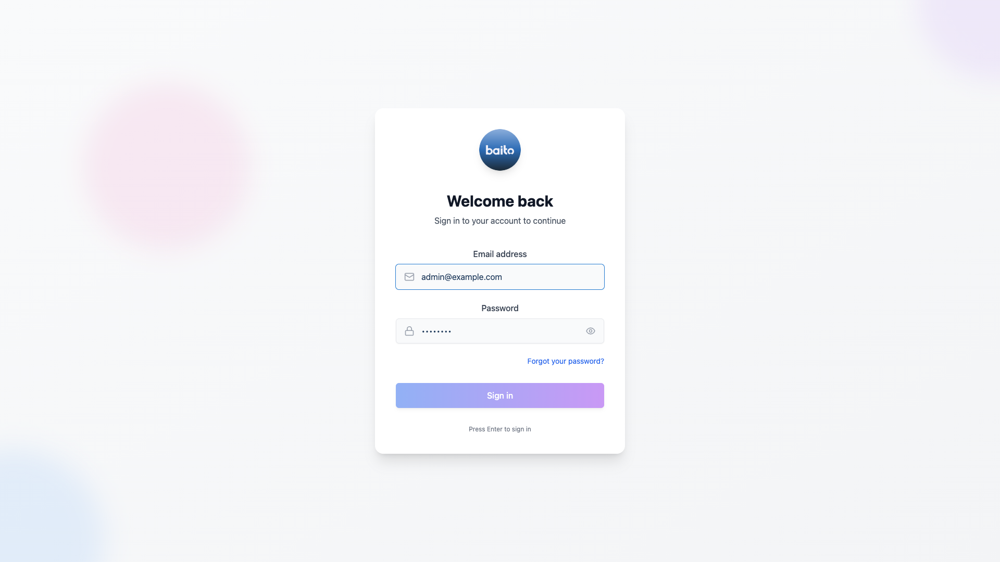
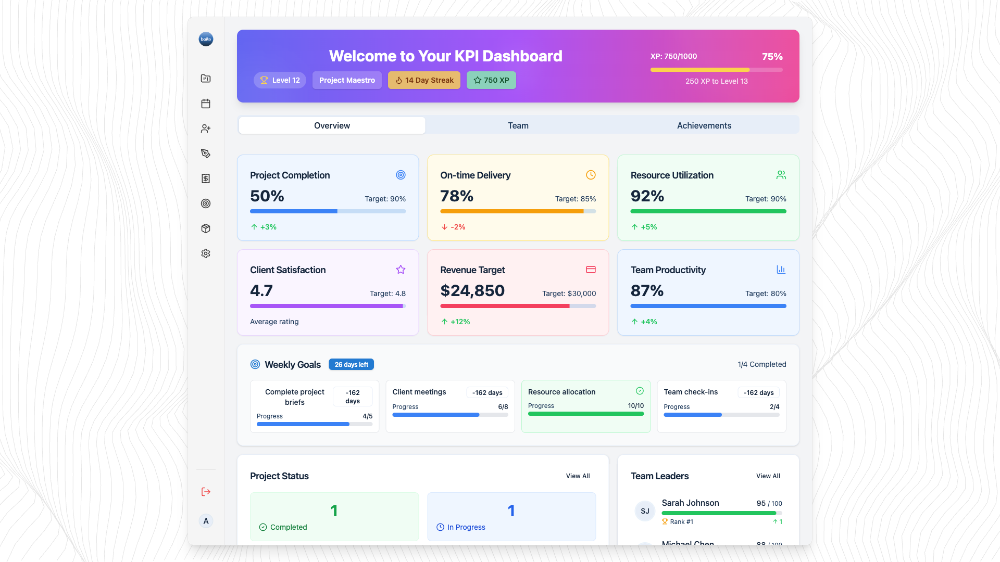

# Baito AI - Complete Project Management User Guide

**Version**: 1.0
**Last Updated**: 2025-10-04
**Audience**: Project Managers, System Administrators
**Purpose**: Step-by-step guide with screenshots for managing projects from creation to completion

---

## Table of Contents

1. [Getting Started](#1-getting-started)
2. [Dashboard Overview](#2-dashboard-overview)
3. [Creating a New Project](#3-creating-a-new-project)
4. [Editing Project Details](#4-editing-project-details)
5. [Managing Staff](#5-managing-staff)
6. [Staff Replacement](#6-staff-replacement)
7. [Payroll Management](#7-payroll-management)
8. [Document Management](#8-document-management)
9. [Exporting Project Data](#9-exporting-project-data)
10. [Generating Invoices](#10-generating-invoices)
11. [Search and Filters](#11-search-and-filters)
12. [Troubleshooting](#12-troubleshooting)

---

## 1. Getting Started

### 1.1 Logging In

**Step 1**: Navigate to the Baito AI login page



**Step 2**: Enter your credentials
- **Email**: Your registered email address
- **Password**: Your password

**Step 3**: Click the "**Login**" button

**Expected Result**: You will be redirected to the Projects Dashboard

> **Tip**: If you forget your password, click "Forgot Password?" to reset it.

---

### 1.2 First-Time Setup

After logging in for the first time:

1. Review your user profile (click profile icon in top-right)
2. Verify your permissions and role
3. Familiarize yourself with the dashboard layout

---

## 2. Dashboard Overview


### 2.1 Dashboard Components

#### A. Header Section
- **Logo**: Click to return to dashboard
- **Month Selector**: Navigate between months to view projects
- **Search Bar**: Quick search for projects
- **User Menu**: Access profile, settings, logout

#### B. Metrics Cards
- **Total Projects**: Count of all projects in the system
- **Active Projects**: Projects currently in progress
- **Completed Projects**: Successfully finished projects
- **This Month**: Projects scheduled for the selected month

#### C. Filter Bar
- **All**: View all projects
- **Planning**: Projects in planning phase
- **Confirmed**: Confirmed and ready to execute
- **In Progress**: Currently running projects
- **Completed**: Finished projects
- **Cancelled**: Cancelled projects

#### D. Action Buttons
- **New Project**: Create a new project
- **Filter Menu**: Advanced filtering options
- **View Toggle**: Switch between grid and list view

#### E. Project Cards
Each card displays:
- Project title and colored border (indicating priority/category)
- Status badge (Planning, Confirmed, etc.)
- Priority badge (Low, Medium, High)
- Dates (start - end date)
- Working hours
- Venue address
- Staff count (filled/total)
- "View Details" button

---

### 2.2 Navigating the Dashboard

**To view projects for a specific month**:
1. Click the month dropdown at the top
2. Select desired month and year
3. Projects for that month will display


**To filter projects by status**:
1. Click status tab (All, Planning, Confirmed, etc.)
2. Project list filters automatically

**To search for a project**:
1. Type project name in search bar
2. Results filter in real-time as you type


---

## 3. Creating a New Project

### 3.1 Starting the Creation Process

**Step 1**: Click the "**New Project**" button on the dashboard


**Step 2**: The multi-step project creation dialog opens

---

### 3.2 Step 1: Project Information


Fill in the following **required fields**:

| Field | Description | Example |
|-------|-------------|---------|
| **Project Title** | Name of the project | "Summer Festival 2025" |
| **Company** | Select client company from dropdown | "ABC Corporation" |
| **Project Manager** | Select responsible manager | "Sarah Chen" |
| **Start Date** | Project start date | "2025-07-15" |

**Optional fields**:
- **End Date**: Project end date (defaults to start date if single-day event)
- **Description**: Additional project details

**Step 3**: Click "**Next**" to proceed

> **Validation**: Fields marked with * are required. You cannot proceed without filling them.

---

### 3.3 Step 2: Event Details


Configure project settings:

| Field | Options | Description |
|-------|---------|-------------|
| **Project Type** | Recruitment, Internal Event, Custom | Type of project |
| **Priority** | Low, Medium, High | Priority level |
| **Status** | Planning, Confirmed, In Progress | Initial status |
| **Brand Logo** | Upload or select | Optional branding |

**Step 4**: Click "**Next**" to continue

---

### 3.4 Step 3: Location


Enter venue information:

| Field | Description | Example |
|-------|-------------|---------|
| **Venue Address** | Full address of event location | "Central Park, New York, NY" |
| **Venue Details** | Additional location info (optional) | "Main stage area, near fountain" |

**Step 5**: Click "**Next**"

---

### 3.5 Step 4: Schedule


Define working hours:

| Field | Description | Example |
|-------|-------------|---------|
| **Schedule Type** | Single, Recurring, Multiple | "Multiple days" |
| **Working Hours Start** | Start time (24-hour format) | "08:00" |
| **Working Hours End** | End time (24-hour format) | "18:00" |

**Step 6**: Click "**Next**"

---

### 3.6 Step 5: Staffing


Set staffing requirements:

| Field | Description | Example |
|-------|-------------|---------|
| **Crew Count** | Total staff needed | 25 |
| **Supervisors Required** | Number of supervisors | 3 |
| **Special Skills** | Required skills (optional) | "Event management, crowd control" |

**Step 7**: Click "**Next**"

---

### 3.7 Step 6: Advanced Settings


Configure additional options:

| Field | Description | Example |
|-------|-------------|---------|
| **Budget** | Project budget (optional) | $15,000 |
| **Invoice Number** | Invoice reference (optional) | "INV-2025-001" |
| **Project Color** | Color code for calendar | Blue |

**Step 8**: Click "**Next**"

---

### 3.8 Step 7: Review & Save


**Step 9**: Review all entered information
- Check all details for accuracy
- Use "**Back**" button to edit any section

**Step 10**: Click "**Create Project**"

**Expected Result**:
- ✅ Success message appears
- ✅ Project is created in database
- ✅ You're redirected to dashboard or project details
- ✅ New project appears in project list


---

## 4. Editing Project Details

### 4.1 Opening Project for Editing

**Step 1**: Locate the project card on the dashboard

**Step 2**: Click "**View Details**" button



**Step 3**: Project details dialog opens


**Step 4**: Click "**Edit**" button (top-right or bottom of dialog)

---

### 4.2 Editing Fields


**Step 5**: Modify any editable fields:
- Project title
- Venue address and details
- Working hours
- Crew count
- Budget
- Status and priority

**Step 6**: Click "**Save Changes**"

**Expected Result**:
- ✅ Success toast notification appears
- ✅ Changes persist to database
- ✅ Project card updates with new information


---

### 4.3 Cancelling Edits

If you want to discard changes:

**Step 1**: Click "**Cancel**" button

**Expected Result**:
- All changes are discarded
- Original values restored
- No database updates

---

## 5. Managing Staff

### 5.1 Accessing the Staffing Tab

**Step 1**: Open project details

**Step 2**: Click "**Staffing**" tab


**Staff Sections**:
- **Applicants** (Pending): Staff who have applied but not yet confirmed
- **Confirmed Staff**: Staff confirmed to work on project
- **On Hold**: Staff temporarily on hold
- **Rejected**: Staff who were rejected

---

### 5.2 Adding Staff to Project

**Step 1**: Click "**Add Staff**" button


**Step 2**: Add Staff dialog opens


**Step 3**: Search for candidate
- Type candidate name in search field
- Results appear as you type
- Select candidate from dropdown


**Step 4**: Set staff details

| Field | Description | Options |
|-------|-------------|---------|
| **Designation** | Role/position | Event Coordinator, Supervisor, etc. |
| **Application Type** | Full project or specific dates | "Full project" / "Specific dates" |
| **Status** | Initial status | Pending, Confirmed |

**If "Specific dates" selected**:

**Step 5**: Select working dates


- Click dates on calendar
- Selected dates highlight
- Can select multiple non-consecutive dates

**Step 6**: Set daily salary (optional)


- Enter daily rate for each selected date
- Can set different rates for different dates

**Step 7**: Click "**Add to Project**"

**Expected Result**:
- ✅ Staff member added to Applicants or Confirmed list (based on initial status)
- ✅ Database record created in `project_staff`
- ✅ Project staff count updates
- ✅ Conflict detection runs (if staff already assigned elsewhere)


---

### 5.3 Conflict Detection

If the selected staff has a schedule conflict:


**Conflict Warning displays**:
- Conflicting project name
- Overlapping dates
- Warning message

**Options**:
1. **Cancel**: Choose a different staff member
2. **Override**: Proceed with assignment (conflict logged)

---

### 5.4 Changing Staff Status

**Step 1**: Locate staff member in list

**Step 2**: Click status dropdown


**Step 3**: Select new status:
- **Confirmed**: Move to Confirmed Staff
- **Pending**: Move to Applicants
- **Hold**: Move to On Hold
- **Rejected**: Move to Rejected

**Expected Result**:
- ✅ Status updates immediately in database
- ✅ Staff member moves to appropriate section
- ✅ Project filled_positions count updates


---

### 5.5 Removing Staff from Project

**Step 1**: Locate staff member

**Step 2**: Click "**Remove**" button or icon


**Step 3**: Confirmation dialog appears

**Step 4**: Click "**Confirm**" to remove

**Expected Result**:
- ✅ Staff member removed from project
- ✅ Database record deleted
- ✅ Staff count decrements

---

### 5.6 Bulk Staff Operations

**Confirming Multiple Applicants**:

**Step 1**: Select multiple applicants using checkboxes


**Step 2**: Click "**Confirm All**" button

**Step 3**: Confirmation dialog shows count

**Step 4**: Click "**Confirm**"

**Expected Result**:
- ✅ All selected staff move to Confirmed section
- ✅ Success message shows count: "8 staff members confirmed"


---

## 6. Staff Replacement

### 6.1 When to Use Replacement

Use the replacement feature when:
- A confirmed staff member calls in sick
- Emergency prevents staff from working
- Staff doesn't show up (no-show)
- Other unexpected reasons

---

### 6.2 Replacing a Staff Member

**Step 1**: In Staffing tab, locate the staff member to replace

**Step 2**: Click "**Replace**" button


**Step 3**: Replacement dialog opens


**Step 4**: Select replacement reason
- Sick leave
- Emergency
- No-show
- Other

**Step 5**: Search for replacement candidate
- Type name in search field
- Select from results

**Step 6**: Configure replacement details
- Dates (inherited from original staff, can modify)
- Salary (inherited, can modify)
- Designation

**Step 7**: Click "**Confirm Replacement**"

**Expected Result**:
- ✅ Original staff marked as "Replaced" with reason
- ✅ Replacement staff added with "Replacement" badge
- ✅ Database records both with relationship
- ✅ Project staff count remains accurate
- ✅ Optional: Notification sent to relevant parties


---

### 6.3 Viewing Replacement Details

Replacement staff display with:
- **Badge**: "Replacement" label
- **Info**: "Replacing: [Original Staff Name]"
- **Reason**: Sick leave / Emergency / etc.


---

## 7. Payroll Management

### 7.1 Accessing Payroll

**Step 1**: Open project details

**Step 2**: Click "**Payroll**" or "**Finance**" tab


---

### 7.2 Viewing Payroll Summary

The Payroll tab displays:

| Column | Description |
|--------|-------------|
| **Staff Name** | Name and photo |
| **Designation** | Role/position |
| **Working Dates** | Dates assigned to work |
| **Daily Rate** | Salary per day |
| **Days Worked** | Count of working days |
| **Total** | Daily rate × days worked |

**Bottom Summary**:
- **Total Staff**: Count of confirmed staff
- **Total Payroll**: Sum of all staff totals
- **Average per Staff**: Total ÷ staff count


---

### 7.3 Editing Staff Salary

**Step 1**: Click "**Edit**" button for staff member


**Step 2**: Salary edit dialog opens

**Step 3**: Modify salary details:
- Change daily rate
- Adjust specific date rates
- Modify total

**Step 4**: Click "**Save**"

**Expected Result**:
- ✅ Salary updates in database
- ✅ Total payroll recalculates automatically
- ✅ Summary updates


---

### 7.4 Saving Payroll

**Step 1**: After reviewing/editing all salaries

**Step 2**: Click "**Save Payroll**" button

**Expected Result**:
- ✅ All payroll data persisted to database
- ✅ Locked for historical record (optional)
- ✅ Ready for invoice generation

---

### 7.5 Payroll Validation

The system validates:
- ✅ All confirmed staff have salary data
- ✅ No negative or zero salaries
- ✅ Calculations are accurate

**If validation fails**:
- ❌ Error message displays
- ❌ Highlights staff with missing/invalid data
- ❌ Cannot save until fixed


---

## 8. Document Management

### 8.1 Accessing Documents

**Step 1**: Open project details

**Step 2**: Click "**Documents**" tab


---

### 8.2 Uploading a Document

**Step 1**: Click "**Add Document**" or "**Upload**" button


**Step 2**: Upload dialog opens


**Step 3**: Select file from your computer
- Click "Choose File" or drag-and-drop
- Supported formats: PDF, DOC, DOCX, XLS, XLSX, JPG, PNG, GIF
- Max size: 10MB

**Step 4**: Enter document details

| Field | Description | Example |
|-------|-------------|---------|
| **Document Name** | Descriptive name | "Event Permit" |
| **Description** | Additional info (optional) | "City permit for event" |
| **Type** | Category | Contract, Legal, Invoice, Other |

**Step 5**: Click "**Upload**"

**Upload Progress**:
- Progress bar shows upload status
- Percentage complete displayed


**Expected Result**:
- ✅ File uploaded to Supabase storage
- ✅ Document metadata saved to database
- ✅ Document appears in list
- ✅ Success notification


---

### 8.3 Adding External Links

For documents hosted externally:

**Step 1**: Click "**Add External Link**"


**Step 2**: Enter link details

| Field | Description | Example |
|-------|-------------|---------|
| **Link URL** | Full URL | "https://docs.google.com/..." |
| **Link Name** | Display name | "Shared Planning Doc" |
| **Description** | Optional details | "Team collaboration document" |

**Step 3**: Click "**Save**"

**Expected Result**:
- ✅ Link saved to database
- ✅ Appears in documents list with link icon
- ✅ Clicking opens in new tab

---

### 8.4 Viewing Documents

Documents list displays:


**For each document**:
- **Name**: Document title
- **Type**: Category badge
- **Size**: File size (for uploads)
- **Uploaded**: Date and user
- **Actions**:
  - **Download**: Download file
  - **Preview**: View (for images/PDFs)
  - **Delete**: Remove document

---

### 8.5 Downloading Documents

**Step 1**: Click "**Download**" button/icon

**Expected Result**:
- ✅ File downloads to your computer
- ✅ Original filename preserved

---

### 8.6 Deleting Documents

**Step 1**: Click "**Delete**" button/icon


**Step 2**: Confirmation dialog appears

**Step 3**: Click "**Confirm**"

**Expected Result**:
- ✅ File removed from Supabase storage
- ✅ Database record deleted
- ✅ Document removed from list

---

### 8.7 Document Upload Errors

**File too large (> 10MB)**:


- Error message: "File size exceeds 10MB limit"
- Upload cancelled
- Select a smaller file

**Invalid file type**:

- Error message: "File type not supported"
- Only allowed types can be uploaded

**Upload failure**:

- Error message: "Upload failed. Please try again."
- Check internet connection
- Retry upload

---

## 9. Exporting Project Data

### 9.1 Accessing Export Options

**Method 1**: From project details dialog

**Step 1**: Open project details
**Step 2**: Click "**Export**" button


**Method 2**: From project card (if available)

**Step 1**: Click "**•••**" menu on project card
**Step 2**: Select "**Export**"

---

### 9.2 Selecting Export Format

**Export Options Dialog**:


**Choose Format**:

| Format | Description | Use Case |
|--------|-------------|----------|
| **CSV** | Basic comma-separated values | Import to other systems |
| **Excel** | Formatted Excel file (multi-sheet) | Professional reporting |
| **PDF** | Printable project summary | Sharing with clients |

**Choose Data to Include**:
- ☑ Project Information
- ☑ Staff List
- ☑ Financial Summary
- ☑ Documents List
- ☑ Working Dates

**Step 3**: Select desired format and data

**Step 4**: Click "**Download**" or "**Generate**"

---

### 9.3 CSV Export

**Expected File Content**:
```csv
Project Title,Client,Start Date,End Date,Status,Staff Count,Budget
Summer Festival 2025,ABC Corp,2025-07-15,2025-07-17,Planning,25,$15000

Staff Name,Designation,Status,Daily Rate,Days Worked,Total
John Doe,Event Coordinator,Confirmed,$150,3,$450
Jane Smith,Supervisor,Confirmed,$200,3,$600
```


---

### 9.4 Excel Export

**Expected File Structure**:

**Sheet 1: Project Info**
- Project details in formatted table
- Color-coded status

**Sheet 2: Staff List**
- Staff with roles, dates, salaries
- Calculated totals

**Sheet 3: Financial Summary**
- Payroll breakdown
- Budget vs actual
- Charts (if enabled)


---

### 9.5 PDF Export

**Expected PDF Layout**:

**Page 1: Project Overview**
- Company logo
- Project title and details
- Status and priority
- Venue information

**Page 2: Staff List**
- Table of confirmed staff
- Roles and working dates

**Page 3: Financial Summary**
- Payroll totals
- Budget information


---

## 10. Generating Invoices

### 10.1 Accessing Invoice Generation

**Step 1**: Open project details

**Step 2**: Navigate to "**Finance**" or "**Invoice**" section

**Step 3**: Click "**Generate Invoice**" button


---

### 10.2 Invoice Preview

**Invoice Preview Dialog**:


**Invoice Components**:

**Header**:
- Company logo (yours)
- Invoice title
- Invoice number (auto-generated or custom)
- Date

**Client Information**:
- Client company name
- Client address
- Client contact

**Project Details**:
- Project title
- Project dates
- Venue

**Line Items**:
- Staff costs breakdown (per role or per person)
- Subtotal
- Tax (if applicable)
- Total amount

**Footer**:
- Payment terms
- Due date
- Bank details (optional)
- Thank you message

---

### 10.3 Editing Invoice Details

**Step 1**: Click "**Edit**" (if available)

**Editable Fields**:
- Invoice number
- Line item descriptions
- Line item amounts
- Notes/terms

**Step 2**: Make changes

**Step 3**: Preview updates in real-time

---

### 10.4 Downloading Invoice

**Step 1**: Review invoice preview

**Step 2**: Click "**Download PDF**" or "**Generate Invoice**"

**Expected Result**:
- ✅ Professional PDF invoice downloads
- ✅ Filename: `Invoice_[ProjectName]_[InvoiceNumber].pdf`
- ✅ Invoice saved to project documents automatically
- ✅ Database updated with invoice record


---

### 10.5 Invoice Calculations

**How Totals are Calculated**:

1. **Staff Costs**:
   - Sum of all confirmed staff totals from Payroll tab
   - `Total = Σ (daily_rate × days_worked)`

2. **Overhead/Markup** (if configured):
   - Additional percentage or fixed amount
   - `Overhead = Staff Costs × overhead_percentage`

3. **Subtotal**:
   - `Subtotal = Staff Costs + Overhead`

4. **Tax** (if applicable):
   - `Tax = Subtotal × tax_rate`

5. **Grand Total**:
   - `Total = Subtotal + Tax`

**Example**:
```
Staff Costs:        $5,000
Overhead (20%):     $1,000
----------------------------
Subtotal:           $6,000
Tax (10%):          $  600
----------------------------
Total:              $6,600
```

---

### 10.6 Re-generating Invoices

If you need to generate multiple versions:

**Step 1**: Click "**Generate Invoice**" again

**Step 2**: System creates new version with updated data

**Expected Behavior**:
- Previous invoice retained in documents
- New invoice number (e.g., INV-001-v2)
- Latest data reflected

---

## 11. Search and Filters

### 11.1 Using the Search Bar


**Step 1**: Click in search bar (top of dashboard)

**Step 2**: Type search query:
- Project title: "Summer"
- Company name: "ABC"
- Venue: "Central Park"

**Step 3**: Results filter in real-time

**Expected Behavior**:
- Results appear as you type (debounced 300ms)
- Matching text highlighted
- No results shows empty state


---

### 11.2 Filtering by Status

**Step 1**: Click status filter tab:
- **All**: Show all projects
- **Planning**: Only planning status
- **Confirmed**: Only confirmed
- **In Progress**: Currently running
- **Completed**: Finished projects
- **Cancelled**: Cancelled projects

**Step 2**: Project list updates automatically


---

### 11.3 Filtering by Month

**Step 1**: Click month dropdown

**Step 2**: Select month and year

**Expected Result**:
- Shows projects with start_date in selected month
- Month displayed in header


---

### 11.4 Advanced Filters

**Step 1**: Click "**Filter**" button (filter icon)

**Step 2**: Advanced filter menu opens


**Filter Options**:
- **Priority**: Low, Medium, High
- **Date Range**: Custom start/end dates
- **Company**: Select specific company
- **Manager**: Filter by project manager
- **Crew Size**: Min/max staff count

**Step 3**: Apply filters

**Step 4**: Click "**Clear Filters**" to reset

---

### 11.5 Combining Filters

You can combine multiple filters:

**Example**:
- **Search**: "Festival"
- **Status**: "Confirmed"
- **Month**: "July 2025"
- **Priority**: "High"

**Result**: Shows only confirmed, high-priority festival projects in July 2025


---

## 12. Troubleshooting

### 12.1 Common Issues

#### Issue: "Failed to create project"

**Possible Causes**:
- Missing required fields
- Database connection error
- Network timeout

**Solutions**:
1. Check all required fields are filled (marked with *)
2. Check internet connection
3. Try again after a moment
4. If persists, contact support

---

#### Issue: "File upload failed"

**Possible Causes**:
- File too large (> 10MB)
- Unsupported file type
- Network interruption

**Solutions**:
1. Check file size (compress if needed)
2. Verify file type is supported
3. Retry upload
4. Try different file

---

#### Issue: "Staff conflict detected"

**Explanation**: Staff member is already assigned to another project on overlapping dates

**Options**:
1. **Cancel**: Choose different staff
2. **Override**: Proceed anyway (creates double-booking)

**Recommendation**: Cancel and choose alternate staff unless override is necessary


---

#### Issue: "Changes not saving"

**Possible Causes**:
- Network issue
- Session expired
- Validation error

**Solutions**:
1. Check for validation error messages
2. Check internet connection
3. Refresh page and try again
4. Log out and log back in

---

#### Issue: "Project not appearing on dashboard"

**Possible Causes**:
- Wrong month selected
- Active filter excludes it
- Search term doesn't match

**Solutions**:
1. Clear search bar
2. Select "All" status filter
3. Navigate to correct month
4. Click "Clear Filters" to reset

---

### 12.2 Error Messages Reference

| Error Message | Meaning | Solution |
|---------------|---------|----------|
| "Title is required" | Project title field is empty | Enter a project title |
| "Company must be selected" | No company chosen | Select a company from dropdown |
| "End date must be after start date" | Invalid date range | Adjust dates |
| "File size exceeds 10MB" | File too large | Compress or choose smaller file |
| "Failed to save changes" | Database error | Check connection, retry |
| "Session expired" | Login session timed out | Log in again |
| "Permission denied" | Insufficient user permissions | Contact administrator |

---

### 12.3 Performance Tips

**For faster loading**:
1. Filter projects to specific month (reduces data loaded)
2. Use list view instead of grid for large datasets
3. Clear browser cache if experiencing slowness
4. Close unused browser tabs

**For large projects**:
1. Use pagination if available
2. Export data for offline viewing
3. Filter to relevant staff only

---

### 12.4 Browser Compatibility

**Recommended Browsers**:
- ✅ Chrome (latest)
- ✅ Firefox (latest)
- ✅ Safari (latest)
- ✅ Edge (latest)

**Not Supported**:
- ❌ Internet Explorer (any version)
- ❌ Very old browser versions

**Check for Updates**: Keep your browser updated for best experience

---

### 12.5 Mobile Usage

**Supported Devices**:
- ✅ iOS (iPhone, iPad)
- ✅ Android phones and tablets

**Mobile Tips**:
1. Use landscape mode for better form viewing
2. Tap-and-hold for additional options
3. Swipe to navigate (if enabled)
4. Use native file pickers for uploads


---

### 12.6 Getting Help

**Support Channels**:

1. **In-App Help**: Click "?" icon for contextual help

2. **Documentation**: Access full docs at [link]

3. **Email Support**: support@baitoai.com

4. **Live Chat**: Click chat icon (bottom-right)

**When Contacting Support, Provide**:
- Screenshot of error (if applicable)
- Description of what you were trying to do
- Browser and OS version
- Project ID or name (if relevant)

---

## Appendix A: Keyboard Shortcuts

| Shortcut | Action |
|----------|--------|
| `Ctrl/Cmd + N` | New Project |
| `Ctrl/Cmd + F` | Focus Search |
| `Ctrl/Cmd + S` | Save (when editing) |
| `Esc` | Close dialog |
| `Tab` | Navigate form fields |
| `Enter` | Submit form |

---

## Appendix B: Best Practices

### Project Management
- ✅ Create projects as soon as dates are confirmed
- ✅ Update status regularly (Planning → Confirmed → In Progress → Completed)
- ✅ Set realistic crew counts based on venue and event size
- ✅ Use priority levels to organize workload

### Staffing
- ✅ Confirm staff as early as possible
- ✅ Review schedule conflicts before overriding
- ✅ Keep replacement reasons documented
- ✅ Update statuses immediately when circumstances change

### Financial
- ✅ Review payroll before generating invoices
- ✅ Save payroll after finalizing staff assignments
- ✅ Generate invoices promptly after project completion
- ✅ Keep budget updated as costs change

### Documentation
- ✅ Upload important documents (permits, contracts) immediately
- ✅ Use descriptive document names
- ✅ Organize with document types
- ✅ Delete outdated documents

---

## Appendix C: Screenshot Index

This guide references 64+ screenshots. Screenshots should be captured for:

1. **Login & Dashboard** (001-004)
2. **Project Creation** (005-013)
3. **Project Editing** (014-017)
4. **Staffing** (018-030)
5. **Replacement** (031-034)
6. **Payroll** (035-039)
7. **Documents** (040-048)
8. **Export** (049-053)
9. **Invoices** (054-056)
10. **Search/Filter** (057-062)
11. **Troubleshooting** (063-064)

**Screenshot Naming Convention**:
`[NUMBER]-[feature]-[description].png`

Example: `001-login-page.png`

---

## Appendix D: Glossary

| Term | Definition |
|------|------------|
| **Applicant** | Staff member who has applied but not confirmed |
| **Confirmed Staff** | Staff member confirmed to work on project |
| **Crew Count** | Total number of staff needed for project |
| **Designation** | Role or position of staff member |
| **Filled Positions** | Number of confirmed staff assigned |
| **Override** | Bypass a warning (e.g., schedule conflict) |
| **Payroll** | Total staff costs for a project |
| **Replacement** | Staff member substituting for another |
| **Schedule Conflict** | Staff assigned to multiple projects on same dates |
| **Status** | Current phase of project (Planning, Confirmed, etc.) |
| **Working Dates** | Specific dates a staff member is assigned to work |

---

## Document Information

**Version History**:
- v1.0 (2025-10-04): Initial creation with complete workflow

**Contributors**:
- Quinn (Test Architect) - Test design and scenarios
- Sarah Chen (Project Manager) - User journey mapping
- Development Team - Feature implementation

**Related Documents**:
- [User Journey Map](../qa/user-journeys/project-workflow-scenarios.md)
- [Test Design Document](../qa/assessments/1.1-test-design-20251004.md)
- [User Story](../qa/stories/1.1-project-workflow-complete-testing.md)

**Feedback**:
Please send feedback or suggestions to: documentation@baitoai.com

---

**End of User Guide**

---

## Next Steps for Screenshot Capture

To complete this guide, you need to capture actual screenshots:

1. **Set up test environment** with sample data
2. **Navigate through each workflow** following this guide
3. **Capture screenshots** at each step
4. **Save with naming convention** (001-xxx.png)
5. **Store in**: `docs/user-guides/screenshots/`
6. **Update guide** with actual screenshot file references

**Screenshot Requirements**:
- Resolution: 1920x1080 (desktop), 375x667 (mobile)
- Format: PNG with compression
- Annotations: Add arrows/callouts for clarity
- Privacy: Blur sensitive data (emails, real names)

---

**Guide Status**: ✅ Structure Complete - Ready for Screenshot Capture
