# Baito AI Chatbot UX/UI Specification

_Generated on 2025-10-07 by Kevin_

## Executive Summary

The AI Chatbot Assistant is an intelligent conversational interface designed to revolutionize how users interact with the Baito-AI staffing and project management platform. This floating chat widget provides a natural language interface that eliminates complex navigation, reduces task completion time by 40-60%, and makes the platform accessible to users of all technical skill levels.

The chatbot serves as an agentic AI assistant that can query data, create and update records, provide proactive suggestions, and handle complex multi-step workflows through simple conversation. It targets four primary user personas across operations, field coordination, administration, and finance roles.

**Project Type:** Web-based AI chat widget (mobile-responsive)
**Target Users:** Operations managers, field coordinators, admin staff, finance managers
**Core Value Proposition:** Natural language interface that reduces learning curve, increases productivity, and provides 24/7 intelligent assistance

---

## 1. UX Goals and Principles

### 1.1 Target User Personas

#### Primary Persona: Non-Tech-Savvy Admin (Lin)
- **Role**: System administrator and data entry
- **Language**: Chinese only
- **Tech Savvy**: Low (not comfortable with technology)
- **Primary Goals**:
  - Enter and update data without complex forms
  - Check project and staff information quickly
  - Handle daily administrative tasks
- **Pain Points**:
  - Struggles with English interfaces
  - Gets lost in complex navigation
  - Needs frequent help with basic tasks
  - Prefers visual/picture-based interfaces
- **Success Criteria**: Can complete daily tasks independently without training

#### Secondary Persona: Non-Tech-Savvy Manager (David)
- **Role**: Operations and team management
- **Language**: Bilingual (Chinese/English)
- **Tech Savvy**: Low-Medium
- **Primary Goals**:
  - Monitor projects and team performance
  - Make quick staffing decisions
  - Approve expenses and payments
- **Pain Points**:
  - Limited time for system training
  - Needs mobile access while on-site
  - Prefers simple, direct interactions
- **Success Criteria**: Can manage operations efficiently from phone

#### Supporting Persona: Field Staff (Multiple)
- **Role**: On-site coordination and operations
- **Language**: Primarily Chinese, some English
- **Tech Savvy**: Low-Medium (trainable)
- **Primary Goals**:
  - Check schedules and assignments
  - Update attendance and status
  - Submit expense claims with photos
- **Pain Points**:
  - Limited training time
  - Must work while mobile
  - Need simple, memorable workflows
- **Success Criteria**: Remember how to use after one training session

### 1.2 Usability Goals

**1. Zero Learning Curve**
- Interface works like familiar messaging apps (WhatsApp, WeChat)
- No manual or training required to get started
- Natural conversation replaces complex forms
- Success metric: New users productive within 5 minutes

**2. Multilingual Support (Chinese + English)**
- Seamless language switching within conversations
- AI automatically detects and responds in user's language
- No buried language settings or configuration
- All UI elements localized (buttons, labels, messages)
- Success metric: 100% Chinese-language task completion

**3. Mobile-First Design**
- Primary interface optimized for smartphone use
- Large, thumb-friendly touch targets (minimum 48px)
- Works perfectly on small screens (320px+)
- Desktop experience is enhancement, not requirement
- Success metric: 80%+ of interactions on mobile devices

**4. Visual Feedback and Clarity**
- Show, don't tell - use colors, icons, and images
- Green ✓ for success, Yellow ⚠️ for warnings, Red ✗ for errors
- Progress indicators for multi-step actions
- Visual confirmations that build confidence
- Success metric: Users understand status without reading text

**5. Forgiving and Safe**
- Easy undo for recent actions
- Confirmation dialogs for destructive operations
- "Are you sure?" for financial transactions
- Conversation history always accessible for review
- Success metric: <5% error rate, zero accidental deletions

**6. Scrollable and Scannable**
- Long conversations stay organized
- Easy to scroll back and review previous interactions
- Key information highlighted and easy to spot
- Conversation summaries for context
- Success metric: Users can find information from 10+ messages ago

### 1.3 Design Principles

These five principles guide every design decision:

#### 1. "Conversation Over Complexity"
**Principle**: Talk to the system like you'd talk to a person.
- Replace forms with natural language
- Eliminate menus, dropdowns, and technical jargon
- Example: Say "显示明天的项目" (Show tomorrow's projects) instead of clicking through 5 buttons
- Why: Non-technical users already know how to have conversations

#### 2. "Show, Don't Tell"
**Principle**: Visual communication beats text explanations.
- Use icons, colors, and images universally understood
- Provide visual confirmations (✓✗⚠️) for every action
- Picture-based choices when possible
- Color-coded status that transcends language
- Why: Visual cues work for users of any language or literacy level

#### 3. "Multilingual by Default"
**Principle**: Language should never be a barrier.
- AI detects user's language automatically from first message
- Seamless Chinese/English switching mid-conversation
- All interface elements fully localized
- No configuration or settings required
- Why: Your team speaks different languages; the system should adapt to them

#### 4. "Mobile is Primary, Desktop is Bonus"
**Principle**: Design for thumbs first, mouse second.
- Optimize for one-handed smartphone use
- Large touch targets, generous spacing
- Vertical scrolling over horizontal navigation
- Works perfectly on smallest phones
- Why: Your staff are mobile and need access anywhere, anytime

#### 5. "Safe by Design"
**Principle**: Prevent errors before they happen, make recovery easy.
- Confirm before any destructive action
- Easy undo for recent changes
- Multiple confirmations for financial operations
- Auto-save conversation history
- Clear visual feedback for every action
- Why: Non-technical users need confidence that they won't break anything

---

### Additional UX Best Practices

**Voice Input Support**
- Speech-to-text for users who struggle with typing
- Especially valuable for Chinese character input
- Hands-free operation for field staff
- Button to toggle voice input on/off

**Quick Action Buttons**
- Common tasks available as one-tap buttons below chat
- Examples: "今天的项目" (Today's Projects), "添加员工" (Add Staff), "费用报销" (Expense Claim)
- Reduces typing for frequent operations
- Personalized based on user role and habits

**Visual Onboarding**
- First-time users see 3 example questions in their language
- Interactive tutorial triggered by "帮助" (help) or "?"
- No mandatory training - learn by doing
- Context-sensitive tips appear when relevant

**Smart Defaults and Memory**
- AI remembers user preferences (usual work hours, team members, common locations)
- Auto-complete for frequently used names/places
- "Same as last time" options for recurring tasks
- Learns from user patterns to provide better suggestions

**Offline Indicators**
- Clear visual message when internet connection is lost
- Queue messages to send when back online
- Critical functions work offline (view cached data)
- No confusing error messages

---

## 2. Information Architecture

### 2.1 Chat Widget Structure (Site Map)

Since this is a conversational interface, the "site map" is organized by functional areas accessible through conversation:

```
AI Chatbot Widget
│
├── 🎯 Entry Points
│   ├── Floating Action Button (FAB) - Bottom right corner
│   ├── Keyboard Shortcut (Cmd/Ctrl + K)
│   └── Menu item: "AI 助手" / "AI Assistant"
│
├── 💬 Chat Interface (Main)
│   ├── Header
│   │   ├── AI Avatar (Baiger tiger mascot)
│   │   ├── Status indicator (Online/Typing/Offline)
│   │   ├── Language toggle (中文/English)
│   │   └── Minimize/Close buttons
│   │
│   ├── Message Area (Scrollable)
│   │   ├── System messages (welcome, tips)
│   │   ├── User messages (right-aligned)
│   │   ├── AI responses (left-aligned)
│   │   ├── Rich content cards (data tables, charts)
│   │   ├── Quick action buttons (inline)
│   │   └── Confirmation dialogs (inline)
│   │
│   ├── Quick Actions Bar
│   │   ├── Common tasks (role-based)
│   │   │   ├── "今天的项目" / "Today's Projects"
│   │   │   ├── "添加员工" / "Add Staff"
│   │   │   ├── "费用报销" / "Expense Claim"
│   │   │   └── "查看薪资" / "View Payroll"
│   │   └── Personalized suggestions (AI-generated)
│   │
│   └── Input Area
│       ├── Text input field
│       ├── Voice input button (🎤)
│       ├── File upload button (📎)
│       ├── Emoji/sticker picker (optional)
│       └── Send button
│
├── 📚 Conversation History
│   ├── Today's conversations
│   ├── Yesterday
│   ├── Last 7 days
│   ├── Last 30 days
│   └── Search conversations
│
├── ⚙️ Settings (Minimal)
│   ├── Language preference (auto-detected, manual override)
│   ├── Notification preferences
│   ├── Voice input settings
│   ├── Quick actions customization
│   └── Clear conversation history
│
└── ❓ Help & Examples
    ├── Example questions (role-specific)
    ├── What can I ask?
    ├── Voice commands tutorial
    └── Keyboard shortcuts
```

### 2.2 Navigation Structure

#### Primary Navigation: Conversational Commands

Unlike traditional apps with menus, navigation happens through natural language:

**1. Direct Commands (Natural Language)**
```
User types or says what they want:
- "显示今天的项目" → Shows today's projects
- "创建新项目" → Starts project creation flow
- "谁明天有空？" → Shows available staff for tomorrow
```

**2. Quick Action Buttons (One-Tap Access)**

**For Admin Role (Lin):**
- 今天的项目 (Today's Projects)
- 添加员工 (Add Staff)
- 更新考勤 (Update Attendance)
- 查看报表 (View Reports)

**For Manager Role (David):**
- 项目总览 (Projects Overview)
- 员工排班 (Staff Scheduling)
- 审批费用 (Approve Expenses)
- 财务报表 (Financial Reports)

**For Field Staff:**
- 我的排班 (My Schedule)
- 打卡签到 (Check-in)
- 提交费用 (Submit Expense)
- 联系管理员 (Contact Admin)

**3. Breadcrumb Context (Conversational)**

The AI maintains context awareness:
```
User: "显示项目" (Show projects)
AI: [Shows list of projects]

User: "第一个" (The first one)
AI: [Opens details for first project - remembers context]

User: "添加John到这个项目" (Add John to this project)
AI: [Adds John to the previously mentioned project]
```

**4. Back/Undo Navigation**

Simple commands to go back:
- "返回" / "Back" / "Go back"
- "撤销" / "Undo" / "Undo that"
- "重新开始" / "Start over" / "Reset"

**5. Mobile Navigation Patterns**

**Collapsed State:**
- Floating button (60px × 60px) in bottom-right corner
- Shows notification badge if new messages
- Single tap to expand

**Expanded State:**
- Full-screen on mobile (<768px)
- Covers main app with slight transparency
- Swipe down to minimize
- Tap outside to close (with confirmation if mid-task)

**Tablet/Desktop:**
- Widget overlays in bottom-right (400px × 600px)
- Doesn't block main interface
- Draggable to reposition
- Resizable (between 360px-600px width)

#### Secondary Navigation: Settings Access

**Accessing Settings:**
- Say "设置" / "Settings"
- Tap gear icon (⚙️) in header
- Type "帮助" / "Help" for guided assistance

**Keyboard Shortcuts (Desktop):**
- `Cmd/Ctrl + K` - Open/close chat
- `Cmd/Ctrl + L` - Clear conversation
- `Cmd/Ctrl + ,` - Open settings
- `Esc` - Close chat
- `Arrow Up` - Edit last message
- `/` - Open quick commands

#### Conversation History Navigation

**Accessing History:**
- Say "显示历史" / "Show history"
- Swipe right on mobile (reveals history panel)
- Click history icon (🕐) in header

**History Organization:**
```
📅 Today
  └─ "Created 5 projects" - 2:30 PM
  └─ "Checked staff availability" - 10:15 AM

📅 Yesterday
  └─ "Approved expenses" - 4:45 PM
  └─ "Updated schedules" - 9:00 AM

📅 This Week
  └─ Monday: "Payroll processing"
  └─ Tuesday: "New staff onboarding"

🔍 Search All Conversations
```

#### Navigation Best Practices

**1. Always Visible Return Path**
- Every screen/state has clear way back
- "返回" button always in top-left
- Breadcrumbs for multi-step workflows

**2. Context Preservation**
- Switching between conversations preserves context
- Returning to chat shows last position
- Draft messages auto-save

**3. Error Recovery**
- "Undo" available for last 10 actions
- Confirmation before destructive operations
- Auto-save prevents data loss

**4. Offline Behavior**
- Queued messages shown with clock icon
- "Offline mode" banner at top
- Critical info cached for viewing

---

## 3. User Flows

### 3.1 Flow 1: Daily Schedule Check (Most Frequent)

**User Goal:** Field staff quickly checks today's schedule on mobile

**Entry Points:**
- Opening chat widget
- Tapping "我的排班" (My Schedule) quick action
- Asking "今天的安排" (Today's schedule)

**Success Criteria:**
- User sees their schedule in <2 seconds
- All relevant details visible without scrolling
- Can check-in directly from schedule view

```mermaid
graph TD
    A[User opens chat] --> B{First time user?}
    B -->|Yes| C[Show welcome + example questions]
    B -->|No| D[Show last conversation]

    C --> E[User taps '我的排班' quick action]
    D --> E

    E --> F[AI shows typing indicator]
    F --> G[Query user's schedule for today]

    G --> H{Has schedule?}
    H -->|Yes| I[Display schedule card]
    H -->|No| J[Show 'No schedule today' message]

    I --> K[Schedule Card Shows:<br/>- Project name<br/>- Time: 9:00 AM - 5:00 PM<br/>- Location with map pin<br/>- Contact person<br/>- Check-in button]

    J --> L[AI suggests: '查看明天' or '联系管理员']

    K --> M{User action?}
    M -->|Tap Check-in| N[Open check-in flow]
    M -->|Ask details| O[Show full project details]
    M -->|Get directions| P[Open map app]
    M -->|Done| Q[End]

    N --> R[Capture location + photo]
    R --> S[Confirm check-in]
    S --> T[✓ Success message]
    T --> Q

    L --> Q
```



**Error States:**
- No internet: Show cached schedule with "Last updated" timestamp
- Location permission denied: Check-in uses manual confirmation
- Check-in failed: Retry with offline queue

---

### 3.2 Flow 2: Quick Project Creation (Operations Manager)

**User Goal:** Manager creates new project using voice while driving

**Entry Points:**
- Voice command: "创建新项目" (Create new project)
- Quick action button: "添加项目"
- Natural ask: "帮我安排明天的仓库项目" (Help me schedule tomorrow's warehouse project)

**Success Criteria:**
- Project created in <30 seconds
- All required fields captured through conversation
- Confirmation before saving

```mermaid
graph TD
    A[User: '创建明天的仓库项目'] --> B[AI extracts:<br/>- Date: Tomorrow<br/>- Type: Warehouse]

    B --> C[AI asks: '哪个公司的项目？'<br/>Which company?]

    C --> D{User responds}
    D -->|Says company name| E[AI searches companies]
    D -->|Not sure| F[AI shows recent companies list]

    E --> G{Company found?}
    G -->|Yes| H[AI asks: '需要多少人？'<br/>How many staff?]
    G -->|No| I[AI: '创建新公司？'<br/>Create new company?]

    F --> J[User selects from list]
    J --> H

    I --> K{User confirms}
    K -->|Yes| L[Quick company creation]
    K -->|No| C

    L --> H

    H --> M[User: '10个人']
    M --> N[AI asks: '工作时间？'<br/>Working hours?]

    N --> O{User provides time}
    O -->|Says time| P[AI: '9 AM - 5 PM?']
    O -->|Uses default| P

    P --> Q[Show confirmation card:<br/>📋 Project Summary<br/>- Company: ABC Corp<br/>- Date: Tomorrow<br/>- Time: 9AM-5PM<br/>- Staff: 10<br/>- Location: Warehouse]

    Q --> R{User action}
    R -->|确认 Confirm| S[Create project in DB]
    R -->|修改 Edit| T[AI: '要改什么？'<br/>What to change?]
    R -->|取消 Cancel| U[Discard draft]

    S --> V{Success?}
    V -->|Yes| W[✓ '项目已创建！'<br/>Project created!<br/>Show quick actions:<br/>- 添加员工 Add staff<br/>- 查看详情 View details]
    V -->|No| X[❌ Error message<br/>Retry or save draft]

    T --> Y[User specifies change]
    Y --> Q

    U --> Z[End]
    W --> Z
    X --> Z
```



**Error States:**
- Company not found: Offer to create new company or show similar names
- Date conflict: Warn about overlapping projects
- Insufficient staff available: AI suggests alternatives
- Save failed: Auto-save as draft for later completion

---

### 3.3 Flow 3: Expense Claim Submission (Field Staff)

**User Goal:** Submit lunch receipt after project completion

**Entry Points:**
- Quick action: "费用报销" (Expense Claim)
- Voice: "提交费用" (Submit expense)
- After photo: Attach receipt photo triggers flow

**Success Criteria:**
- Upload receipt photo easily
- AI extracts amount automatically (OCR)
- Submitted for approval in <60 seconds

```mermaid
graph TD
    A[User taps '费用报销' button] --> B[AI: '什么类型的费用？'<br/>What type of expense?]

    B --> C[Show category buttons:<br/>🍽️ 餐费 Meals<br/>🚗 交通 Transport<br/>🏨 住宿 Accommodation<br/>📝 其他 Other]

    C --> D[User selects: 🍽️ 餐费]

    D --> E[AI: '请上传收据照片'<br/>Please upload receipt<br/>[📸 拍照] [📎 选择文件]]

    E --> F{User action}
    F -->|Take photo| G[Open camera]
    F -->|Choose file| H[Open file picker]

    G --> I[Capture receipt photo]
    H --> I

    I --> J[AI processes image with OCR]
    J --> K[Show loading: '识别中...'<br/>Recognizing...]

    K --> L{OCR successful?}
    L -->|Yes| M[AI extracts:<br/>- Amount: RM 45.50<br/>- Date: Today<br/>- Merchant: Restaurant name]
    L -->|No| N[AI: '无法识别金额'<br/>Enter amount manually]

    M --> O[Show confirmation card:<br/>💰 Expense Claim<br/>Category: 🍽️ Meals<br/>Amount: RM 45.50<br/>Date: 2025-10-07<br/>Project: [Auto-detected]<br/>Receipt: [Thumbnail]]

    N --> P[User inputs amount]
    P --> O

    O --> Q{User action}
    Q -->|提交 Submit| R[Save to database]
    Q -->|修改 Edit| S[AI: '要改什么？'<br/>What to change?]
    Q -->|取消 Cancel| T[Delete draft]

    R --> U{Save successful?}
    U -->|Yes| V[✓ '费用已提交！'<br/>Expense submitted!<br/>等待审批<br/>Pending approval<br/><br/>Quick actions:<br/>- 查看状态 Check status<br/>- 提交更多 Submit more]
    U -->|No| W[❌ '提交失败'<br/>Save as draft<br/>Retry when online]

    S --> X[User makes changes]
    X --> O

    T --> Y[End]
    V --> Y
    W --> Y
```

**Error States:**
- Camera permission denied: Fallback to file upload
- OCR fails: Manual entry with helpful hints
- No project selected: AI suggests recent projects
- Offline: Queue for submission when back online
- File too large: Compress image automatically

---

### 3.4 Flow 4: Check Available Staff (Operations Manager)

**User Goal:** Find staff available for urgent project tomorrow

**Entry Points:**
- Voice: "谁明天有空？" (Who's available tomorrow?)
- Quick action: "查看可用员工"
- During project creation: AI proactively suggests

**Success Criteria:**
- See available staff with skills in <3 seconds
- Filter by certifications/location
- Assign staff directly from results

```mermaid
graph TD
    A[User: '谁明天有空？'] --> B[AI extracts:<br/>- Date: Tomorrow<br/>- Time: All day default]

    B --> C[AI queries availability]
    C --> D[Show loading: '查找中...'<br/>Searching...]

    D --> E{Staff found?}
    E -->|Yes| F[Show staff list card:<br/>👷 15 staff available<br/><br/>Filter by:<br/>🏭 Skills<br/>📍 Location<br/>⭐ Rating]
    E -->|No| G[AI: '没有找到可用员工'<br/>No staff available<br/><br/>Options:<br/>- 查看已排班员工 View scheduled<br/>- 调整日期 Change date<br/>- 发布招聘 Post job]

    F --> H{User action}
    H -->|View staff| I[Show staff card:<br/>Name: John Doe<br/>Skills: 🚜 Forklift, 📦 Warehouse<br/>Rating: ⭐⭐⭐⭐⭐ 4.8<br/>Location: 5km away<br/>Last worked: 2 days ago<br/><br/>Buttons:<br/>- 分配到项目 Assign<br/>- 查看历史 View history]
    H -->|Apply filter| J[User selects skill filter]
    H -->|Done| K[End]

    J --> L[Refined list:<br/>8 staff with forklift cert]
    L --> H

    I --> M{User action}
    M -->|分配 Assign| N[AI: '分配到哪个项目？'<br/>Assign to which project?]
    M -->|查看历史 History| O[Show past projects + ratings]
    M -->|返回 Back| F

    N --> P{Project specified?}
    P -->|Yes| Q[Show confirmation:<br/>Assign John to Project X?<br/>Date: Tomorrow<br/>Time: 9AM-5PM]
    P -->|No| R[AI shows tomorrow's projects list]

    R --> S[User selects project]
    S --> Q

    Q --> T{Confirm?}
    T -->|是 Yes| U[Save assignment]
    T -->|否 No| F

    U --> V{Success?}
    V -->|Yes| W[✓ 'John已分配到Project X'<br/>John assigned!<br/><br/>Quick actions:<br/>- 分配更多 Assign more<br/>- 发送通知 Send notification<br/>- 查看项目 View project]
    V -->|No| X[❌ Conflict detected:<br/>John already assigned<br/>to another project<br/><br/>Options:<br/>- Choose different time<br/>- Select another staff<br/>- Override assignment]

    O --> F
    G --> K
    W --> K
    X --> Y{User resolves}
    Y -->|Adjust time| N
    Y -->|Choose other| F
    Y -->|Override| Z[Confirm override warning]
    Z --> U
```



**Error States:**
- No staff available: Suggest posting job or expanding search criteria
- Schedule conflict: Show conflict details and resolution options
- Assignment failed: Rollback and show error
- Network timeout: Show cached results with staleness indicator

---

### 3.5 Flow 5: Approve Expense Claims (Manager)

**User Goal:** Manager reviews and approves pending expense claims

**Entry Points:**
- Notification: "3 new expense claims"
- Quick action: "审批费用" (Approve Expenses)
- Voice: "显示待审批的费用" (Show pending expenses)

**Success Criteria:**
- See all pending claims with receipts
- Bulk approve or individual review
- Approved claims move to payment queue

```mermaid
graph TD
    A[Manager opens chat] --> B[Notification badge: '3 待审批']

    B --> C[Manager taps or says '审批费用']

    C --> D[AI shows summary card:<br/>💰 Pending Expenses<br/>Total: 3 claims<br/>Amount: RM 245.50<br/><br/>Quick actions:<br/>- 全部审批 Approve all<br/>- 逐个查看 Review each]

    D --> E{Manager action}
    E -->|全部审批| F[Show warning:<br/>⚠️ Approve 3 claims?<br/>Total: RM 245.50<br/><br/>This cannot be undone.]
    E -->|逐个查看| G[Show first claim card]

    F --> H{Confirm?}
    H -->|是 Yes| I[Bulk approve all claims]
    H -->|否 No| D

    G --> J[Expense Claim #1<br/>👤 John Doe<br/>Category: 🍽️ Meals<br/>Amount: RM 45.50<br/>Date: 2025-10-07<br/>Project: Warehouse ABC<br/>Receipt: [Image with zoom]<br/><br/>Buttons:<br/>✅ 批准 Approve<br/>❌ 拒绝 Reject<br/>💬 询问 Ask question<br/>⏭️ 下一个 Next]

    J --> K{Manager action}
    K -->|✅ Approve| L[Mark as approved]
    K -->|❌ Reject| M[AI: '拒绝原因？'<br/>Reason for rejection?]
    K -->|💬 Ask| N[Open message thread with John]
    K -->|⏭️ Next| O[Show claim #2]

    L --> P{More claims?}
    P -->|Yes| O
    P -->|No| Q[✓ 'All reviewed!'<br/>Summary:<br/>✅ Approved: 2<br/>❌ Rejected: 1<br/><br/>Quick actions:<br/>- 查看已批准 View approved<br/>- 处理付款 Process payment]

    M --> R[Show rejection reasons:<br/>1. Receipt unclear<br/>2. Amount exceeds limit<br/>3. Duplicate claim<br/>4. Not work-related<br/>5. Custom reason]

    R --> S[User selects reason]
    S --> T[Send rejection notification]
    T --> P

    N --> U[Message panel opens:<br/>Manager types question]
    U --> V[Send message to John]
    V --> W[Claim marked 'pending info']
    W --> J

    O --> J

    I --> X{Bulk approve success?}
    X -->|Yes| Q
    X -->|No| Y[❌ Some claims failed<br/>Show which ones<br/>Retry individually]

    Y --> G

    Q --> Z[End]
```

**Error States:**
- Receipt image won't load: Show retry button, fallback to text details
- Approval fails: Show error, save draft decision for retry
- Conflicting approval: Warn if another manager already approved
- Network error: Queue approval for when back online
- Payment processing blocked: Show reason and resolution steps

---

### Flow Summary Table

| Flow | Primary User | Frequency | Avg Duration | Critical Success Factor |
|------|-------------|-----------|--------------|------------------------|
| Daily Schedule Check | Field Staff | Multiple times daily | <10 seconds | Fast, visual, mobile-optimized |
| Quick Project Creation | Manager | 5-10 times per day | <30 seconds | Voice input, smart defaults |
| Expense Submission | Field Staff | 2-5 times per week | <60 seconds | Photo upload, OCR, offline queue |
| Check Available Staff | Manager | 10-15 times per day | <20 seconds | Real-time data, skill filtering |
| Approve Expenses | Manager | Daily | 2-5 minutes | Batch operations, clear receipts |

---

## 4. Component Library and Design System

### 4.1 Design System Approach

**Strategy: Hybrid Approach**

Build on your existing design system while creating specialized chat components:

```
Design System Architecture
│
├── 📦 Base Layer: ShadCN UI + TailwindCSS
│   ├── Already integrated in Baito-AI
│   ├── Proven accessibility (WCAG 2.1 AA)
│   ├── Consistent with existing app UI
│   └── Components: Button, Card, Input, Badge, Avatar, etc.
│
├── 🎨 Chat-Specific Components (Custom)
│   ├── ChatWidget - Floating chat container
│   ├── MessageBubble - User/AI message display
│   ├── QuickActionBar - Role-based action buttons
│   ├── RichContentCard - Data tables, charts, forms
│   ├── VoiceInput - Speech-to-text interface
│   └── ConversationHistory - Timeline view
│
├── 🎭 Animation Layer: Framer Motion
│   ├── Message entry/exit animations
│   ├── Widget expand/collapse transitions
│   ├── Typing indicators
│   └── Loading states
│
└── 🌐 Internationalization
    ├── Chinese (Simplified) - Primary
    ├── English - Secondary
    └── Auto-detection with manual override
```

**Benefits of This Approach:**

1. **Consistency**: Chat UI matches rest of Baito-AI application
2. **Speed**: Reuse existing ShadCN components, faster development
3. **Accessibility**: Built-in WCAG compliance from ShadCN
4. **Maintainability**: Updates to base system automatically benefit chat
5. **Flexibility**: Custom components for unique chat needs

**Design Tokens (Inherit from Baito-AI):**

```typescript
// Extend existing Tailwind config
const chatTheme = {
  colors: {
    // Inherit from main app
    primary: 'var(--primary)', // Blue-500
    secondary: 'var(--secondary)', // Emerald-500

    // Chat-specific additions
    chatBubble: {
      user: '#3B82F6', // Blue-500 (primary)
      assistant: '#F3F4F6', // Gray-100
      system: '#FEF3C7', // Yellow-100
      error: '#FEE2E2', // Red-100
    },

    status: {
      online: '#10B981', // Green-500
      offline: '#6B7280', // Gray-500
      typing: '#3B82F6', // Blue-500
    }
  },

  spacing: {
    // Chat-specific spacing
    messagePadding: '12px 16px',
    bubbleGap: '8px',
    widgetPadding: '16px',
  },

  borderRadius: {
    widget: '16px',
    message: '12px',
    button: '8px',
  }
};
```

### 4.2 Core Components

#### 4.2.1 ChatWidget Component

**Purpose**: Main container for entire chat interface

**Variants:**
- `collapsed` - Floating action button only (60×60px)
- `expanded` - Full chat interface (mobile: fullscreen, desktop: 400×600px)
- `minimized` - Header bar only with minimize icon

**States:**
- `default` - Normal state, ready for interaction
- `loading` - Initial connection/authentication
- `offline` - No internet connection
- `error` - Critical error state

**Props:**
```typescript
interface ChatWidgetProps {
  position?: 'bottom-right' | 'bottom-left';
  defaultState?: 'collapsed' | 'expanded';
  theme?: 'light' | 'dark' | 'auto';
  userRole: 'admin' | 'manager' | 'staff';
  language?: 'zh' | 'en' | 'auto';
  onClose?: () => void;
}
```

**Visual Specifications:**
```css
/* Collapsed State */
.chat-widget-collapsed {
  width: 60px;
  height: 60px;
  border-radius: 50%;
  box-shadow: 0 4px 12px rgba(0, 0, 0, 0.15);
  background: var(--primary);
  cursor: pointer;
  transition: all 0.2s ease;
}

.chat-widget-collapsed:hover {
  transform: scale(1.1);
  box-shadow: 0 6px 16px rgba(0, 0, 0, 0.2);
}

/* Expanded State - Mobile */
@media (max-width: 768px) {
  .chat-widget-expanded {
    position: fixed;
    top: 0;
    left: 0;
    width: 100vw;
    height: 100vh;
    border-radius: 0;
    z-index: 9999;
  }
}

/* Expanded State - Desktop */
@media (min-width: 769px) {
  .chat-widget-expanded {
    position: fixed;
    bottom: 24px;
    right: 24px;
    width: 400px;
    height: 600px;
    border-radius: 16px;
    box-shadow: 0 8px 32px rgba(0, 0, 0, 0.12);
    z-index: 9999;
  }
}
```

**Usage Example:**
```tsx
<ChatWidget
  position="bottom-right"
  userRole="manager"
  language="auto"
  theme="light"
/>
```

---

#### 4.2.2 MessageBubble Component

**Purpose**: Individual message display for user/AI/system messages

**Variants:**
- `user` - Right-aligned, primary color background
- `assistant` - Left-aligned, light gray background
- `system` - Centered, yellow/info background
- `confirmation` - Yellow warning background
- `error` - Red error background

**States:**
- `default` - Normal message
- `sending` - User message being sent (opacity 0.6, loading spinner)
- `sent` - Message successfully delivered (checkmark)
- `failed` - Failed to send (retry button)
- `editing` - Message being edited (border highlight)

**Props:**
```typescript
interface MessageBubbleProps {
  type: 'user' | 'assistant' | 'system' | 'confirmation' | 'error';
  content: string | React.ReactNode;
  timestamp: Date;
  status?: 'sending' | 'sent' | 'failed';
  avatar?: string;
  actions?: QuickAction[];
  onRetry?: () => void;
  onEdit?: () => void;
}
```

**Visual Specifications:**
```css
/* User Message */
.message-bubble-user {
  max-width: 75%;
  padding: 12px 16px;
  background: #3B82F6;
  color: white;
  border-radius: 12px 12px 4px 12px;
  margin-left: auto;
  word-wrap: break-word;
}

/* Assistant Message */
.message-bubble-assistant {
  max-width: 85%;
  padding: 12px 16px;
  background: #F3F4F6;
  color: #111827;
  border-radius: 12px 12px 12px 4px;
  margin-right: auto;
  word-wrap: break-word;
}

/* System Message */
.message-bubble-system {
  max-width: 90%;
  padding: 8px 12px;
  background: transparent;
  color: #6B7280;
  font-size: 0.875rem;
  text-align: center;
  margin: 8px auto;
}

/* Confirmation Message */
.message-bubble-confirmation {
  max-width: 85%;
  padding: 12px 16px;
  background: #FEF3C7;
  color: #92400E;
  border: 1px solid #FCD34D;
  border-radius: 12px;
  margin-right: auto;
}

/* Error Message */
.message-bubble-error {
  max-width: 85%;
  padding: 12px 16px;
  background: #FEE2E2;
  color: #991B1B;
  border: 1px solid #FCA5A5;
  border-radius: 12px;
  margin-right: auto;
}
```

**Animations:**
```typescript
// Framer Motion variants
const messageVariants = {
  initial: {
    opacity: 0,
    y: 20,
    scale: 0.95
  },
  animate: {
    opacity: 1,
    y: 0,
    scale: 1,
    transition: {
      duration: 0.2,
      ease: 'easeOut'
    }
  },
  exit: {
    opacity: 0,
    scale: 0.95,
    transition: {
      duration: 0.15
    }
  }
};
```

---

#### 4.2.3 QuickActionBar Component

**Purpose**: Role-based quick action buttons below chat

**Variants:**
- `admin` - Actions for admin role (4-6 buttons)
- `manager` - Actions for manager role (4-6 buttons)
- `staff` - Actions for field staff (4-6 buttons)
- `personalized` - AI-suggested actions based on usage patterns

**States:**
- `default` - Normal interactive state
- `loading` - Action being processed
- `disabled` - Action not available (e.g., offline)

**Props:**
```typescript
interface QuickActionBarProps {
  role: 'admin' | 'manager' | 'staff';
  actions: QuickAction[];
  personalizedSuggestions?: QuickAction[];
  onActionClick: (action: QuickAction) => void;
  maxVisible?: number; // Default: 4
}

interface QuickAction {
  id: string;
  label: string;
  labelZh: string;
  icon: React.ReactNode;
  badge?: number; // Notification count
  disabled?: boolean;
}
```

**Visual Specifications:**
```css
.quick-action-bar {
  display: flex;
  gap: 8px;
  padding: 12px 16px;
  border-top: 1px solid #E5E7EB;
  background: #FFFFFF;
  overflow-x: auto;
  scroll-behavior: smooth;
}

.quick-action-button {
  display: flex;
  flex-direction: column;
  align-items: center;
  gap: 4px;
  min-width: 80px;
  padding: 8px 12px;
  border-radius: 8px;
  background: #F9FAFB;
  border: 1px solid #E5E7EB;
  cursor: pointer;
  transition: all 0.15s ease;
}

.quick-action-button:hover {
  background: #F3F4F6;
  border-color: #3B82F6;
  transform: translateY(-1px);
}

.quick-action-button:active {
  transform: translateY(0);
}

.quick-action-icon {
  font-size: 20px;
  color: #3B82F6;
}

.quick-action-label {
  font-size: 0.75rem;
  color: #374151;
  text-align: center;
  white-space: nowrap;
}

/* Badge for notifications */
.quick-action-badge {
  position: absolute;
  top: -4px;
  right: -4px;
  min-width: 18px;
  height: 18px;
  padding: 0 4px;
  background: #EF4444;
  color: white;
  font-size: 0.625rem;
  font-weight: 600;
  border-radius: 9px;
  display: flex;
  align-items: center;
  justify-content: center;
}
```

---

#### 4.2.4 RichContentCard Component

**Purpose**: Display structured data (tables, charts, forms) within chat

**Variants:**
- `table` - Data table with sorting/filtering
- `form` - Interactive form for data input
- `chart` - Analytics visualization
- `list` - Scrollable list with items
- `detail` - Single record detail view

**States:**
- `default` - Normal display
- `loading` - Fetching data (skeleton)
- `empty` - No data available
- `error` - Failed to load

**Props:**
```typescript
interface RichContentCardProps {
  variant: 'table' | 'form' | 'chart' | 'list' | 'detail';
  title: string;
  data: any;
  actions?: CardAction[];
  expandable?: boolean;
  maxHeight?: string;
}
```

**Visual Examples:**

**Table Variant:**
```css
.rich-card-table {
  max-width: 100%;
  background: white;
  border-radius: 8px;
  border: 1px solid #E5E7EB;
  overflow: hidden;
}

.rich-card-table-header {
  display: flex;
  padding: 12px;
  background: #F9FAFB;
  border-bottom: 1px solid #E5E7EB;
  font-weight: 600;
  font-size: 0.875rem;
}

.rich-card-table-row {
  display: flex;
  padding: 12px;
  border-bottom: 1px solid #F3F4F6;
  font-size: 0.875rem;
  cursor: pointer;
  transition: background 0.15s ease;
}

.rich-card-table-row:hover {
  background: #F9FAFB;
}

.rich-card-table-row:last-child {
  border-bottom: none;
}
```

---

#### 4.2.5 VoiceInput Component

**Purpose**: Speech-to-text input for hands-free operation

**Variants:**
- `button` - Microphone button in input area
- `floating` - Large floating button for dedicated voice mode
- `always-on` - Voice-activated (wake word)

**States:**
- `idle` - Ready to record
- `listening` - Actively recording (animated)
- `processing` - Converting speech to text
- `error` - Microphone permission denied or error

**Props:**
```typescript
interface VoiceInputProps {
  variant?: 'button' | 'floating' | 'always-on';
  language: 'zh-CN' | 'en-US';
  onTranscript: (text: string) => void;
  onError?: (error: Error) => void;
  continuous?: boolean;
}
```

**Visual Specifications:**
```css
/* Microphone Button */
.voice-input-button {
  width: 48px;
  height: 48px;
  border-radius: 50%;
  background: #3B82F6;
  color: white;
  display: flex;
  align-items: center;
  justify-content: center;
  cursor: pointer;
  transition: all 0.2s ease;
}

.voice-input-button:hover {
  background: #2563EB;
  transform: scale(1.05);
}

/* Listening State - Pulsing Animation */
.voice-input-listening {
  animation: pulse 1.5s infinite;
  background: #EF4444;
}

@keyframes pulse {
  0%, 100% {
    transform: scale(1);
    box-shadow: 0 0 0 0 rgba(239, 68, 68, 0.7);
  }
  50% {
    transform: scale(1.05);
    box-shadow: 0 0 0 10px rgba(239, 68, 68, 0);
  }
}

/* Waveform Visualization */
.voice-waveform {
  display: flex;
  gap: 2px;
  align-items: center;
  height: 24px;
}

.voice-waveform-bar {
  width: 3px;
  background: #3B82F6;
  border-radius: 2px;
  animation: wave 1s ease-in-out infinite;
}

@keyframes wave {
  0%, 100% { height: 4px; }
  50% { height: 20px; }
}
```

---

#### 4.2.6 TypingIndicator Component

**Purpose**: Show when AI is "thinking" or typing

**Variants:**
- `dots` - Three animated dots (default)
- `text` - "AI is typing..." with dots
- `wave` - Wave animation

**States:**
- `active` - Animating
- `inactive` - Hidden

**Visual Specifications:**
```css
.typing-indicator {
  display: flex;
  align-items: center;
  gap: 4px;
  padding: 12px 16px;
  background: #F3F4F6;
  border-radius: 12px 12px 12px 4px;
  width: fit-content;
}

.typing-dot {
  width: 8px;
  height: 8px;
  background: #9CA3AF;
  border-radius: 50%;
  animation: typing 1.4s infinite;
}

.typing-dot:nth-child(1) {
  animation-delay: 0s;
}

.typing-dot:nth-child(2) {
  animation-delay: 0.2s;
}

.typing-dot:nth-child(3) {
  animation-delay: 0.4s;
}

@keyframes typing {
  0%, 60%, 100% {
    transform: translateY(0);
    opacity: 0.7;
  }
  30% {
    transform: translateY(-10px);
    opacity: 1;
  }
}
```

---

### 4.3 Component Usage Guidelines

**Accessibility Requirements:**
- All interactive components must have keyboard navigation
- ARIA labels for screen readers (especially Chinese support)
- Focus indicators visible (2px outline, --primary color)
- Color contrast minimum 4.5:1 for text
- Touch targets minimum 48×48px on mobile

**Responsive Behavior:**
- Components adapt to screen width automatically
- Mobile: Stack vertically, full-width buttons
- Desktop: Horizontal layouts, hover states
- Text sizes scale with viewport (clamp() function)

**Animation Principles:**
- Subtle, purposeful animations (<300ms)
- Respect `prefers-reduced-motion` setting
- No animations during high CPU usage (detected)
- Loading states always animated for feedback

**Internationalization:**
- All text content accepts zh/en props
- RTL support not required (Chinese is LTR)
- Date/time formatting respects locale
- Number formatting (currency) locale-aware

---

## 5. Visual Design Foundation

### 5.1 Color Palette

**Primary Colors (Inherit from Baito-AI brand):**

```typescript
const colors = {
  primary: {
    DEFAULT: '#3B82F6',  // Blue-500 - Primary actions, links
    50: '#EFF6FF',
    100: '#DBEAFE',
    200: '#BFDBFE',
    300: '#93C5FD',
    400: '#60A5FA',
    500: '#3B82F6',       // Main brand color
    600: '#2563EB',
    700: '#1D4ED8',
    800: '#1E40AF',
    900: '#1E3A8A',
  },

  secondary: {
    DEFAULT: '#10B981',  // Emerald-500 - Success, confirmations
    50: '#ECFDF5',
    100: '#D1FAE5',
    200: '#A7F3D0',
    300: '#6EE7B7',
    400: '#34D399',
    500: '#10B981',       // Secondary actions
    600: '#059669',
    700: '#047857',
    800: '#065F46',
    900: '#064E3B',
  },

  // Semantic Colors
  success: '#10B981',    // Green - Success states
  warning: '#F59E0B',    // Amber - Warnings, pending
  error: '#EF4444',      // Red - Errors, destructive
  info: '#3B82F6',       // Blue - Information

  // UI Colors
  background: '#FFFFFF', // White - Main background
  surface: '#F9FAFB',    // Gray-50 - Cards, elevated surfaces
  border: '#E5E7EB',     // Gray-200 - Borders, dividers

  // Text Colors
  text: {
    primary: '#111827',   // Gray-900 - Body text
    secondary: '#6B7280', // Gray-500 - Secondary text
    tertiary: '#9CA3AF',  // Gray-400 - Disabled, placeholder
    inverse: '#FFFFFF',   // White - Text on dark backgrounds
  },

  // Chat-Specific Colors
  chat: {
    userBubble: '#3B82F6',      // Blue - User messages
    userText: '#FFFFFF',
    assistantBubble: '#F3F4F6', // Gray-100 - AI messages
    assistantText: '#111827',
    systemBubble: '#FEF3C7',    // Yellow-100 - System messages
    systemText: '#92400E',
    confirmationBubble: '#FEF3C7', // Yellow-100 - Confirmations
    confirmationBorder: '#FCD34D',
    confirmationText: '#92400E',
    errorBubble: '#FEE2E2',     // Red-100 - Errors
    errorBorder: '#FCA5A5',
    errorText: '#991B1B',
  },

  // Status Indicators
  status: {
    online: '#10B981',    // Green - Online/active
    offline: '#6B7280',   // Gray - Offline/inactive
    typing: '#3B82F6',    // Blue - AI typing
    processing: '#F59E0B', // Amber - Processing
  }
};
```

**Color Usage Guidelines:**

| Purpose | Color | Usage |
|---------|-------|-------|
| Primary Actions | Blue-500 (#3B82F6) | Buttons, links, active states |
| Success | Emerald-500 (#10B981) | Checkmarks, completed states |
| Warning | Amber-500 (#F59E0B) | Alerts, confirmations needed |
| Error | Red-500 (#EF4444) | Error messages, destructive actions |
| User Messages | Blue-500 | User chat bubbles background |
| AI Messages | Gray-100 (#F3F4F6) | AI chat bubbles background |
| System Info | Yellow-100 (#FEF3C7) | System messages, tips |

**Accessibility - Color Contrast:**
- All text meets WCAG 2.1 AA standards (4.5:1 minimum)
- Primary Blue on White: 4.52:1 ✅
- White on Primary Blue: 4.52:1 ✅
- Gray-900 on White: 16.26:1 ✅
- Gray-500 on White: 4.57:1 ✅

### 5.2 Typography

**Font Families:**

```typescript
const fontFamilies = {
  // Primary Font Stack
  sans: [
    'Inter',                    // Latin characters
    '-apple-system',
    'BlinkMacSystemFont',
    'Segoe UI',
    'PingFang SC',             // Chinese (macOS)
    'Microsoft YaHei',         // Chinese (Windows)
    'Hiragino Sans GB',        // Chinese fallback
    'sans-serif'
  ],

  // Monospace (for code, technical content)
  mono: [
    'JetBrains Mono',
    'Fira Code',
    'Consolas',
    'Monaco',
    'monospace'
  ],

  // Chinese-optimized reading
  chineseReading: [
    'Noto Sans SC',           // Google Fonts
    'Source Han Sans SC',     // Adobe
    'PingFang SC',
    'Microsoft YaHei',
    'sans-serif'
  ]
};
```

**Why Inter + PingFang SC?**
- **Inter**: Clean, highly legible Latin font optimized for screens
- **PingFang SC**: Apple's system font for Chinese, excellent readability
- **Microsoft YaHei**: Windows fallback, widely available
- Both support clear rendering at small sizes (critical for mobile)

**Type Scale:**

```typescript
const typeScale = {
  // Display (not used in chat widget)
  '3xl': {
    fontSize: '1.875rem',  // 30px
    lineHeight: '2.25rem', // 36px
    fontWeight: 700,
  },

  '2xl': {
    fontSize: '1.5rem',    // 24px
    lineHeight: '2rem',    // 32px
    fontWeight: 700,
  },

  xl: {
    fontSize: '1.25rem',   // 20px
    lineHeight: '1.75rem', // 28px
    fontWeight: 600,
  },

  // Chat Widget Typography
  lg: {
    fontSize: '1.125rem',  // 18px - Widget title
    lineHeight: '1.75rem', // 28px
    fontWeight: 600,
  },

  base: {
    fontSize: '1rem',      // 16px - Message text (default)
    lineHeight: '1.5rem',  // 24px
    fontWeight: 400,
  },

  sm: {
    fontSize: '0.875rem',  // 14px - Secondary info, timestamps
    lineHeight: '1.25rem', // 20px
    fontWeight: 400,
  },

  xs: {
    fontSize: '0.75rem',   // 12px - Labels, badges
    lineHeight: '1rem',    // 16px
    fontWeight: 500,
  },

  xxs: {
    fontSize: '0.625rem',  // 10px - Tiny labels (use sparingly)
    lineHeight: '0.875rem',// 14px
    fontWeight: 600,
  }
};
```

**Typography Usage Map:**

| Element | Size | Weight | Line Height | Usage |
|---------|------|--------|-------------|-------|
| Widget Header | lg (18px) | 600 | 28px | "AI 助手" title |
| Message Content | base (16px) | 400 | 24px | User/AI messages |
| Timestamp | sm (14px) | 400 | 20px | Message times |
| Quick Action Labels | xs (12px) | 500 | 16px | Button labels |
| Badges | xxs (10px) | 600 | 14px | Notification counts |
| System Messages | sm (14px) | 400 | 20px | Tips, warnings |
| Input Placeholder | base (16px) | 400 | 24px | Input hints |

**Chinese Typography Considerations:**

```typescript
const chineseTypography = {
  // Chinese characters need more breathing room
  letterSpacing: {
    normal: '0.01em',      // Slight spacing for Chinese
    relaxed: '0.025em',    // Titles, headers
  },

  // Chinese prefers slightly larger line-height
  lineHeight: {
    body: '1.75',          // 1.75 instead of 1.5
    compact: '1.5',
  },

  // Font weight adjustments
  // Chinese fonts render heavier, so use lighter weights
  fontWeight: {
    normal: 400,           // Regular text
    medium: 500,           // Slightly emphasized (not 600)
    semibold: 600,         // Strong emphasis
    bold: 700,             // Very strong (use sparingly)
  }
};
```

### 5.3 Spacing and Layout

**Spacing Scale (8px base):**

```typescript
const spacing = {
  0: '0px',
  1: '0.25rem',   // 4px - Tight spacing (icon + text)
  2: '0.5rem',    // 8px - Base unit
  3: '0.75rem',   // 12px - Small gaps
  4: '1rem',      // 16px - Default padding
  5: '1.25rem',   // 20px - Medium gaps
  6: '1.5rem',    // 24px - Large gaps
  8: '2rem',      // 32px - Section spacing
  10: '2.5rem',   // 40px - Major sections
  12: '3rem',     // 48px - Large margins
  16: '4rem',     // 64px - Extra large
};
```

**Component Spacing Standards:**

```typescript
const componentSpacing = {
  // Message Bubbles
  messagePadding: '12px 16px',          // Internal bubble padding
  messageBubbleGap: '8px',              // Gap between messages
  messageGroupGap: '16px',              // Gap between time groups

  // Widget Layout
  widgetPadding: '16px',                // Overall widget padding
  widgetHeaderHeight: '56px',           // Header bar height
  widgetFooterHeight: '72px',           // Input area height
  quickActionBarHeight: '80px',         // Quick actions area

  // Input Area
  inputPadding: '12px 16px',
  inputGap: '8px',                      // Gap between input elements

  // Cards and Lists
  cardPadding: '16px',
  cardGap: '12px',                      // Gap between cards
  listItemPadding: '12px 16px',
  listItemGap: '0px',                   // No gap, use borders

  // Buttons
  buttonPadding: {
    sm: '6px 12px',
    md: '8px 16px',
    lg: '12px 24px',
  },

  // Mobile Adjustments
  mobile: {
    widgetPadding: '12px',              // Reduced padding
    messagePadding: '10px 14px',
    buttonPadding: {
      sm: '8px 12px',                   // Larger touch targets
      md: '10px 16px',
      lg: '14px 24px',
    }
  }
};
```

**Layout Grid System:**

```typescript
const layoutGrid = {
  // Chat Widget uses flex layout, not grid
  // But define constraints for content width

  maxWidth: {
    mobile: '100vw',                    // Full width on mobile
    tablet: '600px',                    // Constrained on tablet
    desktop: '400px',                   // Fixed widget width
  },

  minWidth: {
    mobile: '320px',                    // Minimum supported screen
    desktop: '360px',                   // Minimum widget width
  },

  // Message content width within bubbles
  messageMaxWidth: {
    user: '75%',                        // User messages narrower
    assistant: '85%',                   // AI can be wider
    system: '90%',                      // System fills more
  }
};
```

**Responsive Spacing Adjustments:**

```css
/* Mobile (< 768px) */
@media (max-width: 767px) {
  .chat-widget {
    padding: 12px;                     /* Reduced from 16px */
  }

  .message-bubble {
    padding: 10px 14px;                /* Reduced from 12px 16px */
  }

  .quick-action-button {
    min-width: 72px;                   /* Smaller from 80px */
    padding: 6px 10px;
  }
}

/* Desktop (>= 768px) */
@media (min-width: 768px) {
  .chat-widget {
    padding: 16px;
  }

  .message-bubble {
    padding: 12px 16px;
  }

  .quick-action-button {
    min-width: 80px;
    padding: 8px 12px;
  }

  /* Add hover effects on desktop */
  .message-bubble:hover {
    transform: translateX(-2px);       /* Subtle shift */
  }
}
```

**Border Radius System:**

```typescript
const borderRadius = {
  none: '0px',
  sm: '4px',             // Small elements (badges, pills)
  DEFAULT: '8px',        // Default (buttons, inputs)
  md: '12px',            // Medium (message bubbles, cards)
  lg: '16px',            // Large (widget container)
  xl: '24px',            // Extra large (modals)
  full: '9999px',        // Fully rounded (FAB, avatars)
};

// Component-specific radius
const componentRadius = {
  widget: '16px',                      // Widget outer container
  messageBubble: '12px',               // Message bubbles
  quickActionButton: '8px',            // Quick action buttons
  inputField: '8px',                   // Text input
  voiceButton: '9999px',               // Fully round
  fab: '9999px',                       // Floating action button
  badge: '9999px',                     // Notification badges
  card: '8px',                         // Rich content cards
};
```

**Shadow System:**

```typescript
const shadows = {
  // No shadow
  none: 'none',

  // Light shadow - Subtle elevation
  sm: '0 1px 2px 0 rgba(0, 0, 0, 0.05)',

  // Default shadow - Cards, dropdowns
  DEFAULT: '0 1px 3px 0 rgba(0, 0, 0, 0.1), 0 1px 2px 0 rgba(0, 0, 0, 0.06)',

  // Medium shadow - Hover states
  md: '0 4px 6px -1px rgba(0, 0, 0, 0.1), 0 2px 4px -1px rgba(0, 0, 0, 0.06)',

  // Large shadow - Modals, popovers
  lg: '0 10px 15px -3px rgba(0, 0, 0, 0.1), 0 4px 6px -2px rgba(0, 0, 0, 0.05)',

  // Extra large - Chat widget
  xl: '0 20px 25px -5px rgba(0, 0, 0, 0.1), 0 10px 10px -5px rgba(0, 0, 0, 0.04)',

  // Focus ring
  focus: '0 0 0 3px rgba(59, 130, 246, 0.5)',

  // Component-specific shadows
  widget: '0 8px 32px rgba(0, 0, 0, 0.12)',
  fab: '0 4px 12px rgba(0, 0, 0, 0.15)',
  fabHover: '0 6px 16px rgba(0, 0, 0, 0.2)',
  messageBubble: '0 1px 2px rgba(0, 0, 0, 0.05)',
};
```

**Visual Hierarchy Example:**

```
┌─────────────────────────────────────┐
│ 🐯 AI 助手                    ─ ✕  │ ← Header (lg, 600 weight)
├─────────────────────────────────────┤
│                                     │
│  ┌───────────────────────┐          │ ← System message (sm)
│  │ Welcome! Ask me anything │       │
│  └───────────────────────┘          │
│                                     │
│                   ┌──────────────┐  │ ← User message (base)
│                   │ Show today's │  │
│                   │ projects     │  │
│                   └──────────────┘  │
│                      12:34 PM ←     │ ← Timestamp (sm)
│                                     │
│  ┌────────────────────────┐         │ ← AI message (base)
│  │ I found 5 projects...  │         │
│  │ [Project Table Card]   │         │
│  └────────────────────────┘         │
│      12:34 PM                       │
│                                     │
├─────────────────────────────────────┤
│ [今天] [添加] [费用] [排班]          │ ← Quick actions (xs)
├─────────────────────────────────────┤
│ Type a message...          🎤  →   │ ← Input (base)
└─────────────────────────────────────┘

Spacing breakdown:
- Widget padding: 16px
- Message gap: 8px
- Group gap: 16px
- Quick action height: 80px
- Input height: 72px
```

---

## 6. Responsive Design

### 6.1 Breakpoints

**Standard Breakpoints:**

```typescript
const breakpoints = {
  // Mobile devices
  xs: '320px',        // Minimum supported (small phones)
  sm: '375px',        // iPhone SE, small phones
  md: '768px',        // Tablets, iPad
  lg: '1024px',       // Desktop, laptops
  xl: '1280px',       // Large desktop
  '2xl': '1536px',    // Extra large desktop
};

// Chat Widget specific breakpoints
const chatBreakpoints = {
  mobile: '0px',      // 0-767px - Full screen chat
  tablet: '768px',    // 768-1023px - Floating widget
  desktop: '1024px',  // 1024px+ - Floating widget with hover
};
```

**Breakpoint Strategy:**

```css
/* Mobile First Approach */

/* Base styles - Mobile (320px - 767px) */
.chat-widget {
  position: fixed;
  top: 0;
  left: 0;
  width: 100vw;
  height: 100vh;
  border-radius: 0;
}

.chat-widget-collapsed {
  bottom: 16px;
  right: 16px;
  width: 56px;
  height: 56px;
}

/* Tablet (768px - 1023px) */
@media (min-width: 768px) {
  .chat-widget {
    position: fixed;
    bottom: 24px;
    right: 24px;
    width: 400px;
    height: 600px;
    border-radius: 16px;
    top: auto;
    left: auto;
  }

  .chat-widget-collapsed {
    width: 60px;
    height: 60px;
  }
}

/* Desktop (1024px+) */
@media (min-width: 1024px) {
  .chat-widget {
    width: 420px;
    height: 640px;
  }

  /* Enable resize on desktop */
  .chat-widget-expanded {
    resize: both;
    overflow: hidden;
    min-width: 360px;
    max-width: 600px;
    min-height: 400px;
    max-height: 800px;
  }
}
```

### 6.2 Adaptation Patterns

**Mobile Adaptations (<768px):**

```typescript
const mobileAdaptations = {
  layout: {
    fullScreen: true,
    overlay: true,
    stackedLayout: 'vertical',
  },

  interactions: {
    touchTargetSize: '48px',      // Minimum touch target
    swipeGestures: true,           // Swipe to dismiss
    pullToRefresh: false,          // Not needed in chat
    tapToExpand: true,             // Tap message to see details
  },

  typography: {
    scaleFactor: 1.0,              // No scaling needed
    maxWidth: '100%',              // Full width messages
  },

  spacing: {
    padding: '12px',               // Reduced padding
    messageGap: '8px',
    buttonPadding: '12px',
  },

  features: {
    voiceInput: 'prominent',       // Large voice button
    quickActions: 'horizontal-scroll', // Scrollable actions
    keyboard: 'auto-resize',       // Adjust when keyboard appears
  }
};
```

**Tablet Adaptations (768px - 1023px):**

```typescript
const tabletAdaptations = {
  layout: {
    floatingWidget: true,
    position: 'bottom-right',
    width: '400px',
    height: '600px',
  },

  interactions: {
    touchTargetSize: '44px',       // Slightly smaller than mobile
    hoverStates: 'optional',       // Some tablets support hover
    dragToReposition: true,        // Can move widget
  },

  typography: {
    scaleFactor: 1.0,
    maxWidth: '85%',               // Slightly narrower messages
  },

  spacing: {
    padding: '16px',               // Standard padding
    messageGap: '8px',
  },

  features: {
    voiceInput: 'button',          // Standard button size
    quickActions: 'visible-all',   // All actions visible
    keyboard: 'push-content',      // Push widget up when typing
  }
};
```

**Desktop Adaptations (1024px+):**

```typescript
const desktopAdaptations = {
  layout: {
    floatingWidget: true,
    position: 'bottom-right',
    width: '420px',
    height: '640px',
    resizable: true,               // User can resize
    draggable: true,               // User can reposition
  },

  interactions: {
    clickTargetSize: '32px',       // Smaller for precision
    hoverStates: 'all',            // Full hover effects
    keyboardShortcuts: true,       // Cmd+K, etc.
    mouseWheel: 'scroll',          // Scroll messages
  },

  typography: {
    scaleFactor: 1.0,
    maxWidth: '75%',               // More breathing room
  },

  spacing: {
    padding: '16px',
    messageGap: '8px',
  },

  features: {
    voiceInput: 'button',
    quickActions: 'visible-all',
    multipleWindows: false,        // Only one chat instance
  }
};
```

**Responsive Component Behavior:**

| Component | Mobile (<768px) | Tablet (768-1023px) | Desktop (1024px+) |
|-----------|----------------|-------------------|------------------|
| Chat Widget | Fullscreen overlay | Floating 400×600px | Floating 420×640px, resizable |
| Message Bubbles | 90% max-width | 85% max-width | 75% max-width |
| Quick Actions | Horizontal scroll | All visible, 4-6 items | All visible, hover effects |
| Voice Button | Large (56px) | Standard (48px) | Standard (48px) |
| Typography | Base size | Base size | Base size |
| Touch Targets | 48px minimum | 44px minimum | 32px minimum |
| FAB Size | 56×56px | 60×60px | 60×60px |

**Orientation Handling:**

```typescript
// Portrait orientation (default)
const portraitLayout = {
  chatWidget: 'vertical-stack',
  quickActions: 'horizontal-row',
  inputArea: 'bottom-fixed',
};

// Landscape orientation (mobile)
const landscapeLayout = {
  chatWidget: 'vertical-stack',
  quickActions: 'hidden',          // Hide to save space
  inputArea: 'bottom-fixed',
  messageArea: 'expanded-height',  // More vertical space
};
```

**Keyboard Adaptations:**

```typescript
// When virtual keyboard appears on mobile
const keyboardHandling = {
  mobile: {
    behavior: 'resize-viewport',
    inputPosition: 'above-keyboard',
    messageArea: 'scroll-to-bottom',
    quickActions: 'auto-hide',     // Hide when typing
  },

  tablet: {
    behavior: 'push-widget-up',
    maintainSpacing: true,
  },

  desktop: {
    behavior: 'none',              // Physical keyboard
  }
};
```

---

## 7. Accessibility

### 7.1 Compliance Target

**Target Standard:** WCAG 2.1 Level AA

**Critical Requirements:**
- ✅ Perceivable: All information perceivable by all users
- ✅ Operable: All functionality available via keyboard
- ✅ Understandable: Clear, consistent interface
- ✅ Robust: Compatible with assistive technologies

### 7.2 Key Requirements

#### 7.2.1 Keyboard Navigation

**Full Keyboard Support:**

```typescript
const keyboardShortcuts = {
  // Global shortcuts
  'Cmd/Ctrl + K': 'Open/close chat widget',
  'Escape': 'Close chat widget',
  'Cmd/Ctrl + L': 'Clear conversation',
  'Cmd/Ctrl + ,': 'Open settings',

  // Within chat
  'Tab': 'Navigate between interactive elements',
  'Shift + Tab': 'Navigate backwards',
  'Enter': 'Send message',
  'Shift + Enter': 'New line in message',
  'Arrow Up': 'Edit last message',
  'Arrow Down': 'Navigate message history',
  '/': 'Open command palette',

  // Quick actions
  '1-9': 'Trigger quick action by number',
  'Alt + 1-9': 'Alternative quick action trigger',
};
```

**Focus Management:**

```typescript
const focusManagement = {
  // Focus trap within widget when open
  trapFocus: true,

  // Return focus to trigger when closing
  returnFocus: true,

  // Visible focus indicators
  focusIndicator: {
    outline: '2px solid #3B82F6',
    outlineOffset: '2px',
    borderRadius: '4px',
  },

  // Skip links for screen readers
  skipLinks: [
    'Skip to message input',
    'Skip to quick actions',
    'Skip to conversation history'
  ],

  // Focus order
  order: [
    'widget-header',
    'message-list',
    'quick-actions',
    'message-input',
    'voice-button',
    'send-button'
  ]
};
```

#### 7.2.2 Screen Reader Support

**ARIA Labels (Chinese + English):**

```typescript
const ariaLabels = {
  // Widget
  chatWidget: {
    en: 'AI Assistant Chat',
    zh: 'AI 助手对话',
    role: 'dialog',
    ariaLabelledby: 'chat-header',
    ariaDescribedby: 'chat-description',
  },

  // Messages
  userMessage: {
    en: 'Your message',
    zh: '您的消息',
    role: 'article',
    ariaLabel: (text, time) => `You said: ${text} at ${time}`,
  },

  assistantMessage: {
    en: 'AI response',
    zh: 'AI 回复',
    role: 'article',
    ariaLabel: (text, time) => `AI said: ${text} at ${time}`,
    ariaLive: 'polite',    // Announce new messages
  },

  systemMessage: {
    en: 'System notification',
    zh: '系统通知',
    role: 'status',
    ariaLive: 'polite',
  },

  // Input
  messageInput: {
    en: 'Type your message',
    zh: '输入您的消息',
    ariaLabel: 'Message input field',
    ariaDescribedby: 'input-help-text',
  },

  voiceButton: {
    en: 'Voice input',
    zh: '语音输入',
    ariaLabel: {
      idle: 'Start voice input',
      listening: 'Stop voice input (listening)',
      processing: 'Processing voice input',
    },
    ariaPressed: 'true/false',
  },

  sendButton: {
    en: 'Send message',
    zh: '发送消息',
    ariaLabel: 'Send message',
    ariaDisabled: 'true/false',
  },

  // Quick actions
  quickAction: {
    ariaLabel: (label) => `Quick action: ${label}`,
    ariaDescribedby: 'quick-action-help',
  },

  // Status
  typingIndicator: {
    en: 'AI is typing',
    zh: 'AI 正在输入',
    ariaLive: 'polite',
    ariaAtomic: 'true',
  },

  connectionStatus: {
    online: {
      en: 'Connected',
      zh: '已连接',
    },
    offline: {
      en: 'Disconnected',
      zh: '已断开',
    },
    ariaLive: 'assertive',  // Announce immediately
  }
};
```

**Live Regions:**

```html
<!-- Announce new AI messages -->
<div role="log" aria-live="polite" aria-atomic="false">
  <!-- AI messages appear here -->
</div>

<!-- Announce status changes -->
<div role="status" aria-live="polite" aria-atomic="true">
  <!-- Status messages -->
</div>

<!-- Announce errors -->
<div role="alert" aria-live="assertive" aria-atomic="true">
  <!-- Error messages -->
</div>
```

#### 7.2.3 Visual Accessibility

**Color Contrast Compliance:**

| Element | Foreground | Background | Ratio | Status |
|---------|-----------|------------|-------|--------|
| Body text | #111827 | #FFFFFF | 16.26:1 | ✅ AAA |
| Secondary text | #6B7280 | #FFFFFF | 4.57:1 | ✅ AA |
| Primary button | #FFFFFF | #3B82F6 | 4.52:1 | ✅ AA |
| User message text | #FFFFFF | #3B82F6 | 4.52:1 | ✅ AA |
| AI message text | #111827 | #F3F4F6 | 15.21:1 | ✅ AAA |
| Error text | #991B1B | #FEE2E2 | 7.31:1 | ✅ AAA |
| Warning text | #92400E | #FEF3C7 | 7.18:1 | ✅ AAA |

**Non-Color Indicators:**

```typescript
const nonColorIndicators = {
  // Don't rely solely on color
  messageStatus: {
    sending: {
      color: 'gray',
      icon: '⏱️',
      text: 'Sending...',
    },
    sent: {
      color: 'green',
      icon: '✓',
      text: 'Sent',
    },
    failed: {
      color: 'red',
      icon: '✕',
      text: 'Failed',
    }
  },

  connectionStatus: {
    online: {
      color: 'green',
      icon: '●',
      text: 'Online',
    },
    offline: {
      color: 'gray',
      icon: '○',
      text: 'Offline',
    }
  },

  requiresAction: {
    color: 'yellow',
    icon: '⚠️',
    border: '2px solid',
    text: 'Action required',
  }
};
```

**Text Sizing:**

```typescript
const textSizing = {
  // Support browser zoom up to 200%
  zoomSupport: '200%',

  // Use relative units
  units: 'rem',              // Not px

  // Minimum readable sizes
  minimumSize: {
    body: '16px',            // Never smaller
    secondary: '14px',
    label: '12px',
  },

  // User can adjust text size
  userScaling: true,
};
```

#### 7.2.4 Motor Accessibility

**Touch Target Sizes:**

```typescript
const touchTargets = {
  // Mobile minimum (WCAG 2.1)
  mobile: {
    minimum: '44px',         // 44×44px
    recommended: '48px',     // 48×48px for comfort
    spacing: '8px',          // Between targets
  },

  // Desktop
  desktop: {
    minimum: '32px',         // Smaller acceptable
    recommended: '40px',
    spacing: '4px',
  },

  // Component targets
  components: {
    fabButton: '56px',       // Large, easy to hit
    voiceButton: '48px',
    sendButton: '44px',
    quickAction: '48px',
    closeButton: '44px',
    messageAction: '32px',   // Secondary actions
  }
};
```

**Click/Tap Areas:**

```css
/* Expand clickable area beyond visual bounds */
.button-with-padding {
  position: relative;
}

.button-with-padding::before {
  content: '';
  position: absolute;
  top: -8px;
  right: -8px;
  bottom: -8px;
  left: -8px;
  /* Expands click area by 8px on all sides */
}
```

**Gesture Alternatives:**

```typescript
const gestureAlternatives = {
  // Swipe to dismiss
  swipeToDismiss: {
    gesture: 'Swipe down',
    alternative: 'Tap close button',
    keyboardAlternative: 'Press Escape',
  },

  // Drag to reposition
  dragToMove: {
    gesture: 'Drag header',
    alternative: 'N/A (not required)',
  },

  // Long press
  longPress: {
    gesture: 'Long press message',
    alternative: 'Right-click or tap menu icon',
  },

  // Pinch to zoom (images)
  pinchZoom: {
    gesture: 'Pinch',
    alternative: 'Tap to open full-screen',
  }
};
```

#### 7.2.5 Cognitive Accessibility

**Clear Language:**

```typescript
const languageGuidelines = {
  // Use simple, clear language
  clarity: {
    avoid: [
      'Technical jargon',
      'Complex sentences',
      'Ambiguous terms'
    ],
    prefer: [
      'Plain language',
      'Short sentences',
      'Common words'
    ]
  },

  // Consistent terminology
  consistency: {
    'Delete': 'Always "删除", never "移除" or "清除"',
    'Confirm': 'Always "确认", never "确定" or "好的"',
    'Cancel': 'Always "取消"',
  },

  // Error messages
  errorMessages: {
    pattern: 'What happened + Why + How to fix',
    example: {
      bad: '发送失败',
      good: '消息发送失败：网络连接断开。请检查网络后重试。'
    }
  }
};
```

**Consistent Patterns:**

```typescript
const consistentPatterns = {
  // Always same location
  layout: {
    closeButton: 'Top-right corner',
    backButton: 'Top-left corner',
    primaryAction: 'Bottom-right',
    cancelAction: 'Bottom-left or secondary position',
  },

  // Always same interaction
  interactions: {
    confirmActions: 'Two-step (action + confirmation)',
    destructiveActions: 'Warning dialog with checkbox',
    createActions: 'Form → Preview → Confirm',
  },

  // Always same feedback
  feedback: {
    success: 'Green checkmark + message',
    error: 'Red X + explanation + fix',
    pending: 'Spinner + status text',
  }
};
```

**Reduced Motion:**

```css
/* Respect user's motion preferences */
@media (prefers-reduced-motion: reduce) {
  * {
    animation-duration: 0.01ms !important;
    animation-iteration-count: 1 !important;
    transition-duration: 0.01ms !important;
  }

  /* Keep essential animations */
  .typing-indicator,
  .loading-spinner {
    animation-duration: 1s;  /* Allow these */
  }
}

/* Alternative: Disable decorative animations only */
@media (prefers-reduced-motion: reduce) {
  .message-bubble {
    animation: none;          /* No slide-in */
  }

  .fab-button:hover {
    transform: none;          /* No scale effect */
  }

  /* Keep functional animations */
  .loading-spinner {
    animation: spin 1s linear infinite;  /* Keep */
  }
}
```

#### 7.2.6 Internationalization (i18n)

**Language Support:**

```typescript
const i18nSupport = {
  supportedLanguages: ['zh-CN', 'en-US'],
  defaultLanguage: 'zh-CN',
  fallbackLanguage: 'en-US',

  // Auto-detection
  detection: {
    order: [
      'user-preference',     // Saved preference
      'browser-language',    // Browser setting
      'system-language',     // OS language
    ],
  },

  // Language switching
  switching: {
    location: 'Header menu',
    icon: '中/En toggle',
    persisted: true,         // Remember choice
    reloadRequired: false,   // Dynamic switching
  },

  // Chinese variants
  chineseVariants: {
    simplified: 'zh-CN',     // Primary (Mainland China)
    traditional: 'zh-TW',    // Future support (Taiwan)
  }
};
```

**Locale-Aware Formatting:**

```typescript
const localeFormatting = {
  // Dates
  date: {
    'zh-CN': 'YYYY年MM月DD日',
    'en-US': 'MMM DD, YYYY',
  },

  // Times
  time: {
    'zh-CN': 'HH:mm',          // 24-hour
    'en-US': 'h:mm A',         // 12-hour with AM/PM
  },

  // Currency
  currency: {
    'zh-CN': '¥123.45',        // Yuan
    'en-US': '$123.45',        // Dollar
  },

  // Numbers
  numbers: {
    'zh-CN': '1,234.56',       // Comma thousands
    'en-US': '1,234.56',
  },

  // Relative time
  relativeTime: {
    'zh-CN': {
      now: '刚刚',
      minute: '{n}分钟前',
      hour: '{n}小时前',
      day: '{n}天前',
    },
    'en-US': {
      now: 'Just now',
      minute: '{n}m ago',
      hour: '{n}h ago',
      day: '{n}d ago',
    }
  }
};
```

### 7.3 Accessibility Testing Checklist

**Manual Testing:**

- [ ] Keyboard navigation works without mouse
- [ ] Screen reader announces all content correctly
- [ ] Focus indicators visible on all interactive elements
- [ ] Color contrast meets WCAG AA standards
- [ ] Touch targets minimum 44×44px on mobile
- [ ] Text readable at 200% zoom
- [ ] Reduced motion preference respected
- [ ] All images have alt text
- [ ] Form inputs have associated labels
- [ ] Error messages are descriptive and helpful

**Automated Testing:**

```typescript
const automatedTests = {
  tools: [
    'axe-core',              // Accessibility testing
    'Pa11y',                 // Command-line tool
    'Lighthouse',            // Chrome DevTools
  ],

  ciIntegration: true,       // Run on every commit

  minimumScore: {
    lighthouse: 90,          // Out of 100
    axeViolations: 0,        // Zero critical violations
  }
};
```

**Screen Reader Testing:**

- [ ] Test with NVDA (Windows)
- [ ] Test with JAWS (Windows)
- [ ] Test with VoiceOver (macOS/iOS)
- [ ] Test with TalkBack (Android)
- [ ] Chinese language support tested
- [ ] English language support tested

---

## 8. Interaction and Motion

### 8.1 Motion Principles

**Design Philosophy:**
- Motion should be **purposeful**, not decorative
- Animations should **guide attention**, not distract
- Transitions should **feel natural**, following physics
- Motion should **respect user preferences** (reduced motion)

**Core Principles:**

1. **Responsive** - React to user input immediately (<100ms)
2. **Natural** - Follow real-world physics (easing, momentum)
3. **Purposeful** - Every animation has a clear purpose
4. **Efficient** - Short duration (150-300ms for most)
5. **Respectful** - Honor prefers-reduced-motion

### 8.2 Key Animations

#### 8.2.1 Widget Animations

**Widget Open/Close:**

```typescript
const widgetAnimations = {
  // Opening from collapsed FAB
  open: {
    from: {
      width: '60px',
      height: '60px',
      borderRadius: '50%',
      opacity: 0.8,
    },
    to: {
      width: '400px',
      height: '600px',
      borderRadius: '16px',
      opacity: 1,
    },
    duration: 250,
    easing: 'cubic-bezier(0.4, 0, 0.2, 1)', // Material Design standard
  },

  // Closing to FAB
  close: {
    from: {
      width: '400px',
      height: '600px',
      borderRadius: '16px',
      opacity: 1,
    },
    to: {
      width: '60px',
      height: '60px',
      borderRadius: '50%',
      opacity: 0.8,
    },
    duration: 200,
    easing: 'cubic-bezier(0.4, 0, 0.2, 1)',
  }
};
```

**Framer Motion Implementation:**

```tsx
<motion.div
  initial={{ scale: 0, opacity: 0 }}
  animate={{ scale: 1, opacity: 1 }}
  exit={{ scale: 0, opacity: 0 }}
  transition={{ duration: 0.2, ease: 'easeOut' }}
>
  {/* Widget content */}
</motion.div>
```

#### 8.2.2 Message Animations

**Message Entry:**

```typescript
const messageAnimations = {
  // User message (from right)
  userMessage: {
    initial: { x: 20, opacity: 0, scale: 0.95 },
    animate: { x: 0, opacity: 1, scale: 1 },
    transition: { duration: 0.2, ease: 'easeOut' },
  },

  // AI message (from left)
  assistantMessage: {
    initial: { x: -20, opacity: 0, scale: 0.95 },
    animate: { x: 0, opacity: 1, scale: 1 },
    transition: { duration: 0.2, ease: 'easeOut' },
  },

  // System message (fade in center)
  systemMessage: {
    initial: { opacity: 0, y: -10 },
    animate: { opacity: 0.7, y: 0 },
    transition: { duration: 0.15 },
  }
};
```

**Stagger Effect (multiple messages):**

```tsx
<motion.div
  variants={{
    hidden: { opacity: 0 },
    show: {
      opacity: 1,
      transition: {
        staggerChildren: 0.1, // 100ms delay between each
      }
    }
  }}
  initial="hidden"
  animate="show"
>
  {messages.map(msg => (
    <motion.div
      key={msg.id}
      variants={{
        hidden: { opacity: 0, y: 20 },
        show: { opacity: 1, y: 0 }
      }}
    >
      <MessageBubble {...msg} />
    </motion.div>
  ))}
</motion.div>
```

#### 8.2.3 Loading States

**Typing Indicator:**

```css
@keyframes typing {
  0%, 60%, 100% {
    transform: translateY(0);
    opacity: 0.7;
  }
  30% {
    transform: translateY(-10px);
    opacity: 1;
  }
}

.typing-dot {
  animation: typing 1.4s infinite;
}

.typing-dot:nth-child(1) { animation-delay: 0s; }
.typing-dot:nth-child(2) { animation-delay: 0.2s; }
.typing-dot:nth-child(3) { animation-delay: 0.4s; }
```

**Skeleton Loading:**

```css
@keyframes shimmer {
  0% {
    background-position: -1000px 0;
  }
  100% {
    background-position: 1000px 0;
  }
}

.skeleton {
  background: linear-gradient(
    90deg,
    #f0f0f0 0px,
    #f8f8f8 40px,
    #f0f0f0 80px
  );
  background-size: 1000px 100%;
  animation: shimmer 2s infinite;
}
```

**Progress Spinner:**

```css
@keyframes spin {
  from { transform: rotate(0deg); }
  to { transform: rotate(360deg); }
}

.spinner {
  animation: spin 1s linear infinite;
}
```

#### 8.2.4 Interactive Feedback

**Button Press:**

```css
.button {
  transition: transform 0.1s ease;
}

.button:active {
  transform: scale(0.95);
}

.button:hover {
  transform: translateY(-1px);
  box-shadow: 0 4px 8px rgba(0, 0, 0, 0.15);
}
```

**Quick Action Tap:**

```tsx
<motion.button
  whileTap={{ scale: 0.92 }}
  whileHover={{ scale: 1.05, y: -2 }}
  transition={{ duration: 0.1 }}
>
  Quick Action
</motion.button>
```

**Voice Button Pulse (recording):**

```css
@keyframes pulse {
  0%, 100% {
    transform: scale(1);
    box-shadow: 0 0 0 0 rgba(239, 68, 68, 0.7);
  }
  50% {
    transform: scale(1.05);
    box-shadow: 0 0 0 10px rgba(239, 68, 68, 0);
  }
}

.voice-button-listening {
  animation: pulse 1.5s infinite;
}
```

#### 8.2.5 Transitions

**Page Transitions (if navigating between views):**

```tsx
const pageVariants = {
  initial: { opacity: 0, x: -20 },
  enter: { opacity: 1, x: 0 },
  exit: { opacity: 0, x: 20 }
};

<AnimatePresence mode="wait">
  <motion.div
    key={currentView}
    variants={pageVariants}
    initial="initial"
    animate="enter"
    exit="exit"
    transition={{ duration: 0.2 }}
  >
    {/* View content */}
  </motion.div>
</AnimatePresence>
```

**Accordion/Expand:**

```tsx
<motion.div
  initial={{ height: 0, opacity: 0 }}
  animate={{ height: 'auto', opacity: 1 }}
  exit={{ height: 0, opacity: 0 }}
  transition={{ duration: 0.3, ease: 'easeInOut' }}
>
  {/* Expanded content */}
</motion.div>
```

### 8.3 Micro-interactions

**Success Checkmark:**

```tsx
<motion.svg
  initial={{ scale: 0, rotate: -180 }}
  animate={{ scale: 1, rotate: 0 }}
  transition={{ duration: 0.3, type: 'spring' }}
>
  <path d="M5 13l4 4L19 7" />
</motion.svg>
```

**Delete Swipe:**

```tsx
<motion.div
  drag="x"
  dragConstraints={{ left: -100, right: 0 }}
  onDragEnd={(e, { offset }) => {
    if (offset.x < -80) {
      onDelete();
    }
  }}
>
  {/* Message content */}
</motion.div>
```

**Notification Badge Bounce:**

```tsx
<motion.div
  initial={{ scale: 0 }}
  animate={{ scale: 1 }}
  transition={{ type: 'spring', stiffness: 500, damping: 15 }}
>
  {notificationCount}
</motion.div>
```

---

## 9. Design Files and Wireframes

### 9.1 Design Files

**Figma Resources:**

```
📁 Baito AI Chatbot Design System
│
├── 🎨 Components Library
│   ├── ChatWidget
│   ├── MessageBubble (variants)
│   ├── QuickActionBar
│   ├── RichContentCard
│   ├── VoiceInput
│   └── TypingIndicator
│
├── 📱 Screens
│   ├── Mobile Views
│   │   ├── Chat Collapsed (FAB)
│   │   ├── Chat Expanded (Fullscreen)
│   │   └── With Keyboard
│   │
│   ├── Tablet Views
│   │   ├── Chat Collapsed
│   │   └── Chat Floating
│   │
│   └── Desktop Views
│       ├── Chat Collapsed
│       ├── Chat Floating
│       └── Chat Resized
│
├── 🔄 User Flows
│   ├── Daily Schedule Check
│   ├── Quick Project Creation
│   ├── Expense Submission
│   ├── Check Available Staff
│   └── Approve Expenses
│
├── 🎭 Prototypes
│   ├── Mobile Prototype (Interactive)
│   └── Desktop Prototype (Interactive)
│
└── 📐 Design Tokens
    ├── Colors
    ├── Typography
    ├── Spacing
    └── Shadows
```

**Recommended Tools:**
- **Figma** - Primary design tool
- **v0.dev** - AI-assisted component generation
- **Lovable** - Rapid prototyping
- **Framer** - Advanced animations

### 9.2 Key Screen Layouts

#### Layout 1: Mobile Chat (Fullscreen)

```
┌─────────────────────────┐
│ 🐯 AI 助手      中/En ✕ │ ← Header (56px)
├─────────────────────────┤
│                         │
│ Welcome! 你好 👋         │ ← System message
│                         │
│              ┌────────┐ │
│              │ 今天的  │ │ ← User message
│              │ 项目   │ │
│              └────────┘ │
│                 10:30   │
│                         │
│ ┌─────────────────────┐ │
│ │ I found 5 projects │ │ ← AI message
│ │ [Table Card]       │ │
│ └─────────────────────┘ │
│ 10:30                   │
│                         │
│ ●●● (typing)            │ ← Typing indicator
│                         │
├─────────────────────────┤
│ [今天][添加][费用][排班] │ ← Quick actions (80px)
├─────────────────────────┤
│ Type...         🎤   → │ ← Input (72px)
└─────────────────────────┘

Dimensions: 375×812px (iPhone X)
```

#### Layout 2: Desktop Chat (Floating)

```
                    ┌─────────────────────┐
                    │ 🐯 AI 助手    中/En ✕ │
                    ├─────────────────────┤
                    │                     │
                    │ Welcome! 你好 👋     │
                    │                     │
                    │          ┌────────┐ │
                    │          │ 今天的  │ │
                    │          │ 项目   │ │
                    │          └────────┘ │
                    │             10:30   │
                    │                     │
                    │ ┌─────────────────┐ │
                    │ │ Found 5 projects│ │
                    │ │ [Table Card]    │ │
                    │ └─────────────────┘ │
                    │ 10:30               │
                    │                     │
                    ├─────────────────────┤
                    │ [今][添][费][排][更] │
                    ├─────────────────────┤
                    │ Type...     🎤   → │
                    └─────────────────────┘

Position: Bottom-right, 24px margin
Dimensions: 400×600px (resizable 360-600px)
```

#### Layout 3: Rich Content Card (Table View)

```
┌───────────────────────────────┐
│ Today's Projects (5)      [⋮] │ ← Card header
├───────────────────────────────┤
│ Project          Time   Staff │ ← Table header
├───────────────────────────────┤
│ 🏭 Warehouse ABC  9-5    8/10 │ ← Row 1
├───────────────────────────────┤
│ 🏗️ Site XYZ      8-6   12/15 │ ← Row 2
├───────────────────────────────┤
│ 📦 Logistics     7-3    5/5  │ ← Row 3
├───────────────────────────────┤
│ [View All Projects]           │ ← Action button
└───────────────────────────────┘
```

---

## 10. Next Steps

### 10.1 Immediate Actions

**Phase 1: Design System Setup (Week 1)**
- [ ] Set up Figma design file with component library
- [ ] Define and document all design tokens
- [ ] Create reusable component templates
- [ ] Build prototype for user testing
- [ ] Get stakeholder approval on visual direction

**Phase 2: Component Development (Week 2-3)**
- [ ] Set up React + TypeScript project structure
- [ ] Implement base components (Button, Input, Badge, etc.)
- [ ] Build chat-specific components (ChatWidget, MessageBubble, etc.)
- [ ] Integrate Framer Motion for animations
- [ ] Add internationalization (i18n) support
- [ ] Implement voice input functionality

**Phase 3: Integration & Testing (Week 4)**
- [ ] Connect to AI backend (OpenAI/Anthropic API)
- [ ] Integrate with Supabase database
- [ ] Implement real-time messaging
- [ ] Add offline support and error handling
- [ ] Conduct accessibility audit
- [ ] User acceptance testing with real users

**Phase 4: Polish & Launch (Week 5)**
- [ ] Performance optimization
- [ ] Cross-browser testing
- [ ] Mobile device testing
- [ ] Documentation for developers
- [ ] Deployment to production
- [ ] Monitor and iterate based on feedback

### 10.2 Design Handoff Checklist

**For Developers:**

✅ **Design Assets**
- [ ] Figma file with component library shared
- [ ] All icons exported as SVG
- [ ] Images optimized (WebP format)
- [ ] Design tokens exported as JSON/CSS variables

✅ **Documentation**
- [ ] UX specification document (this file)
- [ ] Component usage guidelines
- [ ] Animation specifications
- [ ] Accessibility requirements
- [ ] Responsive breakpoints documented

✅ **Technical Specs**
- [ ] API endpoints documented
- [ ] Database schema defined
- [ ] State management approach
- [ ] Error handling patterns
- [ ] Performance requirements

✅ **Testing Resources**
- [ ] User flow test scenarios
- [ ] Accessibility testing checklist
- [ ] Browser compatibility matrix
- [ ] Device testing list

**For AI Frontend Development:**
- [ ] Generate AI Frontend Prompt from this UX spec
- [ ] Include all component specifications
- [ ] Specify tech stack (React, TypeScript, TailwindCSS, Framer Motion)
- [ ] Define integration points with backend
- [ ] Outline testing requirements

---

## Appendix

### Related Documents

- **PRD**: `/docs/AI_CHATBOT_PRD.md` - Product requirements and features
- **Tech Spec**: TBD - Technical architecture (to be created)
- **Architecture**: TBD - System architecture (to be created)
- **API Spec**: TBD - API endpoints (to be created)

### Version History

| Date | Version | Changes | Author |
| -------- | ------- | --------------------- | ------------- |
| 2025-10-07 | 1.0 | Initial UX specification | Kevin |

---

## Summary

This UX specification defines a comprehensive design system for the Baito AI Chatbot, an intelligent conversational interface that makes the staffing management platform accessible to non-technical users through natural language interaction.

**Key Highlights:**

✅ **User-Centered Design** - Built for non-tech-savvy users (Chinese-speaking admin, manager, field staff)

✅ **Mobile-First** - Optimized for smartphone use with touch-friendly interactions

✅ **Multilingual** - Seamless Chinese/English support with auto-detection

✅ **Accessible** - WCAG 2.1 AA compliant with full keyboard navigation and screen reader support

✅ **Modern Stack** - React 18, TypeScript, TailwindCSS, ShadCN UI, Framer Motion

✅ **Rich Interactions** - Voice input, quick actions, rich content cards, real-time updates

✅ **Comprehensive Flows** - 5 critical user flows fully mapped with error states

✅ **Complete Design System** - Colors, typography, spacing, components all specified

**Next Step:** Generate AI Frontend Prompt for rapid development with v0.dev or similar AI tools.

